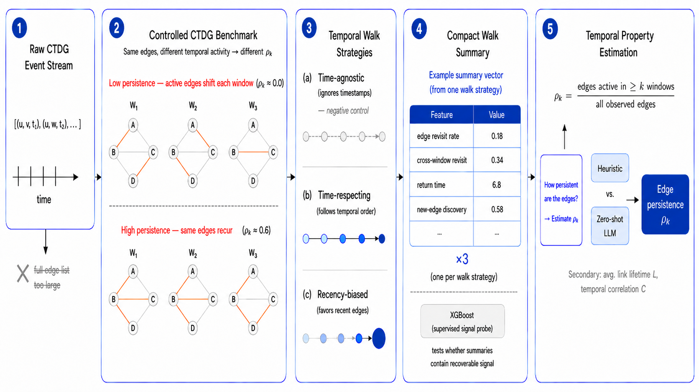

# Temporal Network Persistence from Partial Observations

Research code for a master's thesis on estimating full-network temporal
properties from partial and potentially biased network samples. The project
compares analytical estimators, supervised baselines, and language models under
the same controlled temporal-network tasks.

> [!IMPORTANT]
> **Work in progress.** The target definitions and central benchmark are
> increasingly stable, but the final model comparison and thesis synthesis are
> still underway. Historical pilots, superseded runners, and exploratory
> artifacts remain in the repository for provenance. Start with the files linked
> below rather than assuming that every script is part of the current pipeline.

## The problem

Suppose a temporal interaction network is observed only through a limited walk
or retrieval process. The sample may overrepresent recent, local, or frequently
revisited relationships. Can we still estimate how persistent the relationships
in the **complete** network are?

The main target splits the observation horizon into five windows. For every
dyad, let `K` be the number of windows in which it is active. The primary
quantity is the survival profile

```text
rho_k = P(K >= k),  k = 2, 3, 4, 5.
```

The project studies when this profile is identifiable from compact sample
summaries, how access bias changes the answer, and whether an LLM can add useful
general-purpose inference beyond task-specific estimators.



## Research questions

1. How much information about full-network persistence survives different
   temporal walk and retrieval mechanisms?
2. Which analytical corrections work, and where is supervised learning needed?
3. Do language models use the observed sample, or mostly regress toward prior
   expectations and constants?
4. How should the experiment allocate effort across graphs, walk seeds, prompt
   variants, and repeated generations?
5. Are non-walk access mechanisms, such as complete histories for a small node
   panel, promising alternatives?

## Current status

As of **2026-08-21**:

- the expanded V2 estimator benchmark, its generators, walk mechanisms, and
  leakage-aware evaluation pipeline are implemented;
- the 32-graph target panel and the primary target/scoring definitions are
  recorded, while several final-study freeze gates remain open;
- historical V2.1 LLM evidence and model-noise probes are available;
- a six-cell one-factor-at-a-time LLM input ablation is actively running across
  Codex, Gemini, DeepSeek V4 Flash, and Qwen3.6-27B;
- non-walk access mechanisms have been screened exploratorily, not established
  as a final ranking.

See [Project status and repository guide](docs/PROJECT_STATUS.md) for the
boundary between current, active, and historical code.

## Preliminary design evidence

These are measured design observations, not final thesis conclusions:

- Between-graph heterogeneity dominates walk-seed variation for panel-level
  comparisons; adding graphs is much more valuable than repeatedly walking the
  same graph. See [seed versus graph evidence](docs/SEED_VS_GRAPH_EVIDENCE.md).
- The usefulness of a compact sample depends strongly on the access mechanism
  and estimator. The benchmark therefore reports analytical, supervised, and
  constant-reference rows under leakage-safe group splits.
- LLM response stability and validity are model-dependent. Missing, malformed,
  and token-truncated outputs are reported rather than silently discarded or
  repaired. See [LLM evidence](docs/LLM_EVIDENCE.md) and the
  [frozen evaluation rules](docs/TARGET_EVALUATION_FREEZE.md).

## Quick start

The project is tested with Python 3.10. Create an isolated environment from the
repository root:

```bash
python3 -m venv .venv
source .venv/bin/activate
python -m pip install --upgrade pip
python -m pip install -r requirements.txt
```

Run the unit and invariant tests:

```bash
PYTHONPATH=src python -m unittest discover -s tests
```

Run the synthetic V2 smoke pipeline:

```bash
bash scripts/run_benchmark_v2_smoke.sh
```

The smoke runner uses only local Python models and synthetic data; it makes no
LLM or external model API calls. It recreates only the dedicated
`data/benchmark_v2_smoke/` and `results/benchmark_v2_smoke/` namespaces.

The full benchmark requires separately obtained temporal-network files under
`data/raw/`:

```bash
python src/check_real_data.py --preset v2
SHARDS=12 JOBS=1 RESET=0 bash scripts/run_benchmark_v2_local.sh
```

Dataset names and source pages are defined in
[`config/datasets.yaml`](config/datasets.yaml). Raw datasets and the local PDF
collection are intentionally excluded from the public repository; obtain them
from their original providers and observe their respective terms. See the
[third-party material notice](docs/THIRD_PARTY.md).

## Repository map

| Path | Purpose |
|---|---|
| [`src/`](src/) | generators, sampling mechanisms, estimators, prompt builders, runners, and evaluation |
| [`tests/`](tests/) | unit tests and scientific invariants |
| [`config/`](config/) | dataset registry and benchmark presets |
| [`scripts/`](scripts/) | local orchestration, smoke runs, and resumable API runners |
| [`slurm/`](slurm/) | bwUniCluster job files and cluster setup |
| [`docs/`](docs/) | design decisions, evidence summaries, runbooks, and historical notes |
| `data/` | local raw data and generated benchmark data (not distributed) |
| `results/` | compact evidence and local generated artifacts; large tables and model outputs are not distributed through Git |
| [`figures/`](figures/) | conceptual and result figures |
| [`literature/`](literature/) | literature index and local research notes |

Generated files under `results/`, raw datasets, literature PDFs, logs, model
caches, and local environments are ignored by Git. A small set of compact
historical reports remains versioned as provenance; large case tables,
predictions, and model-answer files are kept outside the public repository.

## Recommended reading order

1. [Project status and repository guide](docs/PROJECT_STATUS.md)
2. [Documentation index](docs/README.md)
3. [V2 benchmark overview](docs/README_V2.md)
4. [Target and evaluation freeze](docs/TARGET_EVALUATION_FREEZE.md)
5. [LLM evidence summary](docs/LLM_EVIDENCE.md)

## Reproducibility and interpretation

- Random seeds for benchmark construction and walks are deterministic unless a
  runbook explicitly studies model-response randomness.
- Learned baselines use source/family-aware splits to keep related temporal
  variants out of opposite train/test folds.
- Raw LLM answers are append-only. Predictions are not clipped, reordered, or
  repaired before the frozen evaluation.
- Product CLIs and hosted APIs can have hidden defaults, quotas, and endpoint
  drift. Such runs are labelled separately from pinned open-weight inference.
- A completed smoke test validates the pipeline, not a scientific model
  ranking.

## Citation and license

Original source code and project documentation are released under the
[MIT License](LICENSE). Citation metadata is available in
[`CITATION.cff`](CITATION.cff); GitHub can render it through **Cite this
repository**. The thesis itself does not yet have an archival DOI, so the
citation metadata may be extended for the final release.

The MIT License does not apply to third-party datasets, publications, model
weights, or other externally authored material. Those items remain governed by
their respective owners and source terms; see
[the third-party material notice](docs/THIRD_PARTY.md).
