# Estimating persistence from a sample

**Question:** a temporal network is only seen through a sample. Can language models estimate how persistent it is?

## 0 · The task

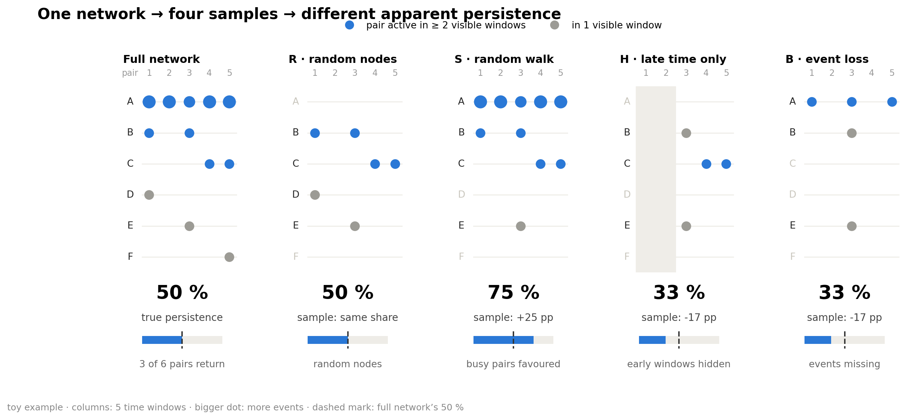

- **ρ₂ (persistence):** share of pairs active in ≥ 2 of 5 time windows. **Naive share:** the same share in the sample.
- Errors and differences are in percentage points (pp).

<details>
<summary><h3>The four samples (arms)</h3></summary>

| Arm | What the sample shows | Also told |
|---|---|---|
| R · random nodes | random nodes and all events among them | number of nodes |
| S · random walk | a walk from node to node along events, which meets busy pairs more often | visits per pair |
| H · late time only | random nodes, only the last 60 % of the time (windows 3–5) | number of nodes |
| B · event loss | each event kept with a small probability p | p |

Each sample shows about 10 % of the network's active pair-windows. 3 samples per network and arm.

</details>

<details>
<summary><h3>The methods</h3></summary>

| Method | What it is |
|---|---|
| Naive share | ρ₂ of the sample, uncorrected |
| Training median | a constant guess from the training networks |
| MLE | statistical model of the sampling, no training |
| ExtraTrees | trained on 16 other real and 400 synthetic networks with known answers; a supervised reference, not a fair competitor |
| GPT | OpenAI `gpt-6-sol`, reasoning effort high |
| GPT + Python | the same, with OpenAI's hosted Python tool (up to 10 calls) |
| DeepSeek | `deepseek-flash`, reasoning effort high |
| Qwen thinking / no thinking | `Qwen3.6-35B-A3B`, run locally, with or without its thinking phase (temperature 1.0 / 0.7) |

Each language model answers each sample 3 times.

</details>

<details>
<summary><h3>One real input</h3></summary>

```
Sampling rule: 24 random nodes; every event between two of them is seen.   (Hospital, arm R)
Seen: 132 pairs, 3,172 events

pattern (windows 1–5)   pairs   events      1 = active in that window
0 0 0 0 1                  12       86
0 1 1 1 0                   5      283
1 1 1 0 0                   4      490
…                           …        …      (31 patterns in total)

Task: estimate ρ₂ … ρ₅ of the full network.        Naive share 56 / 132 = 42 %; true ρ₂ 45 %.
```

ρ₃ to ρ₅ count pairs active in ≥ 3 to 5 windows.

</details>

## 1 · What the networks look like

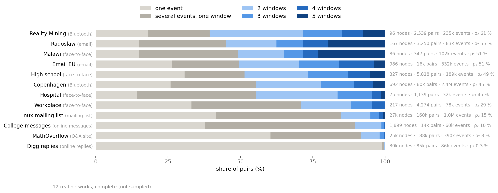

- Many events do not make a pair persistent. In every network but Digg, 21–52 % of pairs have several events, all in one window.
- The same ρ₂ can hide different shapes. Malawi and Email EU both have 51 %, but 23 % of Malawi's pairs are active in all 5 windows, against 4 % in Email EU.

<details>
<summary><h3>What kind of networks these are</h3></summary>

- **Face-to-face (proximity sensors):** Hospital, High school, Workplace, Malawi (a village)
- **Bluetooth (phones near each other):** Copenhagen, Reality Mining
- **Email and mailing list:** Email EU, Radoslaw, Linux mailing list
- **Online messages and replies:** College messages, MathOverflow, Digg replies

</details>

<details>
<summary><h3>Does the number of time windows matter?</h3></summary>

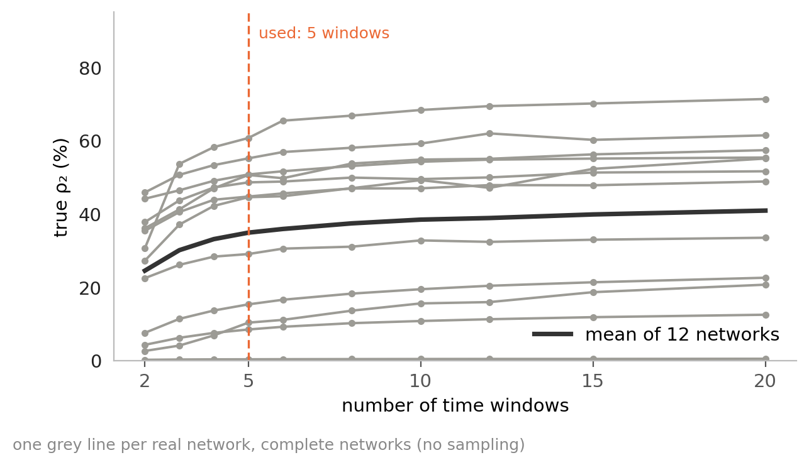

- More windows raise ρ₂ a little: on average 30 % with 3 windows, 35 % with 5, 41 % with 20.
- The networks keep their order (rank correlation with 5 windows ≥ 0.97 for 3 to 20 windows).

</details>

## 2 · Samples distort persistence, except in R

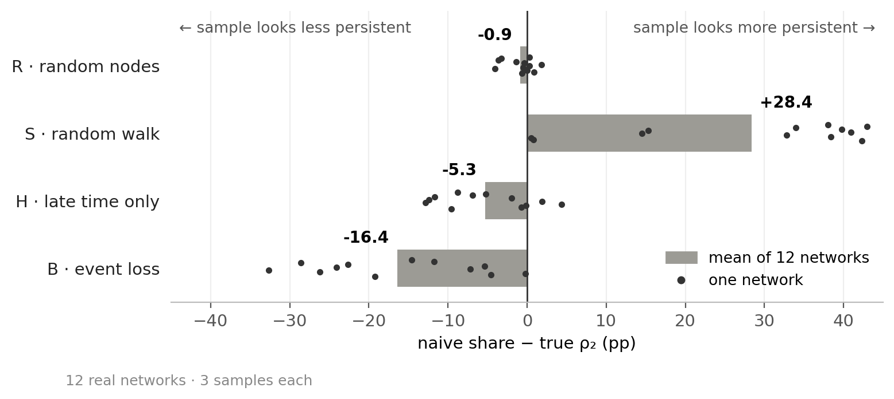

- The walk (S) overstates persistence; hiding the early time (H) and losing events (B) understate it.

## 3 · Who corrects it

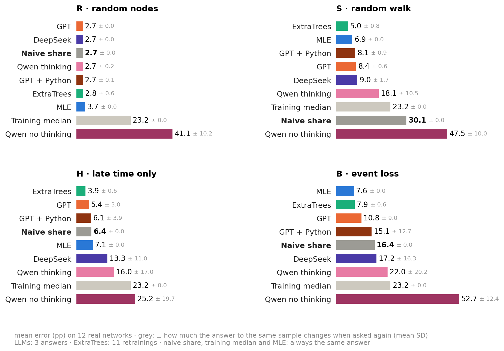

- Correction pays off clearly in S and B, only partly in H. In R there is nothing to correct.
- GPT is the best language model but has no consistent edge over MLE.
- Qwen no thinking is worse than the training median, a constant guess: it answers 85–95 % in R, S and B almost regardless of the sample.

<details>
<summary><h3>Counted per network: who beats the naive share, GPT against MLE</h3></summary>

- **S:** MLE, ExtraTrees and all thinking models beat the naive share by more than 0.5 pp in 11 of 12 networks. **B:** MLE, ExtraTrees and GPT do so in 8 or 9. **H:** at most 8 of 12.
- **GPT against MLE:** better in 2, 6, 4 and worse in 6, 4, 6 networks (S, H, B).

</details>

## 4 · Where a textbook answer exists, the models give it

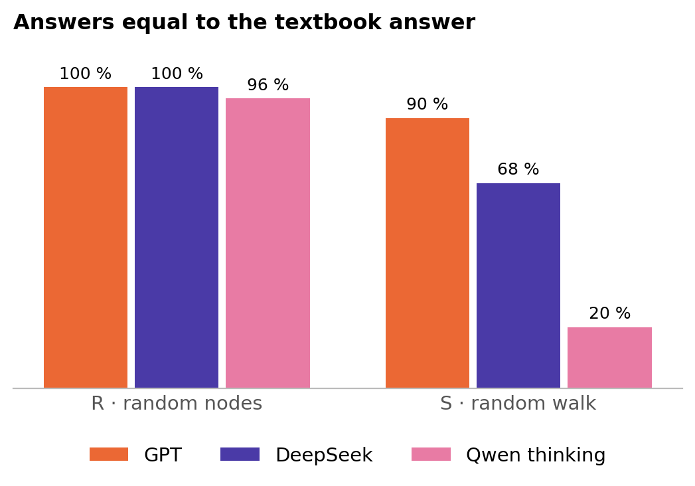

- The textbook answer is the naive share in R and the **simple reweighting** in S: each visit counts 1 / the pair's number of events. A match means within 0.5 pp.
- In S, GPT's error (8.4 pp) is the formula's own (8.8 pp).

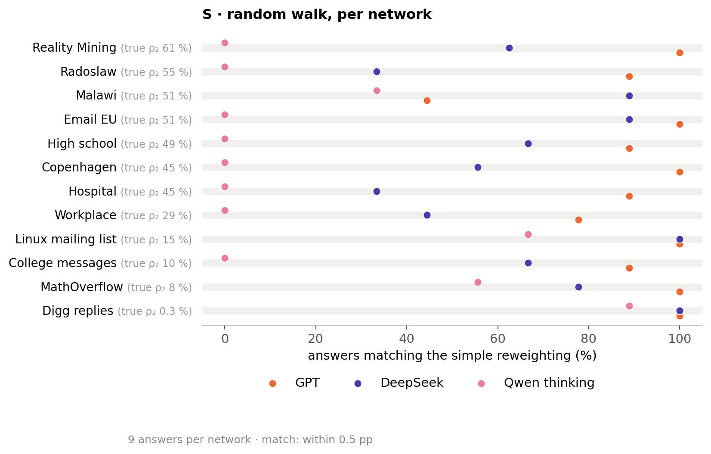

- GPT gives the formula on every network except Malawi (44 %). DeepSeek gives it on some networks, Qwen thinking only on a few (Digg, Linux, MathOverflow).

## 5 · Elsewhere they improvise, and GPT does it best

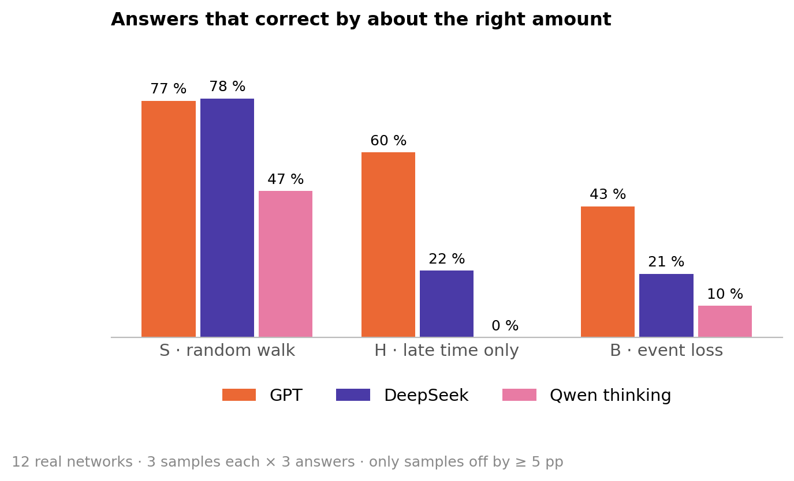

- "About right" means 50–150 % of the correction the sample needs.

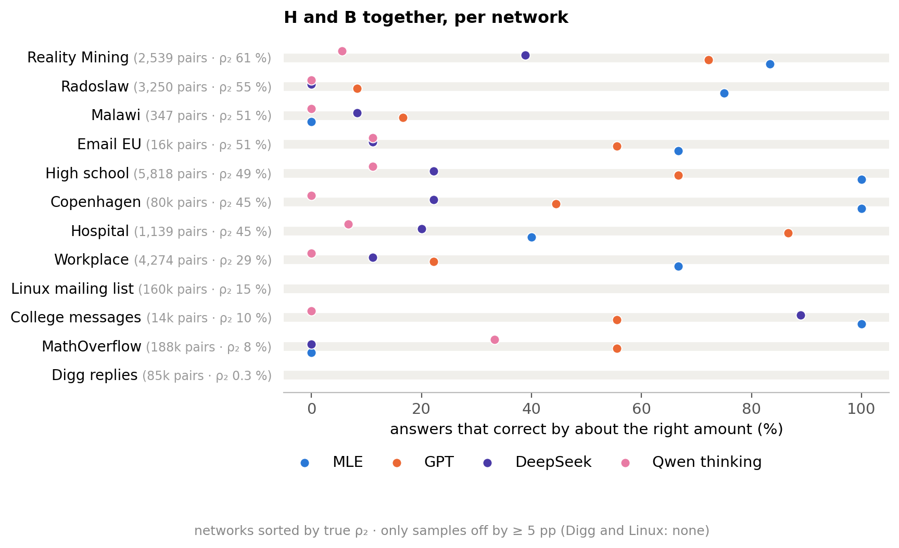

- GPT is about right on most networks, but not on Malawi, Radoslaw and Workplace. DeepSeek and Qwen rarely are (one exception: DeepSeek on College messages).

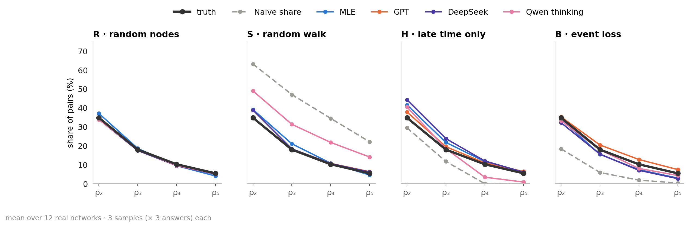

- GPT recovers the whole profile in every arm, even ρ₄ and ρ₅ in H, which three visible windows cannot show (the naive share is 0 there).

<details>
<summary><h3>How long the models think, and what DeepSeek writes</h3></summary>

| Median reasoning tokens | R | S | H | B |
|---|---:|---:|---:|---:|
| GPT | 489 | 3,051 | 4,764 | 8,966 |
| DeepSeek | 9,069 | 35,483 | 50,226 | 57,932 |

- Both write the longest reasoning in H and B. DeepSeek writes 6–19 times as much as GPT and is still less accurate.
- "Guess" appears in DeepSeek's full reasoning in 82 % of H and 58 % of B answers (R: 2 %), e.g. *"We have no data on windows 1-2, so any extrapolation is a guess."*

</details>

## 6 · How much the estimates move

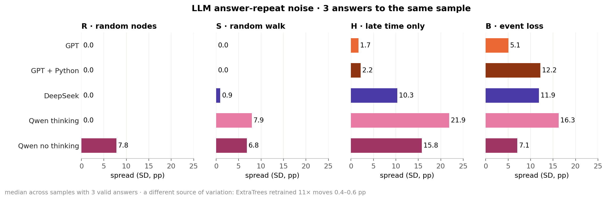

- Asked again with the same sample, the language models answer differently where they improvise (H, B).

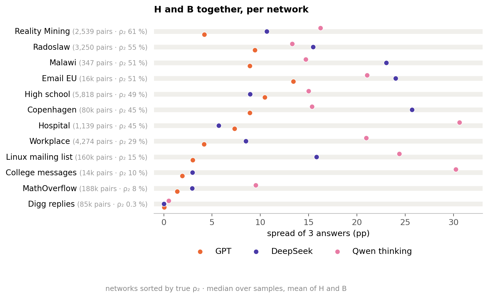

- GPT's and DeepSeek's answers vary mostly on persistent networks and hardly at all on Digg and MathOverflow. Qwen varies on almost every network.

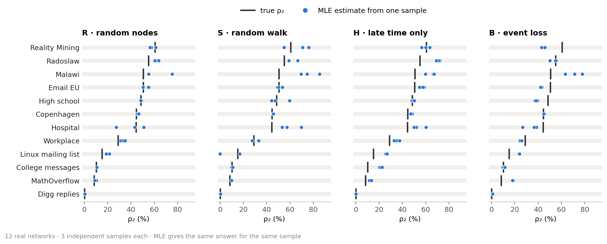

- A new sample barely moves the estimate on most networks. It moves more on the smallest networks (Malawi, Hospital) and, under the walk, on Linux, Reality Mining and High school.
- The gap to the truth is often larger than the spread between samples: the errors are systematic, not chance.

## 7 · Python does not help

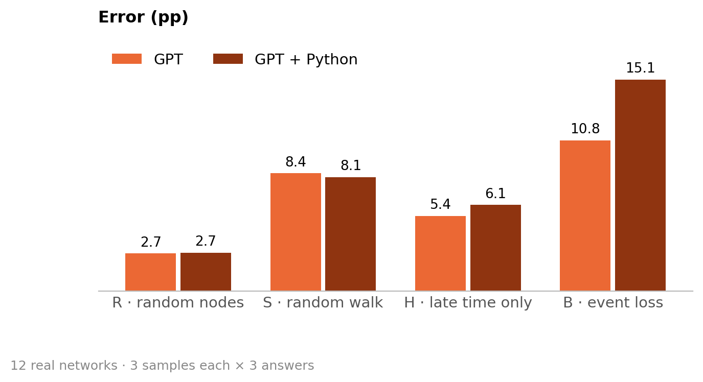

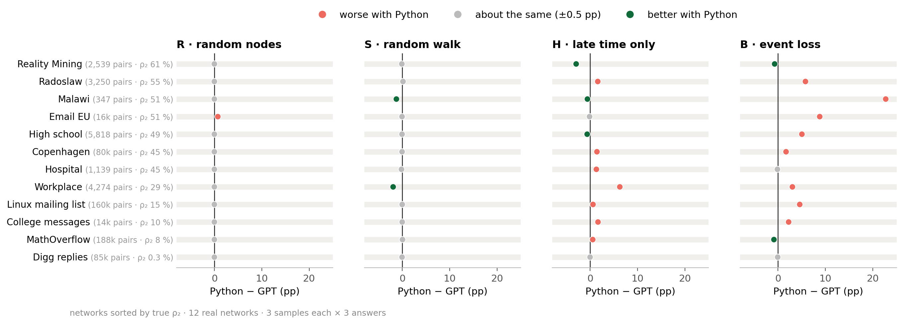

- In R and S, Python changes nothing on any network. In B it makes 8 of 12 networks worse, Malawi by 23 pp.

## 8 · Which networks are hard

### 8.1 With random nodes or a random walk, the same networks are hard for every method

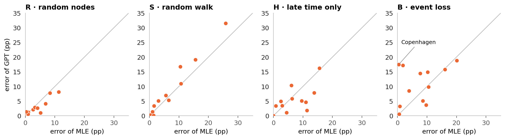

- **R, S:** the dots sit on the diagonal, so difficulty is a property of the network.
- **H, B:** the dots scatter, so it depends on the method. Copenhagen in B is easy for MLE (0.5 pp) and hard for GPT (17.5 pp).

### 8.2 Not the number of events, but how many pairs carry them

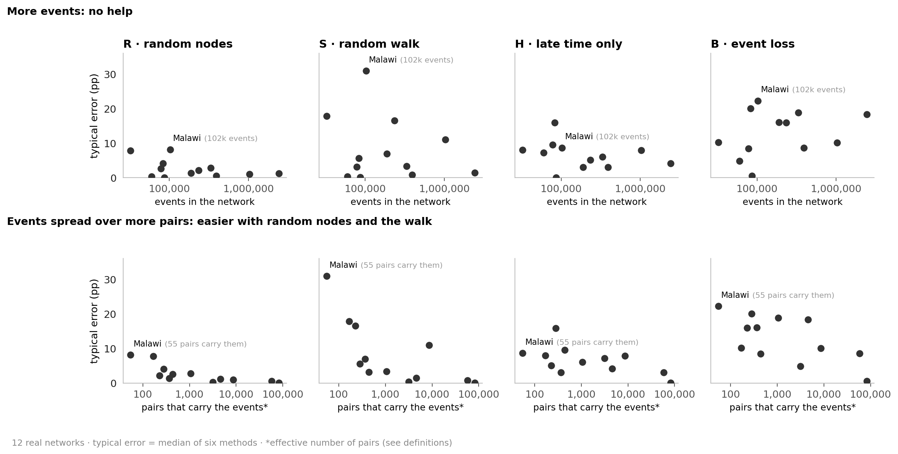

*Typical error:* median error of MLE, ExtraTrees, GPT, GPT + Python, DeepSeek and Qwen thinking. *Pairs that carry the events:* how many equally busy pairs would hold the same events.

- More events do not help in any arm.
- The more pairs carry the events, the easier R and S get; H and B only a little. Malawi's 102k events sit on effectively 55 of its 347 pairs.

### 8.3 Time-shuffled twins: do the methods read the timing?

Each real network has a **twin**: the same nodes, pairs and events per pair, but every event at a random time. A method that used only this static information would give the same answer for a network and its twin. Yet the twin's true ρ₂ is 27 pp higher.

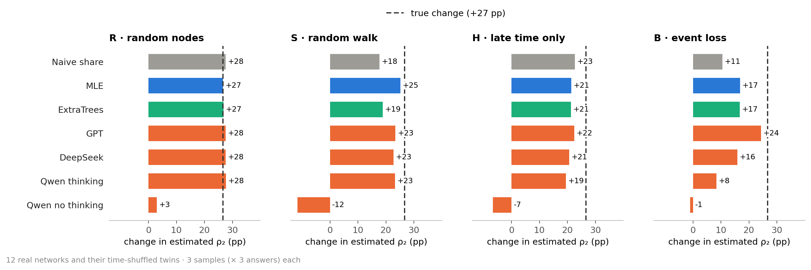

- All methods that read the time patterns raise their estimate, and in R they follow the truth exactly.
- Only Qwen no thinking does not follow (−12 to +3 pp). It does not read the timing.
- Under event loss (B), every method follows only part of the change; GPT follows best.

### 8.4 Synthetic networks: what memory changes

Real networks differ in many things at once. The synthetic networks change only one, **memory**, to measure what it does to the task. Two generators, each run without and with memory on the same random numbers (500 nodes, about 10k events):

- **DAR:** each pair is on or off in each window. Without memory, every window is a new draw; with memory, a pair keeps its last state 80 % of the time.
- **Activity-driven:** active nodes create events with a partner. Without memory, the partner is random; with memory, mostly a known one.

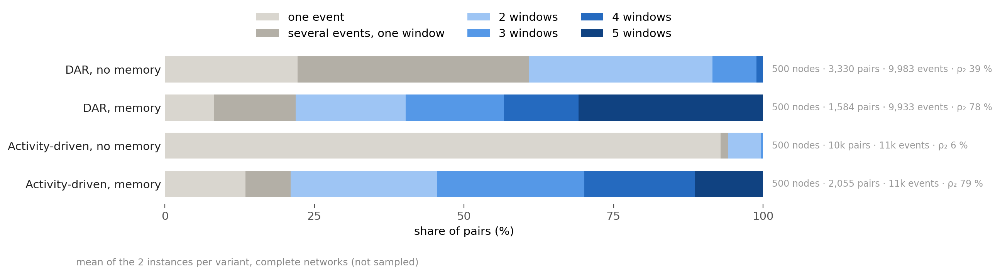

- Memory puts about the same number of events on fewer pairs and makes them persistent: ρ₂ rises from 39 % to 78 % (DAR) and from 6 % to 79 % (activity-driven).

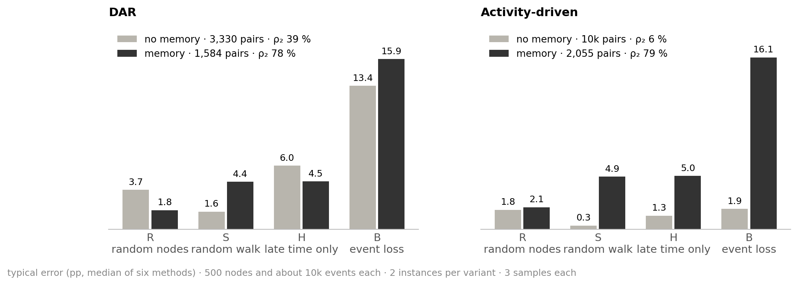

- With memory, the walk (S) and event loss (B) get harder in both generators. R does not; H only with activity-driven.
- These are the two properties that make real networks hard: few pairs carrying the events (S, 8.2) and high persistence (B, 8.5).

<details>
<summary><h3>How the synthetic networks are made</h3></summary>

- **DAR** (discrete autoregressive; Williams et al. 2022): 5,000 random pairs among 500 nodes. In window 1 a pair is on with probability 0.2. In each later window it keeps its last state with probability α (0 without, 0.8 with memory); otherwise it is on with probability 0.2. A pair that is on has 1 + Poisson(1) events at random times in that window.
- **Activity-driven** (Perra et al. 2012; memory rule: Karsai et al. 2014): each node has a fixed activity (a few very active nodes, many quiet ones). In each of 1,000 rounds, a node is active with this probability and creates one event with a partner. With memory, a node that knows n partners picks a new one with probability 1 / (n + 1), otherwise a known one.
- 2 instances per generator. Within an instance, both variants share all random numbers, so only memory differs.
- ExtraTrees was trained on other networks from the same two generators and is very good here (B with memory: 2–3 pp, against 8–18 pp for MLE and GPT). Without it, the values in the figure change by at most 2.4 pp, and the picture stays the same.

</details>

### 8.5 Under event loss, persistent networks are hard

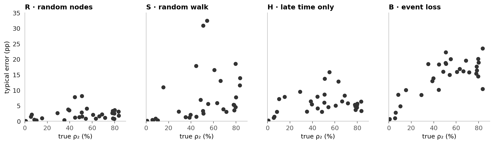

- Only under event loss (B) does the error grow with ρ₂, in real, twin and synthetic networks alike.

### 8.6 Every network on its own

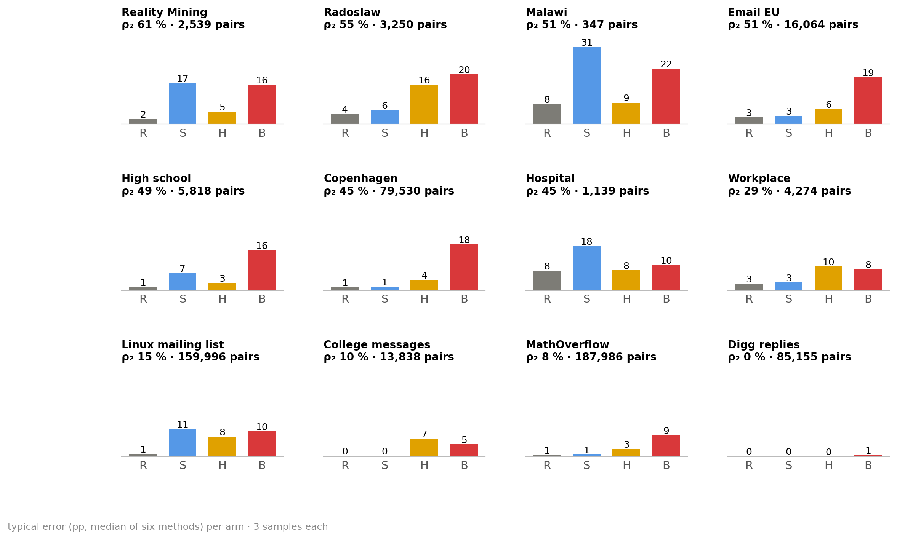

- **Digg:** easy everywhere, because almost every pair has only one event.
- **Malawi:** hardest in S and B. Only 347 pairs, and effectively 55 of them carry the events.
- **Copenhagen:** easy except under event loss.
- **Linux mailing list:** low persistence, yet hard under the walk (11 pp), because its samples differ strongly (section 6).
- **College messages:** easy in R and S, harder in H, where 85 % of its pairs are active only in the hidden early time.

<details>
<summary><h2>Key findings</h2></summary>

1. **Samples distort persistence.** The walk overstates it, late time only and event loss understate it; random nodes do not. (2)
2. **Where a textbook answer exists, the language models give it** (R: the naive share; S: the simple reweighting, mostly GPT and DeepSeek). They are then as good as the formula, not better. (4)
3. **Where none exists, they improvise.** GPT corrects by about the right amount most often; DeepSeek and Qwen rarely, and they answer differently each time. (5, 6)
4. **No language model beats MLE consistently.** Qwen no thinking is worse than a constant guess. (3)
5. **The errors are systematic, not chance:** a new sample barely moves a good estimate. (6)
6. **Python does not help GPT;** under event loss it makes 8 of 12 networks worse. (7)
7. **What makes a network hard:** with random nodes and the walk, few pairs carrying the events; under event loss, high persistence. Memory in synthetic networks produces both. (8.1, 8.2, 8.4, 8.5)
8. **All thinking models read the timing:** for a time-shuffled twin they raise their estimate. Qwen no thinking does not. (8.3)
9. **Five windows are not a special choice:** other numbers of windows shift ρ₂ a little and keep the order of the networks. (1)

</details>

<details>
<summary><h2>Definitions, sources and all numbers</h2></summary>

- **ρ₂ … ρ₅:** share of pairs active in ≥ 2 … 5 of the 5 time windows, among all pairs with at least one event. **Naive share:** the same share among the pairs in the sample.
- **Error:** |estimate − true ρ₂| in pp, averaged per network over its samples and answers, then over networks.
- **Typical error:** median error of the six methods MLE, ExtraTrees, GPT, GPT + Python, DeepSeek and Qwen thinking.
- **Pairs that carry the events** (effective number of pairs): 1 / Σ (events of a pair / all events)², the inverse Simpson index. Malawi 55, Copenhagen 4,590, Digg 82,900.
- **Time-shuffled twin:** the same pairs with the same numbers of events; the event times are shuffled.
- All errors per network and method: [figure](figures/fig_networks_detail.png), [MAIN_RESULTS.md](../results/final/MAIN_RESULTS.md). Robustness: [VARIABILITY.md](../results/final/VARIABILITY.md), [W_SENSITIVITY.md](../results/final/W_SENSITIVITY.md), [WALK.md](../results/final/WALK.md).
- Redraw: `python scripts/analysis_figures.py`; `--inputs` also rebuilds [`data/`](data) (needs `data/raw` and `~/.local/share/masterthesis`).

</details>
