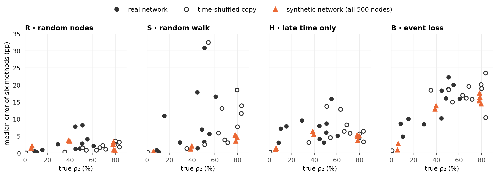
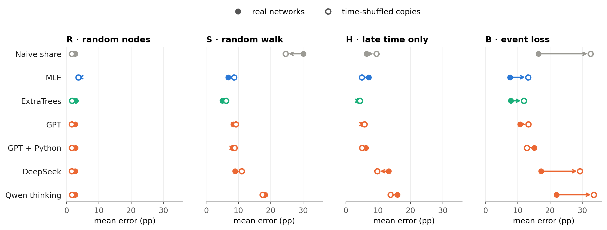

# Estimating persistence from a sample

**Question:** a temporal network is only seen through a sample. Can language models estimate how persistent it is?

**Short answer:**
- Where a sampling rule has a simple textbook correction (R, S), GPT and DeepSeek apply it. They are as good as the formula, not better.
- Where there is none (H, B), they improvise. GPT stays close to the statistical model; DeepSeek and Qwen fall far behind.
- Python does not help, and in B it hurts.

**ρ₂** is the share of pairs that are active in at least 2 of 5 time windows. **Error** is the absolute error of ρ₂ in percentage points (pp), averaged over 12 real networks.

## 0 · What a method gets

A shortened sample from the Hospital network, arm R:

```
Sampling rule: 24 random nodes; every contact between two of them is seen.
Seen: 132 pairs, 3,172 events

pattern (windows 1–5)   pairs   events
0 0 0 0 1                  12       86
0 0 1 0 0                  23      332
0 1 1 1 0                   5      283
1 1 1 0 0                   4      490
…                           …        …      (31 patterns in total)

Task: estimate ρ₂ … ρ₅ of the full network.
```

Here 56 of 132 pairs are active in ≥ 2 windows, so the **naive share** is 42 %. The true ρ₂ is 45 %.

| Arm | Sample | Also told |
|---|---|---|
| R · random nodes | random nodes and all contacts among them | number of nodes |
| S · random walk | a walk along contacts, so busy pairs are seen more often | visits per pair* |
| H · late time only | random nodes, only the last 60 % of the time visible | number of nodes |
| B · event loss | each event kept with a small probability p | p |

Every sample sees about 10 % of the network's activity, with 3 samples per network and arm.
\*The visits allow a textbook correction, the **simple reweighting**: each visit counts 1 / the pair's number of events.

| Method | What it is |
|---|---|
| Naive share | the share in the sample, uncorrected |
| Training median | a constant guess |
| MLE | statistical model of the sampling, no training |
| ExtraTrees | trained on 16 other real and 400 synthetic networks with known answers; a supervised reference, not a fair competitor |
| GPT, GPT + Python, DeepSeek, Qwen thinking, Qwen no thinking | language models, no training, 3 answers per sample |

## 1 · The 12 networks

| Network | Contacts | Nodes | Pairs | Events per pair | True ρ₂ |
|---|---|---:|---:|---:|---:|
| Digg replies | online replies | 30,360 | 85,155 | 1.0 | 0.3 % |
| MathOverflow | Q&A | 24,759 | 187,986 | 2.1 | 8 % |
| College messages | online messages | 1,899 | 13,838 | 4.3 | 10 % |
| Linux mailing list | mailing list | 26,885 | 159,996 | 6.4 | 15 % |
| Workplace | face-to-face | 217 | 4,274 | 18.3 | 29 % |
| Hospital | face-to-face | 75 | 1,139 | 28.5 | 45 % |
| Copenhagen | Bluetooth | 692 | 79,530 | 30.5 | 45 % |
| High school | face-to-face | 327 | 5,818 | 32.4 | 49 % |
| Email EU | email | 986 | 16,064 | 20.7 | 51 % |
| Malawi | face-to-face | 86 | 347 | 294.8 | 51 % |
| Radoslaw | email | 167 | 3,250 | 25.5 | 55 % |
| Reality Mining | Bluetooth | 96 | 2,539 | 92.5 | 61 % |

## 2 · The sample distorts persistence


Only R is unbiased. S overstates persistence, while H and B understate it.

## 3 · Who corrects it


Clear winners exist only in S. In H, no method beats the naive share reliably on ρ₂, though over ρ₂ to ρ₅ correction does help (naive 7.2 pp, GPT 3.3 pp). Qwen no thinking answers 85–95 % almost regardless of the sample and is worse than the constant guess.

## 4 · What the language models compute


In S, 90 % of GPT's answers are the simple reweighting, and its error (8.4 pp) is the formula's (8.8 pp). In H and B the models improvise. There DeepSeek and Qwen are worse than GPT in 10–12 of 12 networks.

## 5 · How stable the estimates are


The language models vary most where they improvise (H, B).

## 6 · Does Python help?

| Arm | GPT | GPT + Python | Python worse in |
|---|---:|---:|---:|
| R | 2.7 | 2.7 | 7/12 |
| S | 8.4 | 8.1 | 2/12 |
| H | 5.4 | 6.1 | 7/12 |
| B | 10.8 | 15.1 | 8/12 |

Only B differs reliably (sign-flip p = 0.008). The answers spread more (12.2 against 5.1 pp) and overshoot (+6.4 against +0.5 pp), at 3.4 times the cost.

## 7 · Which networks are hard, and why


Hard cases cluster in the small face-to-face networks and, in B, in the persistent ones. Three possible reasons follow.

### 7.1 Few pairs in the sample


Every sample sees 10 % of the activity, so a small network gives few pairs (Malawi 18–51, Digg about 8,500). In R and S, fewer pairs means a larger error.

### 7.2 High persistence

In real networks, small and persistent go together. Two extra sets of networks separate them:
- **Time-shuffled copies:** each real network with its contact times shuffled at random. Nodes, pairs and event counts stay the same, but ρ₂ rises (mean 35 % → 62 %).
- **Synthetic networks:** 8 generated networks, all with 500 nodes, from two standard generators:

| Generator | How contacts arise | Without memory | With memory |
|---|---|---:|---:|
| DAR | each pair switches on or off in every window; with memory it keeps its last state 80 % of the time | ρ₂ 39–40 % | ρ₂ 78 % |
| Activity-driven | active nodes contact partners; with memory they prefer known ones | ρ₂ 5–6 % | ρ₂ 78–80 % |



Only in B does the error rise steadily with ρ₂, in all three kinds of networks: losing events hides more of a persistent network.

### 7.3 The real timing of contacts



Shuffling the contact times changes little in R, S and H, so no method relies on real timing. B gets harder for all methods except GPT + Python, because ρ₂ rises (7.2).

---

**More:** full results are in [MAIN_RESULTS.md](../results/final/MAIN_RESULTS.md), robustness checks in [VARIABILITY.md](../results/final/VARIABILITY.md), [W_SENSITIVITY.md](../results/final/W_SENSITIVITY.md) and [WALK.md](../results/final/WALK.md). Redraw the figures with `python scripts/analysis_figures.py`; `--inputs` also rebuilds [`data/`](data) and needs `data/raw` and `~/.local/share/masterthesis`.
