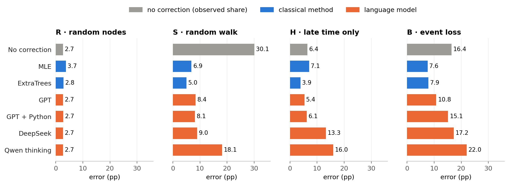
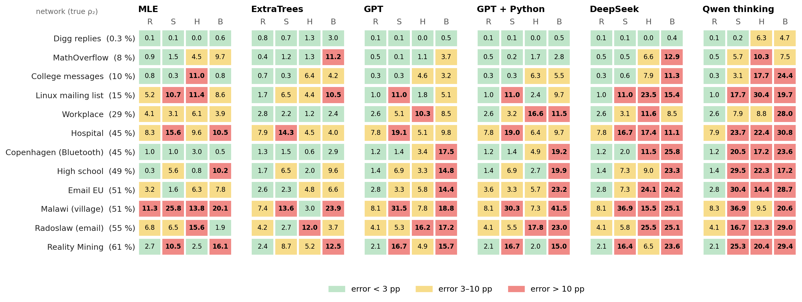
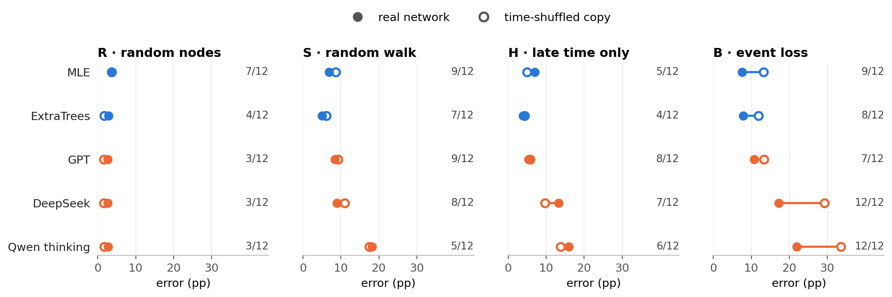
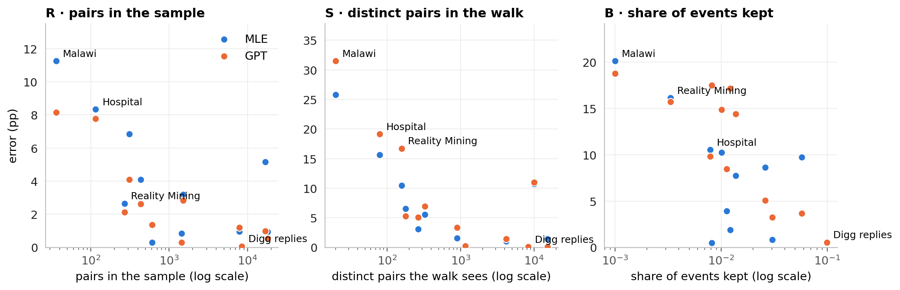

# Analysis

**Question:** how well can language models estimate how persistent a network is from a biased sample, compared with classical methods?

- **Target ρ₂:** share of interacting pairs that are active in at least 2 of 5 time windows.
- **Error:** mean absolute error of ρ₂ in percentage points (pp). It is averaged over the 3 samples (and 3 answers) of a network, then over the 12 real networks, which count equally. Lower is better.
- **Sampling arms:**
  - R: random nodes (unbiased)
  - S: random walk (favours busy pairs)
  - H: only the last 60 % of the time
  - B: events randomly lost
- **Methods:**
  - No correction: the observed share
  - MLE: a statistical model of the sampling
  - ExtraTrees: a trained model
  - Language models: GPT, GPT + Python, DeepSeek, Qwen thinking and Qwen no thinking, each giving 3 answers per sample

The figures are in [`figures/`](figures) as PNG and PDF. `scripts/analysis_figures.py` draws them from the frozen results in [`../results/final`](../results/final).

---

## 1 · Biased sampling separates the methods



*Mean error per arm, 12 real networks. Qwen no thinking (25–53 pp) is not shown.*

**In R**, all methods are within about 1 pp of the observed share, which is already unbiased there. **In S, H and B**, clear differences appear:
- The classical methods are best.
- GPT is the best language model, and Qwen thinking the weakest.
- In B, adding Python raises GPT's error from 10.8 to 15.1 pp.

## 2 · Language-model estimates lie near simple reference values


*Arm S, all valid answers. "Near" means within 0.5 pp. The reweighted share weights every observed pair by 1 / its number of events. In R, GPT, GPT + Python and DeepSeek lie near the observed share in 99–100 % of answers, and Qwen thinking in 96 %.*

About 90 % of GPT's estimates in S lie near the reweighted share, and the models that are near it more often have lower errors. This describes the numbers only. It does not show how the models arrived at them.

## 3 · Reliability: new answer versus new sample


*Left: spread of the 3 answers to the identical sample; this does not apply to the deterministic methods. Right: spread across the 3 samples of a network (language models: mean of their answers per sample). Median over samples or networks.*

GPT gives almost the same number when asked again, but its estimate still moves with the sample (S: 0.0 against 5.4 pp). DeepSeek and Qwen vary strongly in both. With Python, the spread of GPT's answers in B rises from 5.1 to 12.2 pp.

## 4 · Where each method has difficulties



*Error per network and arm. Networks are sorted by true ρ₂ (in brackets). Colours mark error levels.*

Difficulty depends on the method. Copenhagen in B is easy for MLE (0.5 pp) and ExtraTrees (2.9 pp) but hard for every language model (17–26 pp). Networks with a high true ρ₂ tend to have larger errors. Near ρ₂ = 0 (Digg) small errors are easy to reach.

## 5 · Real networks against time-shuffled copies



*Filled: real network. Open: the same network with shuffled time stamps (same pairs and event counts). Numbers: networks out of 12 where the real network has the lower error.*

Shuffling changes the result mostly in B. There, every method has a lower mean error on the real networks, and DeepSeek and Qwen thinking are better on all 12. Shuffling also raises the true ρ₂ (mean 35 % → 62 %; +18 to +41 pp, except Digg +0.5 pp), so the difference is not caused by temporal structure alone.

---

## Appendix

### A1 · Direction of the error: no correction against MLE


MLE reduces the mean bias in S and B and overcorrects in H. A mean signed error near 0 can hide large errors on single networks.

### A2 · Error against the information in the sample (exploratory)



With 12 networks this only shows a tendency: errors are larger when the sample holds few pairs, when the walk sees few distinct pairs, or when few events are kept. Size, true ρ₂ and contacts per pair are strongly linked across the networks and cannot be separated.

### A3 · GPT + Python in arm B

The code of 92 % of GPT + Python answers in B calls a numerical optimiser (found by searching for `optimize` or `minimize`). Answers with 10 or more tool calls (the limit is 10) have a higher error: 17.0 pp against 13.4 pp. Harder samples may cause both. Source: [`data/python_tool_use.csv`](data/python_tool_use.csv).

## Redrawing

```
python scripts/analysis_figures.py            # figures from docs/results/final and docs/analysis/data
python scripts/analysis_figures.py --inputs   # also rebuild docs/analysis/data (needs data/raw and ~/.local/share/masterthesis)
```
