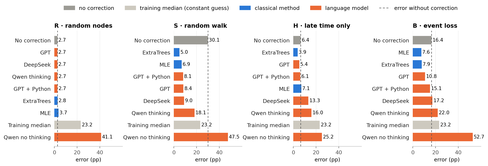
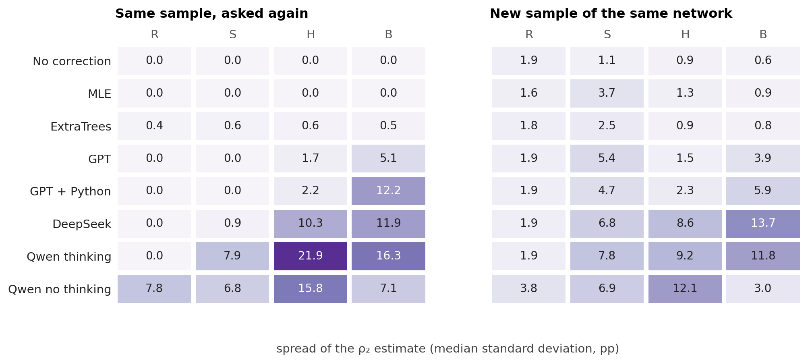
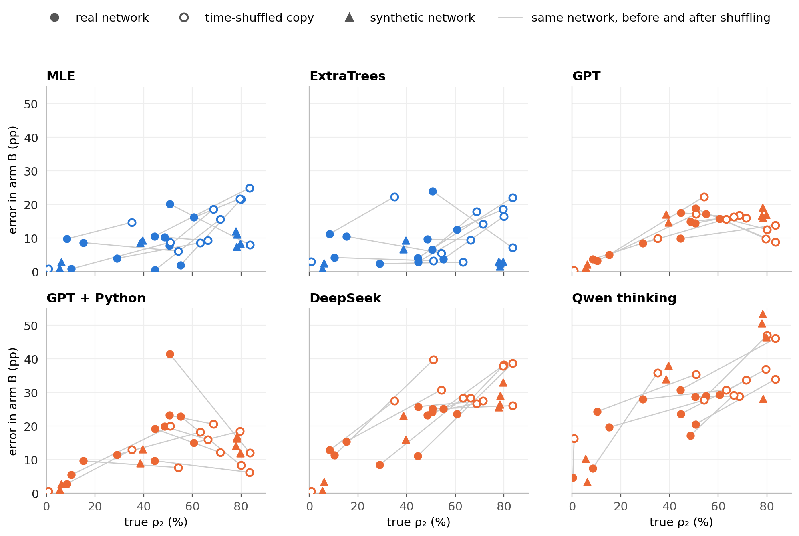
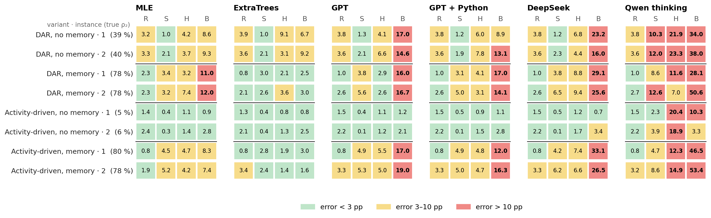

# Estimating persistence from a sample

**Question:** a temporal network is only seen through a sample. How well can language models estimate from that sample how persistent the network is, compared with classical methods?

**ρ₂** is the share of interacting pairs that are active in at least 2 of 5 time windows. All errors are absolute errors of ρ₂ in percentage points (pp), averaged over the samples and answers of a network, then over the 12 real networks. Lower is better.

## 0 · What a method gets

Every method receives the same compact table. Here is a shortened example for the Hospital network in arm R:

```
Sampling rule: 24 random people; every contact between two of them is seen, with its full history.
Seen: 132 pairs, 3,172 events

pattern (windows 1–5)   pairs   events
0 0 0 0 1                  12       86
0 0 1 0 0                  23      332
0 1 1 1 0                   5      283
1 1 0 0 0                   5      415
1 1 1 0 0                   4      490
…                           …        …      (31 patterns in total)

Task: estimate ρ₂ … ρ₅ of the full network.
```

A pattern like `0 1 1 1 0` means active in windows 2, 3 and 4. In this sample, 56 of 132 pairs are active in at least 2 windows, so the observed share is 42 %. The true ρ₂ of the full network is 45 %.

The four sampling arms differ only in how the sample is drawn:

| Arm | How the sample is drawn | Extra information in the table |
|---|---|---|
| R · random nodes | random people, all their mutual contacts | number of people drawn |
| S · random walk | a walk that moves along contacts, so busy pairs are visited more often | how often each pair was visited |
| H · late time only | random people, but windows 1–2 are hidden | which windows are visible |
| B · event loss | every single event is kept with a small probability p | p |

**Methods:**
- **No correction:** the observed share.
- **Training median:** always the same guess.
- **MLE:** a statistical model of the sampling.
- **ExtraTrees:** a model trained on other networks.
- **Language models:** GPT, GPT + Python, DeepSeek, Qwen thinking and Qwen no thinking. Each model answered every sample 3 times.

## 1 · The 12 networks

| Network | Contacts | Nodes | Pairs | Events per pair | One-off pairs | True ρ₂ |
|---|---|---:|---:|---:|---:|---:|
| Digg replies | online replies | 30,360 | 85,155 | 1.0 | 99 % | 0.3 % |
| MathOverflow | Q&A interactions | 24,759 | 187,986 | 2.1 | 60 % | 8 % |
| College messages | online messages | 1,899 | 13,838 | 4.3 | 38 % | 10 % |
| Linux mailing list | mailing-list replies | 26,885 | 159,996 | 6.4 | 42 % | 15 % |
| Workplace | face-to-face, office | 217 | 4,274 | 18.3 | 33 % | 29 % |
| Hospital | face-to-face, ward | 75 | 1,139 | 28.5 | 14 % | 45 % |
| Copenhagen | Bluetooth, students | 692 | 79,530 | 30.5 | 26 % | 45 % |
| High school | face-to-face, students | 327 | 5,818 | 32.4 | 31 % | 49 % |
| Email EU | emails, institute | 986 | 16,064 | 20.7 | 26 % | 51 % |
| Malawi | face-to-face, village | 86 | 347 | 294.8 | 15 % | 51 % |
| Radoslaw | emails, company | 167 | 3,250 | 25.5 | 15 % | 55 % |
| Reality Mining | Bluetooth, students | 96 | 2,539 | 92.5 | 18 % | 61 % |

*One-off pairs have a single event.*

## 2 · The sample distorts persistence


Only R gives an honest picture. The walk (S) makes networks look far more persistent. Hiding early time (H) and losing events (B) make them look less persistent.

## 3 · Which methods correct it



Methods are ranked below "no correction". Only bars left of the dashed line improve on it:
- **R:** almost every method stays at the honest observed share.
- **S:** ExtraTrees and MLE lead (5–7 pp); GPT, GPT + Python and DeepSeek follow (8–9 pp).
- **H:** only ExtraTrees, GPT and GPT + Python beat no correction; MLE is worse.
- **B:** MLE and ExtraTrees halve the error; GPT is the best language model, and Python makes it worse.

## 4 · What the language models compute


Where a simple estimate exists, the models return it. In R that is the observed share. In S it is the simple reweighting, in which each walk visit of a pair counts 1 / its number of events. In H and B no simple estimate exists, and most answers are the models' own values. This explains Section 3: the language models do well exactly where a textbook answer exists.

## 5 · How stable the estimates are



For the same sample, MLE is fixed and ExtraTrees changes by about 0.5 pp when retrained. The language models vary where they have to invent their own correction (H, B), GPT least and Qwen most. A new sample moves every estimate by about 1–14 pp; the classical methods move most in S.

## 6 · Which networks are hard, and why

Networks are sorted by true ρ₂. The table shows how many pairs each arm's sample contains; it is the same budget, but small networks give few pairs.

| Network | True ρ₂ | Pairs seen in R | S | H | B |
|---|---:|---:|---:|---:|---:|
| Digg replies | 0.3 % | 8,434 | 8,597 | 8,577 | 8,515 |
| MathOverflow | 8 % | 18,154 | 15,261 | 19,280 | 20,155 |
| College messages | 10 % | 1,445 | 1,168 | 1,382 | 1,516 |
| Linux mailing list | 15 % | 16,800 | 3,719 | 17,156 | 17,186 |
| Workplace | 29 % | 436 | 277 | 503 | 525 |
| Hospital | 45 % | 115 | 74 | 146 | 164 |
| Copenhagen | 45 % | 7,912 | 4,220 | 9,987 | 10,380 |
| High school | 49 % | 609 | 331 | 791 | 816 |
| Email EU | 51 % | 1,512 | 914 | 2,123 | 2,332 |
| Malawi | 51 % | 36 | 18 | 38 | 51 |
| Radoslaw | 55 % | 312 | 175 | 404 | 518 |
| Reality Mining | 61 % | 268 | 158 | 332 | 372 |


What makes a network hard differs by arm:

| Arm | What makes it hard | Example | How consistent over the 12 networks |
|---|---|---|---|
| R | few pairs in the sample | Malawi (36 pairs): 7–11 pp; Digg (8,434 pairs): ≤ 0.8 pp | strong: rank correlation −0.6 (MLE) to −0.8 (all others) |
| S | few pairs in the walk | Hospital against Copenhagen, same ρ₂: 74 against 4,220 pairs, GPT 19.1 against 1.4 pp | strong: −0.6 to −0.85 |
| H | no common cause; depends on the method | College messages (85 % of pairs active only in the hidden windows): MLE 11.0, GPT 4.6 pp | weak: 0.0 to −0.7 |
| B | high true ρ₂, for the language models | Copenhagen: MLE 0.5, GPT 17.5 pp | GPT 0.87, DeepSeek 0.74; ExtraTrees only 0.29 |

*A rank correlation of ±1 means the errors are ordered exactly like the feature; 0 means no relation.*

## 7 · Does the real timing of contacts matter?

Each network also has a **time-shuffled copy**: the same pairs with the same number of events, but at random times. If a method relied on real timing patterns, such as bursts of contacts, its error would change on the copy. Shuffling spreads a pair's events over more windows, so the true ρ₂ rises:

| Network | Digg | MathOverflow | College | Linux | Workplace | Hospital | Copenhagen | High school | Email EU | Malawi | Radoslaw | Reality |
|---|---:|---:|---:|---:|---:|---:|---:|---:|---:|---:|---:|---:|
| True ρ₂, real | 0.3 % | 8 % | 10 % | 15 % | 29 % | 45 % | 45 % | 49 % | 51 % | 51 % | 55 % | 61 % |
| True ρ₂, shuffled | 1 % | 35 % | 51 % | 54 % | 63 % | 84 % | 72 % | 66 % | 69 % | 84 % | 80 % | 80 % |


In R, S and H the correcting methods change by at most about 4 pp, so none of them depends much on real timing. In B the copies are much harder for most methods (DeepSeek 17 → 29 pp, Qwen thinking 22 → 34 pp). GPT + Python is the exception and gets slightly better.

## 8 · Event loss is hard when persistence is high

Section 7 suggests that B gets harder as ρ₂ rises. The synthetic networks test this with known generators, with and without memory:

| Synthetic variant | How it works | Nodes | Pairs | Events per pair | True ρ₂ |
|---|---|---:|---:|---:|---:|
| DAR, no memory | each pair switches on and off at random in every window | 500 | ≈ 3,300 | 3.0 | 39–40 % |
| DAR, memory | as above, but a pair keeps its last state 80 % of the time | 500 | ≈ 1,600 | 6.2–6.4 | 78 % |
| Activity-driven, no memory | active people pick random partners | 500 | ≈ 10,200 | 1.1 | 5–6 % |
| Activity-driven, memory | active people prefer partners they already know | 500 | ≈ 2,050 | 5.3–5.4 | 78–80 % |



For DeepSeek and Qwen thinking, the error in B rises steadily with ρ₂ in every kind of network: real, shuffled and synthetic, with or without memory. GPT and GPT + Python rise up to ρ₂ ≈ 40 % and then level off at 10–20 pp, and MLE rises more weakly. ExtraTrees shows no such trend, but it was trained on networks from these generators.

---

## Appendix

### A1 · Synthetic networks, all arms

| Synthetic variant | True ρ₂ | Pairs | Events per pair |
|---|---:|---:|---:|
| DAR, no memory | 39–40 % | ≈ 3,300 | 3.0 |
| DAR, memory | 78 % | ≈ 1,600 | 6.2–6.4 |
| Activity-driven, no memory | 5–6 % | ≈ 10,200 | 1.1 |
| Activity-driven, memory | 78–80 % | ≈ 2,050 | 5.3–5.4 |



### A2 · Full results and robustness

- **All methods, networks and measures:** [MAIN_RESULTS.md](../results/final/MAIN_RESULTS.md), [PER_SOURCE.csv](../results/final/PER_SOURCE.csv)
- **ExtraTrees training repeats:** [VARIABILITY.md](../results/final/VARIABILITY.md)
- **Number of windows:** [W_SENSITIVITY.md](../results/final/W_SENSITIVITY.md)
- **Random-walk checks:** [WALK.md](../results/final/WALK.md)

Figures are in [`figures/`](figures) as PNG and PDF, and the tables behind them in [`data/`](data). Redraw them with `python scripts/analysis_figures.py`. Adding `--inputs` also rebuilds `data/`, which needs `data/raw` and `~/.local/share/masterthesis`.
