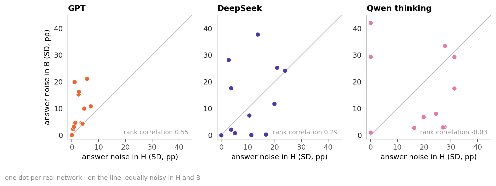
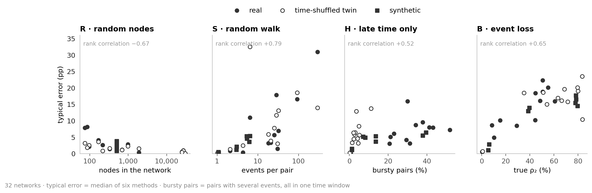
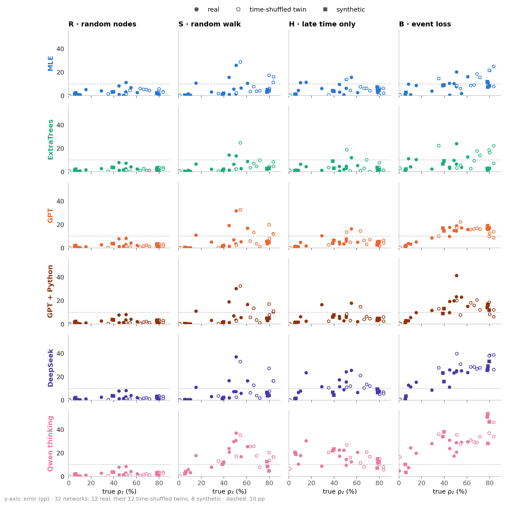

# Persistence under sampling bias

**How does sampling bias affect persistence estimates in temporal graphs—and how do LLMs compare with conventional methods?**

## 0 · The challenge: sampling changes apparent persistence

<details>
<summary>Definitions</summary>

| Term | Meaning |
|---|---|
| Node | Person or account |
| Event | One interaction between two nodes |
| Pair | Two nodes that interact; direction ignored |
| Window | One of 5 equal time intervals |
| **Persistence · ρ₂** | **Share of interacting pairs active in ≥ 2 windows; our main target** |
| Profile · ρ₃ … ρ₅ | Shares active in ≥ 3 … 5 windows |
| Naive share | Persistence counted directly in the sample |
| Error · pp | Percentage points from truth; 40 % vs 50 % → 10 pp |
| Spread · SD | Standard deviation: how much estimates vary |
| Typical error | Median error across six main methods; excludes Qwen no thinking |

</details>

### 0a · One graph, four samples: different shares of returning pairs


| Sampler | What it shows | What can go wrong |
|---|---|---|
| **R · random nodes** | Full histories between sampled nodes | Equal pair inclusion, but samples vary |
| **S · random walk** | Full histories of visited pairs; visit weights | Busy pairs are overrepresented |
| **H · late time** | Sampled nodes; windows 3–5 only | Early returns are hidden |
| **B · event loss** | Each event retained with probability p | Returns—and whole pairs—disappear |

### 0b · Real samples: walks overstate persistence; missing time and events usually understate it


## 1 · Twelve networks: persistence from 0.3 % to 61 %

### 1a · Twelve real networks, ordered by true ρ₂

<!-- table:network_specs -->
| Network | Interactions | Nodes | Pairs | Events | Events/pair | True ρ₂ |
| --- | --- | ---: | ---: | ---: | ---: | ---: |
| Reality Mining | Phone proximity | 96 | 2,539 | 234,757 | 92.5 | 60.7 % |
| Radoslaw | Email | 167 | 3,250 | 82,876 | 25.5 | 55.1 % |
| Malawi | Face-to-face | 86 | 347 | 102,293 | 294.8 | 50.7 % |
| Email EU | Email | 986 | 16,064 | 332,334 | 20.7 | 50.6 % |
| High school | Face-to-face | 327 | 5,818 | 188,508 | 32.4 | 48.6 % |
| Copenhagen | Phone proximity | 692 | 79,530 | 2,426,279 | 30.5 | 44.7 % |
| Hospital | Face-to-face | 75 | 1,139 | 32,424 | 28.5 | 44.5 % |
| Workplace | Face-to-face | 217 | 4,274 | 78,249 | 18.3 | 29.0 % |
| Linux mailing list | Email replies | 26,885 | 159,996 | 1,028,233 | 6.4 | 15.3 % |
| College messages | Messages | 1,899 | 13,838 | 59,835 | 4.3 | 10.3 % |
| MathOverflow | Online replies | 24,759 | 187,986 | 390,441 | 2.1 | 8.4 % |
| Digg replies | Online replies | 30,360 | 85,155 | 86,203 | 1.0 | 0.3 % |
<!-- /table:network_specs -->

### 1b · Activity over time: how many pairs are active in each window, and how often they return


### 1c · 3–20 windows: persistence changes modestly, the ordering even less


- Mean ρ₂ stays within **6 pp** of the five-window value; rank correlation **≥ 0.97**.

## 2 · The comparison: the same sample for every method

| Specification | Setting |
|---|---|
| Coverage | About 10 % of active pair–window cells |
| Samples | 3 seeds per network and sampler |
| LLM answers | 3 independent repeats per sample, each scored on its own ([mean of 3 → 6c](#averaging)) |
| Scoring | Mean absolute error; each network counts equally |
| **LLMs** | GPT (`gpt-6-sol`), GPT + Python, DeepSeek (`deepseek-flash`), Qwen3.6 thinking / no thinking |
| **Statistical estimators** | Naive share; MLE (fits a distribution; no training) |
| **Supervised models** | ExtraTrees (16 other real + 400 synthetic training graphs); training-median baseline |

<details>
<summary>2 detail · Which features does ExtraTrees use?</summary>

### ExtraTrees: 174 input features

| Feature group | Count | Content |
|---|---:|---|
| Time patterns · pairs | 31 | Share of seen pairs per on/off pattern over the 5 windows |
| Time patterns · events | 31 | Share of seen events per pattern |
| Events per window | 5 | Share of seen events in each window |
| Size and density | 4 | Nodes, pairs and events seen (log); events per pair |
| Starting estimate | 4 | Simple ρ₂ … ρ₅: naive share (R), MLE (S, H), thinning model (B) |
| Sampler | 6 | Sampler flags; B's keep rate p |
| Walk weights · S only | 93 | The 31 pattern shares, weighted three ways by walk visits |

- All computed from the text the LLMs see. ExtraTrees learns a correction to the starting estimate.

</details>

### 2a · Example input: Hospital, random nodes

- Sampling rule, sizes and time patterns; S also has weights. No truth, names or node IDs.

```text
Rule: 24 random nodes; all events between them are seen.
Seen: 132 pairs, 3,172 events
pattern (windows 1–5)   pairs   events
0 0 0 0 1                  12       86
0 1 1 1 0                   5      283
1 1 1 0 0                   4      490
…                           …        …
Task: estimate the full graph's ρ₂ … ρ₅.
```

## 3 · Estimation: correction helps in S and B; in H mainly beyond ρ₂

<a id="ranking-real"></a>

### 3a · Mean error: no LLM consistently beats MLE in S/H/B


- GPT is the strongest LLM: it uses the formulas most often ([4a](#formula)) and its answers scatter least ([6b](#answer-noise)).
- **R:** nothing to correct; random nodes cause no selection bias. MLE's model fit costs 1 pp.
- **H:** only ExtraTrees is well below the naive share (3.9 vs 6.4 pp). **Why:** the time cut hides returns, but it also hides whole pairs. The two partly cancel, so the sample is already close.
- **B:** hardest overall. **Why:** only 0.1–10 % of events are kept, so every pair's history has gaps ([per network → 8d](#network-difficulty)).

### 3b · Persistence profile: similar ranking; in H correction pays off beyond ρ₂


- **H:** with three visible windows the naive share must say 0 for ρ₄ and ρ₅; there correction clearly helps. At ρ₃ only GPT gains much.

### 3c · Corrected estimates: H/S tend above truth; B's errors cancel


- **Why:** in H, methods add returns for the hidden windows ([8a](#mle-gpt)); in S, two small networks (Malawi, Hospital) cause most of the excess.
- **B:** DeepSeek's mean error is −2.6 pp, its absolute error **17.2 pp**. A good mean hides large errors.

## 4 · Correction: formulas help where information survives

<a id="formula"></a>

### 4a · R/S: every LLM counts correctly in R; using the weights in S depends on the LLM


- **R:** count returning pairs. **S:** undo the walk's preference for busy pairs with weights.
- **S:** the formula alone gives 8.8 pp (GPT: 8.4). MLE (6.9) reweights before fitting; ExtraTrees (5.0) starts from the MLE.
- **Why Qwen thinking trails (18 pp):** it leaves a third of its S answers unweighted.

<details>
<summary>4a detail · On which networks do the LLMs use the weights?</summary>

### S per network: the LLM matters most, but small networks are harder for all three


- The LLM matters most: GPT uses the weights in 90 % of its answers, DeepSeek in 68 %, Qwen thinking in 20 %.
- The network matters too: all three use them most on the three largest networks (Linux, MathOverflow, Digg) and least on small ones (Workplace, Hospital, Radoslaw).

</details>

### 4b · H/B: how often is the correction within 50–150 % of what is needed? GPT most often among LLMs; MLE stays competitive


- Needed correction = truth − naive share; made = estimate − naive share. Counted: made is 50–150 % of needed. Only samples at least 5 pp off.
- **Why Qwen thinking and DeepSeek trail:** Qwen often makes no correction at all (70 % of its H answers repeat the naive share). DeepSeek corrects, but its answers scatter ([6b](#answer-noise)).

<details>
<summary>4b detail · On which networks is the correction within 50–150 %?</summary>

### H/B per network: how often the correction is within 50–150 % depends on the network


</details>

## 5 · Reasoning: more tokens do not guarantee lower error

### 5a · Tokens and error: B uses the most reasoning

<!-- table:reasoning -->
<table>
<thead>
<tr><th rowspan="2" scope="col">LLM</th><th colspan="4" scope="colgroup">Median reasoning tokens / error (pp)</th></tr>
<tr><th scope="col">R</th><th scope="col">S</th><th scope="col">H</th><th scope="col">B</th></tr>
</thead>
<tbody>
<tr><th scope="row">GPT</th><td>489 / 2.7</td><td>3,051 / 8.4</td><td>4,764 / 5.4</td><td>8,966 / 10.8</td></tr>
<tr><th scope="row">GPT + Python</th><td>309 / 2.7</td><td>2,080 / 8.1</td><td>3,948 / 6.1</td><td>8,998 / 15.1</td></tr>
<tr><th scope="row">DeepSeek</th><td>9,069 / 2.7</td><td>35,483 / 9.0</td><td>50,226 / 13.3</td><td>57,932 / 17.2</td></tr>
<tr><th scope="row">Qwen thinking</th><td>6,068 / 2.7</td><td>9,589 / 18.1</td><td>6,402 / 16.0</td><td>13,173 / 22.0</td></tr>
</tbody>
</table>
<!-- /table:reasoning -->

- DeepSeek uses **6–19×** GPT's reasoning tokens, with no accuracy gain.
- **Likely why:** tokens rise with difficulty (R → B). Long reasoning marks a hard sample; it does not solve it.
- Qwen: all output tokens counted. Without thinking: valid answers, but 25–53 pp error—worse than the constant training median (23 pp).

## 6 · Noise: new samples and repeated answers

### 6a · Noise from 3 sample redraws: highest in S


- **Why S:** a walk keeps revisiting busy pairs; it sees about 40 % fewer different pairs than random nodes.
- **H/B:** MLE's redraw SD is ≈ 1 pp, its error 7–8 pp: mostly bias, not sample noise.

<details>
<summary>6a detail · Which networks generate redraw noise?</summary>

### Redraw noise per network: small networks are the noisy ones, in every sampler


- The fewer pairs a sample holds, the more the estimate changes from draw to draw. This holds in each of the four samplers, weakest in S.

</details>

<a id="answer-noise"></a>

### 6b · Noise from 3 LLM answers to the same sample: H/B dominate


- **Likely why H/B:** R/S have a formula, so repeated answers agree. H/B have none; each answer makes its own assumptions.
- Low spread can still mean consistently wrong estimates.
- ExtraTrees gives one answer per sample; its bar shows 11 retrainings instead. The reported fit is the best of the 11 in S and H (5.0 vs 5.5 pp; 3.9 vs 4.2).

<details>
<summary>6b detail · Which networks generate answer noise?</summary>

### Answer noise per network: no stable pattern; it changes with sampler and LLM



- A stable pattern would put the networks on the line. Instead, the networks that are noisy in H are mostly not the ones that are noisy in B.
- Only GPT shows a trend: more noise on more persistent networks. Digg (ρ₂ ≈ 0): no noise anywhere.


</details>

<a id="averaging"></a>

<details>
<summary>6c · What if the 3 answers are averaged first?</summary>

### Averaging the 3 answers: LLM error drops in H/B, most in B


- Elsewhere each answer is scored on its own. With the mean of 3, B's order stays MLE 7.6, ExtraTrees 7.9, GPT 8.2 pp; DeepSeek and Qwen thinking now beat the naive share (16.4).
- Averaging can never raise this error and costs three answers; its size is the finding.

</details>

## 7 · Python: no consistent accuracy gain

### 7a · GPT with and without Python: in B, error and answer spread both rise


- **B:** worse with Python on **8 of 12** networks. R/S change little.
- **Likely why:** R/S need only arithmetic, which GPT does without Python. In B, GPT uses Python to fit models of its own, and its answers scatter twice as much.
- Twins and synthetic networks: no penalty. Cost: **3.4×**.

<details>
<summary>7a detail · On which networks does Python help or hurt?</summary>

### Python per network: effects vary by network


</details>

## 8 · Individual networks: average difficulty hides exceptions

<a id="mle-gpt"></a>

### 8a · Network or method: the network decides in R/S, the method in H/B


- **R/S:** all methods struggle on the same networks (rank agreement ≈ 0.9).
- **H/B:** agreement drops to ≈ 0.4; the method's assumptions decide.

<details>
<summary>8a detail · On which networks does MLE win, on which GPT, and why?</summary>

### H/B per network: MLE and GPT fail on different networks


- **H:** MLE assumes steady pair activity and adds ≈ 12 pp where ≈ 5 are needed ([twins → 9a](#twins)). That fits where the sample is far off (High school, Reality Mining) and overshoots where it is close (Linux, College messages); there GPT adds only 2–3 pp.
- **B:** GPT wins clearly only on Linux and MathOverflow, where MLE overshoots by 9–10 pp. Elsewhere GPT's answers scatter: Copenhagen 31–80 %, truth 45 %.

</details>

### 8b · Event concentration: fewer effective pairs make every sampler harder, R/S most


- Effective pairs = equally busy pairs with the same event concentration. Malawi: **347 actual, 55 effective**, the hardest network in R, S and B.
- **Why:** with few effective pairs, a sample keeps seeing the same few pairs (a Malawi walk sees ≈ 20).

<a id="hard-networks"></a>

### 8c · What makes a network hard: each sampler has its own answer



- **R:** small networks. Few nodes give a sample with few pairs.
- **S:** many events per pair. The walk follows events and keeps revisiting busy pairs.
- **H:** bursty pairs. They have many events but never return, so they look like returning pairs. The weakest of the four relations.
- **B:** persistent pairs. Their returns must be rebuilt from the few events kept.
- These properties overlap: among the real networks, the small ones are also the dense and persistent ones.

<a id="network-difficulty"></a>

### 8d · Per-network error: B is hardest often, not always


- Hardest sampler: **B on 6 networks · S on 4 · H on 2**.

## 9 · Controlled tests: do methods use timing and memory?

<a id="twins"></a>

### 9a · Twins: timing sensitivity in LLMs—except Qwen no thinking

| Kept | Changed | Test |
|---|---|---|
| Nodes, pairs, events per pair, global event times | Times reassigned to pairs: bursts dissolve, mean ρ₂ **+27 pp** | Timing sensitivity beyond node/pair/event totals |


- **R/S/H:** the naive share itself rises by 18–28 pp, so following it proves little.
- **B:** the cleaner test: naive +11, MLE +17, GPT +24 of +27 pp.
- **H:** MLE adds ≈ 11 pp on twins and ≈ 12 on real networks; twins need ≈ 9, real networks ≈ 5. So it fits the twins: 4.9 pp vs naive 9.4.

<details>
<summary>9a detail · Which methods estimate persistence best on twins?</summary>

### Twins: mean error by method and sampler


- vs [real networks (3a)](#ranking-real): R/S unchanged. **H:** MLE moves ahead of the naive share. **B:** all errors rise; ExtraTrees, GPT (with or without Python) and MLE stay ahead, within 1.5 pp.

</details>

### 9b · Synthetic networks: two memory rules with real-world motivations

| Generator | Real-world motivation | Memory rule tested here |
|---|---|---|
| **DAR · link states** | Transport/contact links and diffusion ([Williams et al.](https://arxiv.org/abs/1909.08134)) | 80 % copy previous ON **or OFF**; otherwise redraw |
| **Activity-driven · partners** | Mobile calls and information spreading ([Karsai et al.](https://www.nature.com/articles/srep04001)); original model: epidemics ([Perra et al.](https://arxiv.org/abs/1203.5351)) | Known partner with probability **n/(n+1)**; n = partners known |

- Per generator: 2 networks without and 2 with memory, same size (**500 nodes, ≈ 10k events**) and same random numbers: only the memory rule differs.
- DAR only switches links ON or OFF; we add event counts. The animations show tiny examples, not the tested networks.

#### DAR: copying the last state makes links persist

- **Copy:** ON stays ON, OFF stays OFF. **New draw:** choose ON (20 %) or OFF again.


#### Activity-driven: remembered partners make contacts return

- Active nodes make one contact, lasting one round. With 3 known partners: **75 % known, 25 % new**.


### 9c · Memory: similar event counts, much more persistence


### 9d · Memory raises event-loss error—mostly where persistence starts low


- Activity-driven: ρ₂ 6 → 79 %, B error 2 → 16 pp. DAR: 39 → 78 %, 13 → 16 pp.
- Two paired instances per generator: a mechanism check, not a broad synthetic benchmark.

<details>
<summary>9d detail · Which methods estimate persistence best on synthetic networks?</summary>

### Synthetic networks: mean error by method and sampler


- vs [real networks (3a)](#ranking-real): same leaders (ExtraTrees, MLE, GPT). **H:** all three, and DeepSeek, now beat the naive share (9.5 pp). **B:** ExtraTrees clearly first (3.6 vs MLE 7.5 pp); it was trained on graphs from the same two generators.
- **Why S and H are easier than on real networks:** synthetic networks have few events per pair (median 4 vs 23) and few bursty pairs (11 % vs 31 %), the two properties that make S and H hard ([8c](#hard-networks)).

</details>

### 9e · All 32 networks: every method in every sampler



- **R:** easy for every method on real, twin and synthetic networks alike.
- **S:** synthetic networks are easy for all methods (few events per pair). Real and twin networks with busy pairs are hard for all.
- **H:** twins and synthetic networks are easier for MLE (4.9 and 3.7 vs 7.1 pp): they have few bursty pairs, as MLE assumes. Qwen thinking stays high everywhere.
- **B:** error rises with ρ₂. Above 30 %, ExtraTrees stays below 10 pp on 16 of 24 networks, MLE on 12, GPT on 4, DeepSeek and Qwen thinking on none.
- **B:** twins are hardest (ρ₂ +27 pp with the same events). Synthetic networks are easy only for ExtraTrees, which was trained on the same generators.

## 10 · Key findings

**How does sampling bias affect persistence estimates?**

1. **It depends on what the sampler hides.** Random nodes: no bias. Walks overstate persistence (+28 pp). Missing time and missing events understate it (−5 and −16 pp).
2. **What is hidden decides how well it can be corrected.** Walk weights are known, so a formula removes most of the bias (30 → 5–9 pp). Hidden time and lost events must be modelled; 4–8 pp remain even for the best method.
3. **The network matters as much as the method**, and each sampler has its own hard networks: small ones (R), busy pairs (S), bursty pairs (H), persistent pairs (B).

**How do LLMs compare with conventional methods?**

4. **Where a formula exists (R, S), the best LLM uses it** and comes close to the conventional methods (S: GPT 8.4, MLE 6.9, ExtraTrees 5.0 pp).
5. **Where none exists (H, B), LLMs fall behind.** Their answers scatter; more reasoning or Python does not help. No LLM consistently beats MLE or ExtraTrees; GPT comes closest.
6. **In short:** today's LLMs calculate well, but do not yet replace a statistical model when information is missing.

<details>
<summary>Evidence behind the why-statements</summary>

| Statement | Evidence | Data |
|---|---|---|
| 3a · GPT is the strongest LLM | Uses the formula in 100 % (R) and 90 % (S) of answers; lowest answer SD of all LLMs (H 1.7, B 5.1 pp) | [answer_types.csv](data/answer_types.csv), [VARIABILITY.md](../results/final/VARIABILITY.md) |
| 3a · H: hidden returns and hidden pairs partly cancel | 51 % of returning pairs look non-returning; 40 % of all pairs are hidden; the naive share ends only 5 pp too low | [HISTORY.md](../results/final/HISTORY.md) |
| 3a · B is hardest | Keep rate p: 0.1 % (Malawi) to 9.9 % (Digg) | [network_features.csv](data/network_features.csv) |
| 3b · H beyond ρ₂ | ρ₄: naive 10.3, training median 8.7, MLE 3.7, ExtraTrees 2.7, GPT 2.6 pp. ρ₃: naive 6.7, GPT 3.3 | [PREDICTIONS.csv](../results/final/PREDICTIONS.csv) |
| 3c · S ends above truth | Signed error of the six methods: Malawi +14 to +37 pp, Hospital +14 to +24 (a walk sees ≈ 20 and ≈ 80 pairs). Without the two, the mean is −0.5 to +1.0 pp (Qwen thinking: +11) | [PER_SOURCE.csv](../results/final/PER_SOURCE.csv), [WALK.md](../results/final/WALK.md) |
| 4a detail · Small networks are harder | Share of S answers using the weights vs pairs in the network, Spearman: GPT 0.71, DeepSeek 0.53, Qwen thinking 0.51 | [relations.csv](data/relations.csv) |
| 4a · Qwen thinking in S | 34 % of its S answers equal the naive share (34 pp off); its other answers: 9 pp | [answer_types.csv](data/answer_types.csv) |
| 4b · Qwen thinking, DeepSeek in H/B | Qwen repeats the naive share in 70 % (H) and 35 % (B) of answers; its other H answers are 39 pp off. DeepSeek answer SD: 10–12 pp | [answer_types.csv](data/answer_types.csv), [VARIABILITY.md](../results/final/VARIABILITY.md) |
| 5a · Tokens follow difficulty | Median tokens rise from R to B in every LLM (table in 5a) | [under_the_hood.csv](data/under_the_hood.csv) |
| 6a · S is the noisiest sample | 17–89 % of walk steps revisit a pair; a walk sees 40 % fewer pairs than random nodes (median) | [WALK.md](../results/final/WALK.md), [relations.csv](data/relations.csv) |
| 6a detail · Small networks are noisy | Redraw SD vs pairs in the sample, Spearman: R −0.67, S −0.55, H −0.83, B −0.90 | [relations.csv](data/relations.csv) |
| 6b detail · No stable pattern | Same networks noisy in H and B? Spearman: GPT 0.55, DeepSeek 0.29, Qwen thinking −0.03. GPT's noise vs ρ₂: 0.73 (H), 0.66 (B) | [relations.csv](data/relations.csv) |
| 7a · Python | 8.3 code runs per B answer (R: 0.9); 92 % of B answers call a numerical optimiser; answer SD 5.1 → 12.2 pp; averaged over 3 answers the penalty shrinks from 4.4 to 2.4 pp; cost USD 94.50 vs 27.59 | [under_the_hood.csv](data/under_the_hood.csv), [answer_averaging.csv](data/answer_averaging.csv) |
| 8a · Network in R/S, method in H/B | Mean rank agreement of the six methods: R 0.93, S 0.89, H 0.42, B 0.38 | [relations.csv](data/relations.csv) |
| 8a detail · MLE in H | MLE adds 12.1 pp, needed 5.3 (twins: 10.8 vs 9.3) | [SUMMARY.csv](../results/final/SUMMARY.csv) |
| 8b · Effective pairs | Typical error vs effective pairs, Spearman: R −0.87, S −0.81, H −0.57, B −0.61 | [relations.csv](data/relations.csv) |
| 8c · Each sampler has its own hard networks | Typical error vs property, Spearman on all 32 networks: nodes (R) −0.67, events per pair (S) +0.79, bursty pairs (H) +0.52, true ρ₂ (B) +0.65. Same sign within real, twin and synthetic networks (R: all synthetic networks have 500 nodes) | [relations.csv](data/relations.csv) |
| 8c · Properties overlap | Real networks: true ρ₂ vs keep rate p, Spearman −0.76 | [relations.csv](data/relations.csv) |
| 9d detail · Synthetic networks are easier in S and H | Median events per pair: 4 (synthetic) vs 23 (real); bursty pairs: 11 % vs 31 % (twins: 3 %) | [relations.csv](data/relations.csv) |
| 9e · B at high persistence | Networks with ρ₂ > 30 % (24) and B error below 10 pp: ExtraTrees 16, MLE 12, GPT + Python 5, GPT 4, DeepSeek 0, Qwen thinking 0. Twins: median ρ₂ 68 % vs 45 % (real) | [relations.csv](data/relations.csv) |

</details>

<details>
<summary>Sources and all numbers</summary>

- Design, method settings and literature: [DESIGN.md](../DESIGN.md).
- Scores: [MAIN_RESULTS.md](../results/final/MAIN_RESULTS.md), [all network/method errors](figures/fig_networks_detail.png), [PREDICTIONS.csv](../results/final/PREDICTIONS.csv), [between-network error SDs](data/performance_spread.csv), [method-vs-method counts and sign-flip tests (descriptive)](data/paired_comparisons.csv).
- Noise: [VARIABILITY.md](../results/final/VARIABILITY.md), [per-network SDs and persistence profile](data/noise_by_network.csv), [estimated variance components](data/noise_components.csv), [averaged answers](data/answer_averaging.csv).
- Correction: [mean residuals and absolute errors](data/correction_reliability.csv), [time cut in H](../results/final/HISTORY.md).
- LLMs: [reasoning tokens and Python code runs](data/under_the_hood.csv), [answers matching a formula](data/answer_types.csv).
- Controls: [twin activity](figures/fig10b_twin_active.png), [twin errors](figures/fig10c_twin_error.png), [Python on controls](figures/fig6c_python_groups.png), [higher persistence levels](figures/fig9b_levels.png), [twin features](data/twin_features.csv).
- Robustness: [window sensitivity](../results/final/W_SENSITIVITY.md), [walk settings](../results/final/WALK.md).
- Redraw: `python scripts/analysis_figures.py`; `--inputs` rebuilds input summaries from locally stored raw data. Frozen results are unchanged.

</details>
