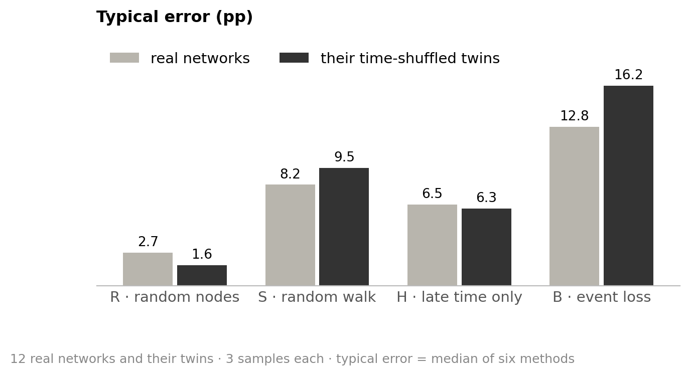

# Estimating persistence from a sample

**Can a language model recover how often connections return, when sampling changes what we see?**

## 0 · The challenge: the same network looks different in each sample

A **node** is a person or account; an **event** is one interaction; a **pair** is two nodes that interact. We divide time into **5 equal windows**. **Persistence (ρ₂)** is the share of pairs active in at least 2 windows. The **naive share** counts this in the sample. Errors use **percentage points (pp)**.

### One network, four different views


**The task:** recover the full network's persistence from the sample and its sampling rule. A missing interaction may hide a returning pair.

### The distortion also appears in the 12 real networks


Random nodes (R) include every pair with equal probability, but individual samples still vary. The walk (S) favours busy pairs. Late time (H) hides early windows. Event loss (B) removes interactions.

<details>
<summary>Definitions used throughout</summary>

- **ρ₂ … ρ₅:** share of all interacting pairs active in ≥ 2 … 5 windows. A pair with many events in one window still has only one active window.
- **Error:** absolute distance to truth, in percentage points (pp); 40 % instead of 50 % is 10 pp. We average within each network, then across networks; every network counts equally.
- **Mean error with sign:** retains over- and underestimates, which can cancel.
- **Typical error:** median error of MLE, ExtraTrees, GPT, GPT + Python, DeepSeek and Qwen thinking. It describes their shared difficulty; individual methods can differ.
- **Spread (SD):** standard deviation; how much estimates vary. Low spread does not mean low error.
- **Effective pairs:** number of equally busy pairs that would carry the observed event concentration: 1 / Σ(events of pair / all events)². Fewer means events are concentrated on fewer connections.

</details>

## 1 · What the networks look like

### When connections return


Networks differ in both persistence and timing. Malawi and Email EU both have ρ₂ ≈ 51 %, but 28 % versus 16 % of pairs return in 4–5 windows. College messages and Reality Mining fade out; Workplace has no events in window 3.

<details>
<summary>All 12 networks: size, persistence and sampling-relevant features</summary>

### Size and interactions

Counts describe the cleaned, undirected networks used here.

<!-- table:network_specs -->
| Network | Interactions | Nodes | Pairs | Events | Events/pair |
| --- | ---: | ---: | ---: | ---: | ---: |
| Reality Mining | Phone proximity | 96 | 2,539 | 234,757 | 92.5 |
| Radoslaw | Email | 167 | 3,250 | 82,876 | 25.5 |
| Malawi | Face-to-face | 86 | 347 | 102,293 | 294.8 |
| Email EU | Email | 986 | 16,064 | 332,334 | 20.7 |
| High school | Face-to-face | 327 | 5,818 | 188,508 | 32.4 |
| Copenhagen | Phone proximity | 692 | 79,530 | 2,426,279 | 30.5 |
| Hospital | Face-to-face | 75 | 1,139 | 32,424 | 28.5 |
| Workplace | Face-to-face | 217 | 4,274 | 78,249 | 18.3 |
| Linux mailing list | Email replies | 26,885 | 159,996 | 1,028,233 | 6.4 |
| College messages | Messages | 1,899 | 13,838 | 59,835 | 4.3 |
| MathOverflow | Online replies | 24,759 | 187,986 | 390,441 | 2.1 |
| Digg replies | Online replies | 30,360 | 85,155 | 86,203 | 1.0 |
<!-- /table:network_specs -->

### Persistence and event concentration

Early-only pairs interact only in windows 1–2, which H hides. Effective pairs measure concentration, not a second count of actual pairs.

<!-- table:network_profiles -->
| Network | True ρ₂ | True ρ₃ | True ρ₄ | True ρ₅ | Effective pairs | Early-only pairs |
| --- | ---: | ---: | ---: | ---: | ---: | ---: |
| Reality Mining | 60.7 % | 28.5 % | 14.8 % | 7.6 % | 228 | 57.9 % |
| Radoslaw | 55.1 % | 37.6 % | 28.5 % | 19.7 % | 282 | 37.3 % |
| Malawi | 50.7 % | 34.9 % | 28.2 % | 23.1 % | 55 | 36.0 % |
| Email EU | 50.6 % | 29.8 % | 15.9 % | 3.8 % | 1,051 | 32.0 % |
| High school | 48.6 % | 26.7 % | 12.8 % | 5.2 % | 365 | 26.1 % |
| Copenhagen | 44.7 % | 22.1 % | 10.7 % | 4.2 % | 4,590 | 18.9 % |
| Hospital | 44.5 % | 16.4 % | 4.6 % | 1.4 % | 168 | 25.9 % |
| Workplace | 29.0 % | 11.9 % | 4.6 % | 0.0 % | 439 | 45.8 % |
| Linux mailing list | 15.3 % | 5.1 % | 2.0 % | 0.7 % | 8,589 | 41.4 % |
| College messages | 10.3 % | 1.3 % | 0.3 % | 0.0 % | 3,162 | 84.8 % |
| MathOverflow | 8.4 % | 1.9 % | 0.5 % | 0.1 % | 57,996 | 44.7 % |
| Digg replies | 0.3 % | 0.0 % | 0.0 % | 0.0 % | 82,901 | 30.4 % |
<!-- /table:network_profiles -->

</details>

<details>
<summary>Does the number of windows matter?</summary>

### Persistence for other time resolutions


More windows raise mean ρ₂ (30 % with 3, 35 % with 5, 41 % with 20). The networks keep nearly the same order: rank correlation with 5 windows ≥ 0.97 from 3 windows on. Method performance below uses **5 windows**.

</details>

## 2 · The comparison: the same information for every method

Each arm is tuned to see about **10 % of active pair–window cells**, with **3 samples per network**. Each language model answers each sample **3 times**. All methods receive the same aggregated table and sampling rule; truth is withheld.

| Sampler | What is visible |
|---|---|
| R · random nodes | all interactions between sampled nodes |
| S · random walk | full histories of visited pairs; visits and inverse-event weights |
| H · late time only | sampled nodes, windows 3–5 only |
| B · event loss | independently retained events; retention probability p |

<details>
<summary>The methods</summary>

| Method | What it does |
|---|---|
| Naive share | treats the sample as the full network |
| Training median | always gives the same training-based guess |
| MLE | fits a statistical model of pair activity and sampling; no training |
| ExtraTrees | learns a correction from 16 other real and 400 synthetic training networks |
| GPT | `gpt-6-sol`, high reasoning effort |
| GPT + Python | the same model, with up to 10 hosted Python calls |
| DeepSeek | `deepseek-flash`, high reasoning effort |
| Qwen thinking / no thinking | `Qwen3.6-35B-A3B`, local; temperature 1.0 / 0.7 |

ExtraTrees has additional training information. Its test network and twin are excluded from training and tuning. Results use one fixed fit; 10 additional fits measure training variation. Invalid language-model answers are excluded, without retries or repairs.

</details>

<details>
<summary>One input: Hospital, random nodes</summary>

```text
Sampling rule: 24 random nodes; all events between them are seen.
Seen: 132 pairs, 3,172 events

pattern (windows 1–5)   pairs   events
0 0 0 0 1                  12       86
0 1 1 1 0                   5      283
1 1 1 0 0                   4      490
…                           …        …

Task: estimate ρ₂ … ρ₅ of the full network.
```

1 means active in that window. The sample's naive share is 56 / 132 = 42 %; hidden truth is 45 %. The input contains sizes and pattern counts, **no node IDs or network name**.

</details>

## 3 · Correction helps, but the sampler and network both matter

### 3a · Mean error: no language model consistently beats MLE


Correction helps clearly in S and B, partly in H. S, H and B remain harder than R even for their best method (5.0, 3.9 and 7.6 versus 2.7 pp). GPT is the best language model overall. Qwen no thinking often answers 85–95 % almost regardless of the input.

### 3b · Error across the persistence profile


In H, MLE is worse than the naive share at ρ₂ (7.1 versus 6.4 pp), but better across the whole profile (4.4 versus 7.2 pp). The visible three windows cannot directly reveal ρ₄ or ρ₅.

### 3c · A good average correction can hide unreliable estimates


**Dot near zero:** the mean correction is right. **Wide line:** individual estimates are still far off. In B, DeepSeek's mean is only 2.6 pp below truth, but its mean absolute error is 17.2 pp. Opposite errors cancel; B remains hard.

<details>
<summary>Mean estimates of the whole profile: the same cancellation can occur</summary>

### Mean persistence versus truth


MLE, GPT and DeepSeek recover much of the mean profile, including hidden levels in H. This is an average across different networks, not evidence that each network is recovered.

</details>

<details>
<summary>Three independent samples: stable MLE estimates can still miss the truth</summary>

### MLE estimates per network and sampler


Many estimates cluster away from truth. A new sample does not remove a systematic error. Variation is larger on small networks and, under S, on Linux, Reality Mining and High school. Section 6 compares both sources of variation for every method.

</details>

### 3d · A sampler's mean difficulty hides differences between networks


In R and S, MLE and GPT tend to struggle on the same networks. In H and B, the better method depends on the network. No sampler is hardest everywhere: B on 6 networks, S on 4, H on 2.

<details>
<summary>Every network: difficulty across R, S, H and B</summary>

### Typical error per network


Digg is easy everywhere. Malawi is hard in S and B. Copenhagen is mainly hard in B. In H, College messages loses 85 % of its pairs, although its naive share is only 2 pp too high: losing entire pairs and losing active windows can offset each other.

</details>

<details>
<summary>Why does MLE sometimes beat GPT, and sometimes lose?</summary>

### Different corrections win on different networks


| Sampler | What the estimates show | Plausible explanation |
|---|---|---|
| H · College messages | naive 12 %, MLE 21 %, GPT 15 %; truth 10 % | MLE extrapolates late activity to early time; 85 % of pairs are actually early-only |
| H · High school | naive 37 %; MLE and GPT ≈ 49 %; truth 49 % | both correct the mean; MLE's individual estimates stay closer |
| B · MathOverflow | GPT error 3.7 pp, MLE 9.7 pp | MLE adds too much persistence here |
| B · Copenhagen | MLE error 0.5 pp, GPT 17.5 pp | MLE corrects closely; GPT often overshoots |

MLE assumes each pair's activity probability stays the same across windows. In B, it also assumes a common distribution of event counts in active windows. Real timing and event heterogeneity can violate these assumptions. These are **possible mechanisms**, not a proven explanation of GPT's choices; GPT's reasoning trace is unavailable.

</details>

<details>
<summary>Correction is most useful when the naive sample is far off</summary>

### Improvement relative to the naive share

When the naive share is off by ≥ 10 pp, MLE, ExtraTrees and GPT improve 21 of 22 network–sampler cases. Below 5 pp, each improves at most 1 of 18. This check uses known truth; the naive error is unknown on a new network.

</details>

<details>
<summary>Event concentration explains R and S better than event count</summary>

### More events do not consistently make estimation easier


### Fewer pairs carrying the events make R and S harder


Malawi's 102k events concentrate on effectively 55 of its 347 pairs. Across these 12 networks, R and S get easier as more pairs carry the events; H and B show a weaker relationship. This is an association, not a causal test.

</details>

## 4 · Answers often match a simple formula

### 4a · Matching the naive share or walk reweighting


The formula is the naive share in R; in S, each walk visit counts **1 / events of that pair**. Matching means within 0.5 pp. GPT's S error is close to the formula's own (8.4 versus 8.8 pp): a correct calculation still has sampling error.

<details>
<summary>4b · Formula-based correction: matches on each network</summary>

### Estimates matching the walk reweighting, per network


GPT matches frequently on every network except Malawi (44 %). DeepSeek does so on some networks, Qwen thinking on few. MLE fits a model to the weighted counts; it need not equal the direct weighted share.

</details>

## 5 · Hidden windows and lost events require assumptions

### 5a · How often is the correction about right?


“About right” means **50–150 % of the needed correction**, on samples whose naive error is ≥ 5 pp. It does not mean low final error. GPT is the best language model; in B, MLE falls in this band more often (76 %).

<details>
<summary>5b · Correction performance on individual networks</summary>

### Corrections within the target band, H and B together


Methods miss different networks. Blank entries mean no eligible samples, not zero successful corrections; small counts make these percentages coarse.

</details>

### 5c · More reasoning does not guarantee better estimates

DeepSeek uses 6–19 times as many reasoning tokens as GPT and is more accurate in no arm. All models use the most tokens under event loss.

<details>
<summary>5d · Reasoning length and estimation error</summary>

### Tokens and error by method and sampler

<!-- table:reasoning -->
| Method | Sampler | Median reasoning tokens | Error (pp) |
| --- | ---: | ---: | ---: |
| GPT | R | 488 | 2.7 |
| GPT | S | 3,051 | 8.4 |
| GPT | H | 4,764 | 5.4 |
| GPT | B | 8,966 | 10.8 |
| GPT + Python | R | 308 | 2.7 |
| GPT + Python | S | 2,080 | 8.1 |
| GPT + Python | H | 3,948 | 6.1 |
| GPT + Python | B | 8,998 | 15.1 |
| DeepSeek | R | 9,069 | 2.7 |
| DeepSeek | S | 35,482 | 9.0 |
| DeepSeek | H | 50,226 | 13.3 |
| DeepSeek | B | 57,932 | 17.2 |
| Qwen thinking | R | 6,068 | 2.7 |
| Qwen thinking | S | 9,588 | 18.1 |
| Qwen thinking | H | 6,402 | 16.0 |
| Qwen thinking | B | 13,173 | 22.0 |
<!-- /table:reasoning -->

Qwen counts include the final answer (about 55 tokens); API models report reasoning tokens. GPT exposes no reasoning trace. “Guess” appears in DeepSeek's reasoning in 82 % of H and 58 % of B answers; in Qwen's, 40 % and 54 %. This describes their text, not the cause of an error.

</details>

## 6 · Where variation comes from

A new sample changes the **data**. Asking again changes the **answer**. Training ExtraTrees again changes the **fitted model**. These are different experiments.

### 6a · New samples first, repeated answers second


**Hollow dot:** SD between 3 samples, using each sample's mean answer. **Filled dot:** SD of 3 answers to identical input. In H and B, repeated answers vary most for DeepSeek and Qwen. MLE and fixed-fit ExtraTrees repeat exactly, but can still be wrong.

For language models, the hollow dot still includes answer noise: averaging 3 answers reduces it, but cannot remove it. It therefore measures sensitivity to a new sample **plus remaining answer noise**.

<details>
<summary>6b · Same sample: answer spread per network and sampler</summary>

### Spread of three answers (SD, pp)

Each cell is the median SD over that network's samples. The last column averages R, S, H and B equally. MLE and ExtraTrees use a fixed estimator, so their answer spread is 0. † means only 2 samples have all 3 valid answers.

<!-- table:answer_spread -->
#### MLE and ExtraTrees: all 12 networks

| Method | R | S | H | B | Mean of R/S/H/B |
| --- | ---: | ---: | ---: | ---: | ---: |
| MLE | 0.0 | 0.0 | 0.0 | 0.0 | 0.0 |
| ExtraTrees | 0.0 | 0.0 | 0.0 | 0.0 | 0.0 |

#### GPT

| Network | True ρ₂ | R | S | H | B | Mean of R/S/H/B |
| --- | ---: | ---: | ---: | ---: | ---: | ---: |
| Reality Mining | 60.7 % | 0.0 | 0.0 | 4.0 | 4.4 | 2.1 |
| Radoslaw | 55.1 % | 0.0 | 0.0 | 2.6 | 16.3 | 4.7 |
| Malawi | 50.7 % | 0.0 | 2.2 | 7.0 | 10.8 | 5.0 |
| Email EU | 50.6 % | 0.0 | 0.0 | 5.7 | 21.1 | 6.7 |
| High school | 48.6 % | 0.0 | 0.0 | 1.0 | 19.9 | 5.2 |
| Copenhagen | 44.7 % | 0.0 | 0.1 | 2.5 | 15.3 | 4.5 |
| Hospital | 44.5 % | 0.0 | 0.0 | 4.6 | 10.0 | 3.7 |
| Workplace | 29.0 % | 0.0 | 0.1 | 3.6 | 4.7 | 2.1 |
| Linux mailing list | 15.3 % | 0.0 | 0.0 | 1.3 | 4.7 | 1.5 |
| College messages | 10.3 % | 0.0 | 0.1 | 0.7 | 3.1 | 1.0 |
| MathOverflow | 8.4 % | 0.0 | 0.0 | 0.5 | 2.3 | 0.7 |
| Digg replies | 0.3 % | 0.0 | 0.1 | 0.0 | 0.1 | 0.0 |

#### GPT + Python

| Network | True ρ₂ | R | S | H | B | Mean of R/S/H/B |
| --- | ---: | ---: | ---: | ---: | ---: | ---: |
| Reality Mining | 60.7 % | 0.0 | 0.0 | 2.1 | 14.4 | 4.1 |
| Radoslaw | 55.1 % | 0.0 | 0.0 | 1.0 | 27.4 | 7.1 |
| Malawi | 50.7 % | 0.0 | 12.6 | 5.3 | 3.4 | 5.3 |
| Email EU | 50.6 % | 0.0 | 0.0 | 6.1 | 11.5 | 4.4 |
| High school | 48.6 % | 0.0 | 0.0 | 0.6 | 21.9 | 5.6 |
| Copenhagen | 44.7 % | 0.0 | 0.0 | 2.6 | 16.0 | 4.7 |
| Hospital | 44.5 % | 0.0 | 0.0 | 3.2 | 5.6 | 2.2 |
| Workplace | 29.0 % | 0.0 | 0.0 | 16.0 | 17.5 | 8.4 |
| Linux mailing list | 15.3 % | 0.0 | 0.0 | 1.0 | 11.5 | 3.1 |
| College messages | 10.3 % | 0.0 | 0.1 | 2.6 | 4.7 | 1.9 |
| MathOverflow | 8.4 % | 0.0 | 0.0 | 1.0 | 2.1 | 0.8 |
| Digg replies | 0.3 % | 0.0 | 0.0 | 0.0 | 0.3 | 0.1 |

#### DeepSeek

| Network | True ρ₂ | R | S | H | B | Mean of R/S/H/B |
| --- | ---: | ---: | ---: | ---: | ---: | ---: |
| Reality Mining | 60.7 % | 0.0 | 1.1† | 3.7 | 17.6 | 5.6 |
| Radoslaw | 55.1 % | 0.0 | 1.8 | 2.8 | 28.1 | 8.2 |
| Malawi | 50.7 % | 0.0 | 0.0 | 20.8 | 25.3 | 11.5 |
| Email EU | 50.6 % | 0.0 | 0.0 | 23.8 | 24.2 | 12.0 |
| High school | 48.6 % | 0.0 | 2.0 | 10.5 | 7.4 | 5.0 |
| Copenhagen | 44.7 % | 0.0 | 0.9 | 13.7 | 37.7 | 13.1 |
| Hospital | 44.5 % | 0.0 | 0.9 | 11.3 | 0.1 | 3.1 |
| Workplace | 29.0 % | 0.0 | 1.3 | 16.7 | 0.3 | 4.6 |
| Linux mailing list | 15.3 % | 0.0 | 0.0 | 19.9 | 11.7 | 7.9 |
| College messages | 10.3 % | 0.0 | 0.4 | 5.1 | 0.8 | 1.6 |
| MathOverflow | 8.4 % | 0.0 | 1.0 | 3.7 | 2.1 | 1.7 |
| Digg replies | 0.3 % | 0.0 | 0.1 | 0.0 | 0.0 | 0.0 |

#### Qwen thinking

| Network | True ρ₂ | R | S | H | B | Mean of R/S/H/B |
| --- | ---: | ---: | ---: | ---: | ---: | ---: |
| Reality Mining | 60.7 % | 0.0 | 11.6 | 24.4 | 8.0 | 11.0 |
| Radoslaw | 55.1 % | 0.0 | 24.0 | 19.8 | 6.8 | 12.6 |
| Malawi | 50.7 % | 2.5 | 0.0 | 0.0 | 29.4 | 8.0 |
| Email EU | 50.6 % | 0.0 | 23.2 | 0.0 | 42.1 | 16.3 |
| High school | 48.6 % | 0.0 | 26.4 | 27.0 | 3.0 | 14.1 |
| Copenhagen | 44.7 % | 0.0 | 0.0 | 27.5 | 3.2 | 7.7 |
| Hospital | 44.5 % | 0.0 | 11.7 | 27.8 | 33.5 | 18.2 |
| Workplace | 29.0 % | 0.0 | 0.5 | 0.0 | 41.9 | 10.6 |
| Linux mailing list | 15.3 % | 0.0 | 0.0 | 31.2 | 17.5 | 12.2 |
| College messages | 10.3 % | 0.0 | 4.2 | 31.2 | 29.2 | 16.2 |
| MathOverflow | 8.4 % | 0.0 | 6.9 | 16.3 | 2.7 | 6.5 |
| Digg replies | 0.3 % | 0.0 | 0.2 | 0.0 | 1.0 | 0.3 |

#### Qwen no thinking

| Network | True ρ₂ | R | S | H | B | Mean of R/S/H/B |
| --- | ---: | ---: | ---: | ---: | ---: | ---: |
| Reality Mining | 60.7 % | 7.8 | 8.0 | 20.6 | 8.6 | 11.2 |
| Radoslaw | 55.1 % | 7.8 | 7.8 | 13.2 | 12.4 | 10.3 |
| Malawi | 50.7 % | 24.6 | 25.8† | 42.5 | 5.2 | 24.5 |
| Email EU | 50.6 % | 7.2 | 2.0 | 12.4 | 3.7 | 6.3 |
| High school | 48.6 % | 3.3 | 7.0 | 17.0 | 4.6 | 8.0 |
| Copenhagen | 44.7 % | 0.8 | 0.8 | 26.9 | 6.0 | 8.6 |
| Hospital | 44.5 % | 5.9 | 5.5 | 18.5 | 3.0 | 8.2 |
| Workplace | 29.0 % | 8.9 | 15.3 | 53.1 | 28.4 | 26.4 |
| Linux mailing list | 15.3 % | 5.5 | 1.5 | 16.5 | 3.1 | 6.7 |
| College messages | 10.3 % | 20.0 | 3.8 | 10.8 | 34.0 | 17.1 |
| MathOverflow | 8.4 % | 18.6 | 9.6 | 9.6 | 8.2 | 11.5 |
| Digg replies | 0.3 % | 10.4 | 21.3 | 0.0 | 45.9 | 19.4 |
<!-- /table:answer_spread -->

</details>

<details>
<summary>New sample: spread per network and sampler</summary>

### Spread between the three sample means (SD, pp)

Language-model cells include remaining answer noise. The last column averages the four arms equally; it is not an SD pooled across arms.

<!-- table:sample_spread -->
#### MLE

| Network | True ρ₂ | R | S | H | B | Mean of R/S/H/B |
| --- | ---: | ---: | ---: | ---: | ---: | ---: |
| Reality Mining | 60.7 % | 2.5 | 11.1 | 3.5 | 1.4 | 4.6 |
| Radoslaw | 55.1 % | 1.7 | 4.4 | 1.4 | 2.9 | 2.6 |
| Malawi | 50.7 % | 11.6 | 8.1 | 4.1 | 7.4 | 7.8 |
| Email EU | 50.6 % | 2.9 | 2.3 | 2.0 | 0.5 | 1.9 |
| High school | 48.6 % | 0.4 | 8.2 | 1.1 | 1.1 | 2.7 |
| Copenhagen | 44.7 % | 1.0 | 0.4 | 0.6 | 0.3 | 0.6 |
| Hospital | 44.5 % | 12.0 | 8.6 | 5.4 | 6.4 | 8.1 |
| Workplace | 29.0 % | 2.0 | 3.1 | 2.4 | 0.8 | 2.1 |
| Linux mailing list | 15.3 % | 1.5 | 9.7 | 0.8 | 0.3 | 3.1 |
| College messages | 10.3 % | 0.3 | 0.4 | 1.3 | 1.0 | 0.8 |
| MathOverflow | 8.4 % | 0.8 | 0.0 | 1.1 | 0.5 | 0.6 |
| Digg replies | 0.3 % | 0.1 | 0.1 | 0.0 | 0.2 | 0.1 |

#### ExtraTrees

| Network | True ρ₂ | R | S | H | B | Mean of R/S/H/B |
| --- | ---: | ---: | ---: | ---: | ---: | ---: |
| Reality Mining | 60.7 % | 2.5 | 10.0 | 2.7 | 1.1 | 4.1 |
| Radoslaw | 55.1 % | 2.0 | 3.8 | 0.5 | 3.9 | 2.6 |
| Malawi | 50.7 % | 8.6 | 2.4 | 3.3 | 4.8 | 4.8 |
| Email EU | 50.6 % | 2.8 | 2.0 | 1.1 | 0.6 | 1.6 |
| High school | 48.6 % | 0.4 | 7.9 | 1.0 | 0.9 | 2.6 |
| Copenhagen | 44.7 % | 1.5 | 0.4 | 0.6 | 0.2 | 0.7 |
| Hospital | 44.5 % | 10.6 | 6.9 | 2.4 | 6.2 | 6.5 |
| Workplace | 29.0 % | 3.4 | 2.5 | 1.8 | 0.7 | 2.1 |
| Linux mailing list | 15.3 % | 1.0 | 9.7 | 0.6 | 0.3 | 2.9 |
| College messages | 10.3 % | 0.2 | 0.5 | 0.8 | 0.8 | 0.6 |
| MathOverflow | 8.4 % | 0.5 | 0.1 | 0.6 | 0.6 | 0.5 |
| Digg replies | 0.3 % | 0.1 | 0.0 | 0.1 | 0.0 | 0.1 |

#### GPT

| Network | True ρ₂ | R | S | H | B | Mean of R/S/H/B |
| --- | ---: | ---: | ---: | ---: | ---: | ---: |
| Reality Mining | 60.7 % | 2.5 | 17.6 | 3.2 | 5.9 | 7.3 |
| Radoslaw | 55.1 % | 2.3 | 7.5 | 1.5 | 6.5 | 4.5 |
| Malawi | 50.7 % | 9.8 | 3.1 | 6.5 | 4.0 | 5.8 |
| Email EU | 50.6 % | 2.9 | 3.9 | 0.6 | 2.9 | 2.6 |
| High school | 48.6 % | 0.7 | 9.3 | 1.5 | 11.6 | 5.8 |
| Copenhagen | 44.7 % | 1.5 | 0.7 | 1.8 | 8.5 | 3.1 |
| Hospital | 44.5 % | 10.7 | 12.5 | 5.6 | 10.4 | 9.8 |
| Workplace | 29.0 % | 3.3 | 6.9 | 3.7 | 3.5 | 4.4 |
| Linux mailing list | 15.3 % | 1.0 | 7.5 | 0.9 | 0.8 | 2.5 |
| College messages | 10.3 % | 0.2 | 0.3 | 0.8 | 3.7 | 1.3 |
| MathOverflow | 8.4 % | 0.5 | 0.1 | 1.5 | 3.8 | 1.5 |
| Digg replies | 0.3 % | 0.1 | 0.1 | 0.0 | 0.1 | 0.1 |

#### GPT + Python

| Network | True ρ₂ | R | S | H | B | Mean of R/S/H/B |
| --- | ---: | ---: | ---: | ---: | ---: | ---: |
| Reality Mining | 60.7 % | 2.5 | 17.5 | 2.1 | 12.1 | 8.6 |
| Radoslaw | 55.1 % | 2.3 | 7.8 | 0.4 | 4.3 | 3.7 |
| Malawi | 50.7 % | 9.8 | 4.9 | 6.8 | 11.7 | 8.3 |
| Email EU | 50.6 % | 3.8 | 3.9 | 0.7 | 5.9 | 3.5 |
| High school | 48.6 % | 0.7 | 9.3 | 2.4 | 4.4 | 4.2 |
| Copenhagen | 44.7 % | 1.5 | 0.6 | 2.9 | 13.6 | 4.6 |
| Hospital | 44.5 % | 10.7 | 12.7 | 6.2 | 10.3 | 10.0 |
| Workplace | 29.0 % | 3.3 | 4.5 | 5.4 | 7.2 | 5.1 |
| Linux mailing list | 15.3 % | 1.0 | 7.5 | 1.3 | 5.9 | 3.9 |
| College messages | 10.3 % | 0.2 | 0.3 | 2.4 | 4.1 | 1.8 |
| MathOverflow | 8.4 % | 0.5 | 0.2 | 2.1 | 2.3 | 1.3 |
| Digg replies | 0.3 % | 0.1 | 0.1 | 0.0 | 0.2 | 0.1 |

#### DeepSeek

| Network | True ρ₂ | R | S | H | B | Mean of R/S/H/B |
| --- | ---: | ---: | ---: | ---: | ---: | ---: |
| Reality Mining | 60.7 % | 2.5 | 17.7 | 5.5 | 6.1 | 8.0 |
| Radoslaw | 55.1 % | 2.3 | 7.4 | 14.9 | 8.2 | 8.2 |
| Malawi | 50.7 % | 9.8 | 11.8 | 13.1 | 20.0 | 13.7 |
| Email EU | 50.6 % | 2.9 | 6.2 | 11.5 | 13.9 | 8.6 |
| High school | 48.6 % | 0.7 | 9.3 | 9.1 | 13.6 | 8.2 |
| Copenhagen | 44.7 % | 1.5 | 0.5 | 5.5 | 13.8 | 5.3 |
| Hospital | 44.5 % | 10.7 | 12.5 | 14.2 | 10.9 | 12.1 |
| Workplace | 29.0 % | 3.3 | 4.4 | 8.1 | 0.9 | 4.2 |
| Linux mailing list | 15.3 % | 1.0 | 7.5 | 13.0 | 15.4 | 9.2 |
| College messages | 10.3 % | 0.2 | 0.6 | 3.9 | 17.8 | 5.6 |
| MathOverflow | 8.4 % | 0.5 | 0.3 | 6.1 | 14.3 | 5.3 |
| Digg replies | 0.3 % | 0.1 | 0.1 | 0.0 | 0.4 | 0.2 |

#### Qwen thinking

| Network | True ρ₂ | R | S | H | B | Mean of R/S/H/B |
| --- | ---: | ---: | ---: | ---: | ---: | ---: |
| Reality Mining | 60.7 % | 2.5 | 15.5 | 9.3 | 9.2 | 9.1 |
| Radoslaw | 55.1 % | 2.3 | 5.2 | 6.1 | 25.5 | 9.7 |
| Malawi | 50.7 % | 9.4 | 11.5 | 10.3 | 16.6 | 12.0 |
| Email EU | 50.6 % | 2.9 | 9.8 | 5.1 | 1.0 | 4.7 |
| High school | 48.6 % | 0.7 | 4.2 | 9.1 | 9.6 | 5.9 |
| Copenhagen | 44.7 % | 1.5 | 23.1 | 8.3 | 12.3 | 11.3 |
| Hospital | 44.5 % | 10.7 | 4.9 | 6.9 | 21.7 | 11.0 |
| Workplace | 29.0 % | 3.3 | 11.5 | 1.6 | 18.6 | 8.8 |
| Linux mailing list | 15.3 % | 1.0 | 21.2 | 20.8 | 21.3 | 16.1 |
| College messages | 10.3 % | 0.2 | 2.7 | 14.3 | 11.2 | 7.1 |
| MathOverflow | 8.4 % | 0.5 | 5.8 | 9.3 | 10.3 | 6.5 |
| Digg replies | 0.3 % | 0.1 | 0.2 | 10.7 | 7.3 | 4.6 |

#### Qwen no thinking

| Network | True ρ₂ | R | S | H | B | Mean of R/S/H/B |
| --- | ---: | ---: | ---: | ---: | ---: | ---: |
| Reality Mining | 60.7 % | 4.6 | 5.8 | 11.5 | 2.7 | 6.1 |
| Radoslaw | 55.1 % | 8.6 | 4.1 | 6.6 | 8.9 | 7.1 |
| Malawi | 50.7 % | 16.2 | 11.7 | 17.6 | 3.2 | 12.2 |
| Email EU | 50.6 % | 2.1 | 8.0 | 12.7 | 2.5 | 6.3 |
| High school | 48.6 % | 2.9 | 2.0 | 6.1 | 2.3 | 3.3 |
| Copenhagen | 44.7 % | 2.7 | 4.9 | 22.0 | 1.1 | 7.7 |
| Hospital | 44.5 % | 6.3 | 0.8 | 11.2 | 2.9 | 5.3 |
| Workplace | 29.0 % | 2.6 | 9.6 | 18.0 | 19.8 | 12.5 |
| Linux mailing list | 15.3 % | 10.1 | 51.4 | 30.3 | 1.6 | 23.3 |
| College messages | 10.3 % | 2.3 | 19.5 | 28.2 | 35.8 | 21.5 |
| MathOverflow | 8.4 % | 1.6 | 5.1 | 10.6 | 7.6 | 6.2 |
| Digg replies | 0.3 % | 13.2 | 14.2 | 6.5 | 16.1 | 12.5 |
<!-- /table:sample_spread -->

</details>

<details>
<summary>Can sample noise and answer noise be separated?</summary>

### Approximate variance attribution

Yes, **under independent samples and answers**, using the repeated design. Subtract answer variance / 3 from the variance between the 3 sample means. Pool variances equally across networks, then take the square root. These are RMS SDs (pp), so they differ from the medians in 6a.

<!-- table:noise_components -->
| Method | Sampler | Networks | Between samples | Answer noise | Adjusted sample noise |
| --- | ---: | ---: | ---: | ---: | ---: |
| MLE | R | 12/12 | 5.0 | 0.0 | 5.0 |
| MLE | S | 12/12 | 6.2 | 0.0 | 6.2 |
| MLE | H | 12/12 | 2.5 | 0.0 | 2.5 |
| MLE | B | 12/12 | 3.0 | 0.0 | 3.0 |
| ExtraTrees | R | 12/12 | 4.3 | 0.0 | 4.3 |
| ExtraTrees | S | 12/12 | 5.3 | 0.0 | 5.3 |
| ExtraTrees | H | 12/12 | 1.6 | 0.0 | 1.6 |
| ExtraTrees | B | 12/12 | 2.6 | 0.0 | 2.6 |
| GPT | R | 12/12 | 4.5 | 0.0 | 4.5 |
| GPT | S | 12/12 | 7.9 | 2.0 | 7.8 |
| GPT | H | 12/12 | 3.0 | 4.3 | 1.7 |
| GPT | B | 12/12 | 6.2 | 12.0 | 0.0† |
| GPT + Python | R | 12/12 | 4.6 | 0.6 | 4.6 |
| GPT + Python | S | 12/12 | 7.8 | 3.3 | 7.6 |
| GPT + Python | H | 12/12 | 3.5 | 6.2 | 0.0† |
| GPT + Python | B | 12/12 | 7.9 | 16.3 | 0.0† |
| DeepSeek | R | 12/12 | 4.5 | 0.0 | 4.5 |
| DeepSeek | S | 11/12 | 7.1 | 5.0 | 6.5 |
| DeepSeek | H | 12/12 | 9.8 | 14.0 | 5.6 |
| DeepSeek | B | 12/12 | 12.8 | 22.9 | 0.0† |
| Qwen thinking | R | 12/12 | 4.4 | 0.9 | 4.4 |
| Qwen thinking | S | 12/12 | 11.9 | 14.8 | 8.2 |
| Qwen thinking | H | 12/12 | 10.4 | 22.5 | 0.0† |
| Qwen thinking | B | 12/12 | 15.3 | 26.3 | 2.1 |
| Qwen no thinking | R | 12/12 | 7.7 | 13.0 | 1.6 |
| Qwen no thinking | S | 11/12 | 17.8 | 11.9 | 16.4 |
| Qwen no thinking | H | 12/12 | 17.0 | 24.6 | 9.5 |
| Qwen no thinking | B | 12/12 | 13.3 | 19.3 | 7.2 |
<!-- /table:noise_components -->

Only complete 3 × 3 cases enter; incomplete answer sets are excluded. **0†** means the adjusted variance fell below zero: sample noise is unresolved, not proven absent. With only 3 samples and 3 answers, this is a rough estimate, not a precise decomposition. It separates measured variation, **not why a model makes a mistake**; systematic bias is not noise.

### ExtraTrees: variation from training again

Median SD of predictions over 11 fits, with the test input held fixed:

<!-- table:training -->
| ExtraTrees: new training fit | R | S | H | B |
| --- | ---: | ---: | ---: | ---: |
| Spread (SD, pp) | 0.4 | 0.6 | 0.6 | 0.5 |
<!-- /table:training -->

This includes new training samples and random seeds. It is separate from the fixed-fit ExtraTrees dots above.

</details>

<details>
<summary>Variation across the full persistence profile</summary>

### Spread at ρ₂, ρ₃, ρ₄ and ρ₅ (pp)

Within each arm, take the median across networks; then average the four arms equally. Between-sample spread uses mean answers; same-sample spread uses each network's median answer SD. MLE and ExtraTrees keep fit 0.

<!-- table:noise_profile -->
| Method | Target | Between samples | Same sample |
| --- | ---: | ---: | ---: |
| MLE | ρ2 | 1.9 | 0.0 |
| MLE | ρ3 | 1.1 | 0.0 |
| MLE | ρ4 | 0.5 | 0.0 |
| MLE | ρ5 | 0.2 | 0.0 |
| ExtraTrees | ρ2 | 1.5 | 0.0 |
| ExtraTrees | ρ3 | 1.3 | 0.0 |
| ExtraTrees | ρ4 | 0.6 | 0.0 |
| ExtraTrees | ρ5 | 0.2 | 0.0 |
| GPT | ρ2 | 3.2 | 2.5 |
| GPT | ρ3 | 2.3 | 1.9 |
| GPT | ρ4 | 1.6 | 1.3 |
| GPT | ρ5 | 0.7 | 0.3 |
| GPT + Python | ρ2 | 3.7 | 3.5 |
| GPT + Python | ρ3 | 1.9 | 3.2 |
| GPT + Python | ρ4 | 1.1 | 1.9 |
| GPT + Python | ρ5 | 0.6 | 0.6 |
| DeepSeek | ρ2 | 7.7 | 5.3 |
| DeepSeek | ρ3 | 3.8 | 1.6 |
| DeepSeek | ρ4 | 1.5 | 0.8 |
| DeepSeek | ρ5 | 1.1 | 0.5 |
| Qwen thinking | ρ2 | 7.7 | 10.1 |
| Qwen thinking | ρ3 | 6.5 | 6.0 |
| Qwen thinking | ρ4 | 3.8 | 2.1 |
| Qwen thinking | ρ5 | 2.0 | 0.8 |
| Qwen no thinking | ρ2 | 6.4 | 9.8 |
| Qwen no thinking | ρ3 | 9.3 | 14.0 |
| Qwen no thinking | ρ4 | 11.7 | 15.0 |
| Qwen no thinking | ρ5 | 10.7 | 13.5 |
<!-- /table:noise_profile -->

</details>

## 7 · Python gives no consistent gain

### 7a · GPT with and without Python


### 7b · Where Python changes the error


Python makes B worse on 8 of 12 networks, Malawi by 23 pp. Its median same-sample answer spread in B rises from 5.1 to 12.2 pp. In R and S, error changes by at most 2 pp per network. GPT already calculates the simple formulas closely; calculation alone does not solve the missing-information problem.

## 8 · Controlled tests: change timing and memory

Real networks differ in many ways at once. **Twins** hold their static connections fixed and shuffle timing. **Synthetic networks** change a memory rule. Together they test whether the patterns above survive controlled changes.

### 8.1 · Timing test: does the estimate change when static connections stay fixed?

A **time-shuffled twin** keeps the same nodes, pairs, events per pair and global event times. Only the assignment of times to pairs changes. Mean true ρ₂ rises by **27 pp**.

The input shows sizes, time patterns and walk weights, with no node IDs or adjacency. Sizes imply simple static proxies (**density, mean degree**); individual degrees, triangles and communities are unavailable. The twin asks whether estimates also respond to **when pairs are active**. Samples are recalibrated after shuffling, so their sizes can change too: this tests temporal sensitivity, not internal reasoning or a pure timing-only change in the input.

### 8.2 · Estimates follow some of the timing change


MLE, ExtraTrees and the thinking language models raise their estimates. In R they track the true change closely; in B they recover only part of it, GPT the most. Qwen no thinking responds inconsistently (−12 to +3 pp), giving little evidence of useful timing sensitivity.

<details>
<summary>What the twins look like</summary>

### The same event rhythm, more returning pairs


The share of pairs active in 4–5 windows rises from 10 % to 34 % on average. This comes from redistributing event times, without adding interactions.

</details>

<details>
<summary>Which sampler becomes harder after time shuffling?</summary>

### Typical error before and after shuffling



Only B becomes clearly harder. Its error rises for every main method: 3–6 pp for MLE, ExtraTrees and GPT; about 12 pp for DeepSeek and Qwen thinking.

</details>

### 8.3 · Memory test: two mechanisms with real-world motivations

Each generator runs **without and with memory**, sharing random draws within each paired instance: 500 nodes, about 10k events, 2 instances per variant. We change the rule; persistence and event concentration can change as consequences.

| Generator | Real-world motivation | Why use it here? |
|---|---|---|
| DAR · link states | lasting transport and contact links; the original work studies diffusion over them | a simple control: copy the last ON **or OFF** state with probability 0.8 |
| Activity-driven · partner choice | human activity; mobile calls and information spreading with remembered contacts | a social mechanism: contact a known partner with probability n / (n + 1), n = partners known |

The first activity-driven paper also studies epidemic spreading; the memory extension is grounded in mobile call data and studies rumour spreading. Our DAR is a simplified DAR(1) control without cross-link copying; its 1 + Poisson(1) events per active window are our addition. Sources: [Williams et al. (2022)](https://arxiv.org/abs/1909.08134), [Perra et al. (2012)](https://arxiv.org/abs/1203.5351), [Karsai et al. (2014)](https://www.nature.com/articles/srep04001).

<details>
<summary>DAR: copy ON or OFF, or redraw (animation)</summary>

### How link memory works


Without memory, every window redraws: 20 % ON. With memory, 80 % copy the previous state, 20 % redraw. **Copying OFF also keeps a link absent.** Only ever-active pairs enter persistence; a returning pair is ON in ≥ 2 windows. The small example illustrates the rule, not a test result. The study uses 5,000 possible pairs.

</details>

<details>
<summary>Activity-driven: new or remembered partner (animation)</summary>

### How partner memory works


Active nodes create one contact per round. Without memory, the partner is random. With 3 known partners, the next is known with probability **75 %** and new with 25 %. The first is always new. Contacts last one round; grey lines only record history. The study uses 1,000 rounds, grouped into 5 windows.

</details>

### 8.4 · Memory puts events on fewer, more persistent pairs


With roughly the same event count, ρ₂ rises from 39 → 78 % in DAR and 6 → 79 % in activity-driven.

### 8.5 · Memory especially hurts event-loss estimates


In activity-driven networks, B's typical error rises from 1.9 to 16.1 pp. DAR is already persistent and hard in B without memory. S gets harder by 3–5 pp in both generators.

ExtraTrees was trained on other instances of these generator families, so this is a familiar setting for it. Excluding it changes typical errors here by at most 2.4 pp. These 2 paired instances per generator are mechanism checks, not a broad benchmark of synthetic networks.

<details>
<summary>Python on the controlled networks</summary>

### GPT with and without Python on twins and synthetic networks


In B, Python changes twin error little (13.3 → 12.8 pp) and helps somewhat on synthetic networks (12.9 → 10.7 pp). Its effect depends on the network setting.

</details>

### 8.6 · All 32 networks: persistence makes event loss hard


**B:** every tested network with ρ₂ > 30 % has typical error of 10–24 pp. This pattern appears in real networks, in twins after shuffling and in activity-driven networks after adding memory. A pair must survive in at least two windows to look persistent; losing events can erase those returns or the whole pair.

**S:** high persistence alone does not decide difficulty (about 1–33 pp error among networks above 30 %). Concentrated activity and the walk's uneven coverage also matter. **R** retains full histories for sampled pairs; **H** must extrapolate missing early time, so timing differences can change which method wins.

The controlled changes support the B pattern, but do not isolate persistence from every accompanying change: memory also concentrates events, and shuffling changes pair histories. “Typical error” pools six methods; MLE can still do well on an individual network where language models struggle. These observations explain the benchmark pattern, not a universal threshold at 30 %.

<details>
<summary>The same check for higher persistence levels</summary>

### Error versus true ρ₃, ρ₄ and ρ₅


In B, error rises with the true value at every level. Among real networks, R, S and B tend to keep the same hard networks from ρ₂ to ρ₅; H changes more (rank correlations 0.77, 0.76 and 0.93 versus 0.35).

</details>

<details>
<summary>Key findings</summary>

1. **Sampling changes apparent persistence.** Correction helps where the sample is far off, but does not recover R's accuracy.
2. **A good mean can hide large errors.** Inspect individual errors and variation; repeating a wrong estimate does not fix it.
3. **GPT is the strongest language model here; MLE remains competitive.** More reasoning or Python gives no consistent gain.
4. **Both sampler and network matter.** R and S show shared network difficulty; H and B make the method's assumptions more consequential.
5. **Event loss is especially hard on persistent networks.** Twins and memory tests reproduce this pattern through different mechanisms.

</details>

<details>
<summary>Sources and all numbers</summary>

- Design and literature: [DESIGN.md](../DESIGN.md). Generator papers and their specific roles are linked in 8.3.
- Errors per network and method: [detail figure](figures/fig_networks_detail.png), [MAIN_RESULTS.md](../results/final/MAIN_RESULTS.md). Raw scores: [PREDICTIONS.csv](../results/final/PREDICTIONS.csv).
- Variation: [VARIABILITY.md](../results/final/VARIABILITY.md), [network SDs](data/noise_by_network.csv), [variance components](data/noise_components.csv). Correction: [mean residual and absolute error](data/correction_reliability.csv).
- Robustness: [W_SENSITIVITY.md](../results/final/W_SENSITIVITY.md), [WALK.md](../results/final/WALK.md).
- Redraw figures and tables: `python scripts/analysis_figures.py`. `--inputs` also rebuilds the compact input summaries (needs raw networks and locally stored answers). Frozen results in `docs/results/final` are unchanged.

</details>
