# Estimating persistence from a sample

**Question:** a temporal network is only seen through a sample. Can language models estimate how persistent it is?

## 0 · The task


- **ρ₂ (persistence):** share of pairs active in ≥ 2 of 5 time windows. **Naive share:** the same share in the sample.
- The main target is ρ₂; section 3 also checks ρ₃ to ρ₅ (≥ 3 to 5 windows).
- Errors in percentage points (pp).

<details>
<summary><h3>The four samples (arms)</h3></summary>

| Arm | What the sample shows | Also told |
|---|---|---|
| R · random nodes | random nodes and all events among them | number of nodes |
| S · random walk | a walk along events; busy pairs are met more often | visits per pair |
| H · late time only | random nodes, only the last 60 % of the time (windows 3–5) | number of nodes |
| B · event loss | each event kept with a small probability p | p |

Each sample shows about 10 % of the active pair-windows; 3 samples per network and arm.

</details>

<details>
<summary><h3>The methods</h3></summary>

| Method | What it is |
|---|---|
| Naive share | ρ₂ of the sample, uncorrected |
| Training median | a constant guess from the training networks |
| MLE | statistical model of the sampling, no training |
| ExtraTrees | trained on 16 other real and 400 synthetic networks; a supervised reference, not a fair competitor |
| GPT | OpenAI `gpt-6-sol`, reasoning effort high |
| GPT + Python | the same, with OpenAI's hosted Python tool (up to 10 calls) |
| DeepSeek | `deepseek-flash`, reasoning effort high |
| Qwen thinking / no thinking | `Qwen3.6-35B-A3B`, run locally, with or without thinking (temperature 1.0 / 0.7) |

Each language model answers each sample 3 times.

</details>

<details>
<summary><h3>One real input</h3></summary>

```
Sampling rule: 24 random nodes; every event between two of them is seen.   (Hospital, arm R)
Seen: 132 pairs, 3,172 events

pattern (windows 1–5)   pairs   events      1 = active in that window
0 0 0 0 1                  12       86
0 1 1 1 0                   5      283
1 1 1 0 0                   4      490
…                           …        …      (31 patterns in total)

Task: estimate ρ₂ … ρ₅ of the full network.        Naive share 56 / 132 = 42 %; true ρ₂ 45 %.
```

</details>

## 1 · What the networks look like


- Radoslaw and Malawi rest on very persistent pairs (28–29 % are active in 4–5 windows). In Linux, College messages, MathOverflow and Digg, 85–100 % of the pairs are active in one window only.
- The same ρ₂ can hide different shapes: Malawi and Email EU both have 51 %, but 28 % against 16 % of their pairs are active in 4–5 windows.
- College messages, Reality Mining and Email EU fade out. Workplace is empty in window 3, so none of its pairs can be active in all 5 windows.

<details>
<summary><h3>Does the number of time windows matter?</h3></summary>


- More windows raise ρ₂ a little (mean 30 % with 3, 35 % with 5, 41 % with 20 windows), but the networks keep their order (rank correlation with 5 windows ≥ 0.97 from 3 windows on).

</details>

## 2 · Samples distort persistence, except in R


- The walk (S) overstates persistence; hiding the early time (H) and losing events (B) understate it.
- In H, pairs lose active windows, but whole pairs also disappear; the effects can cancel. In College messages, the time cut alone hides 85 % of pairs, yet the naive share is only 2 pp too high. A nearly correct share can hide a large loss of information.

## 3 · Correction pays where the sample is far off


- Correction pays off clearly in S and B, only partly in H; in R there is nothing to correct. No method brings S, H or B down to R's 2.7 pp (best: 5.0, 3.9 and 7.6 pp).
- GPT is the best language model but has no consistent edge over MLE.
- Qwen no thinking is worse than a constant guess: in R, S and B it answers 85–95 % almost regardless of the sample.


- The ranking is broadly similar across ρ₂ to ρ₅, but H differs: MLE is worse than the naive share at ρ₂ (7.1 vs 6.4 pp), yet better over the whole profile (4.4 vs 7.2 pp).
- In S and H, correction helps even more at the higher levels. In B, only MLE and ExtraTrees stay clearly ahead of the naive share up to ρ₅.


- In H, every method corrects too much: the sample needs +5 pp, they add +7 to +15.
- In S and B the amount is about right on average; Qwen thinking makes only half of it in S.

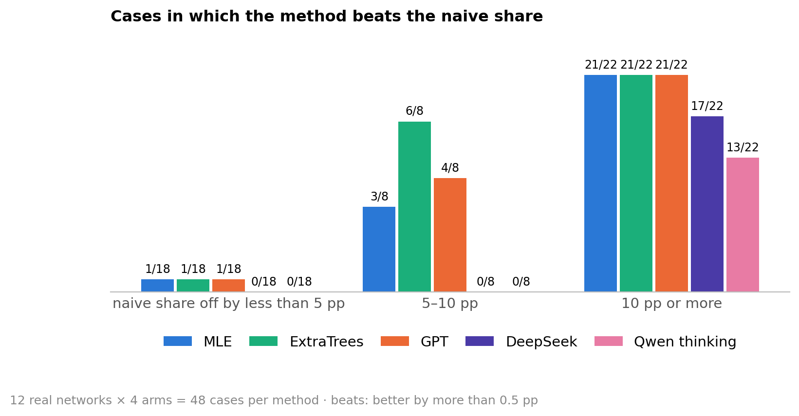

- Correction helps most where the sample is far off. This is a check against known truth; for an unknown network, the sample's error is unknown too.
- Off by 10 pp or more, MLE, ExtraTrees and GPT beat the naive share in 21 of 22 cases; off by less than 5 pp, no method does in more than 1 of 18.
- Of a large error, MLE and ExtraTrees leave about a fifth, GPT and DeepSeek half, Qwen thinking most (median 23, 17, 47, 51 and 85 %).

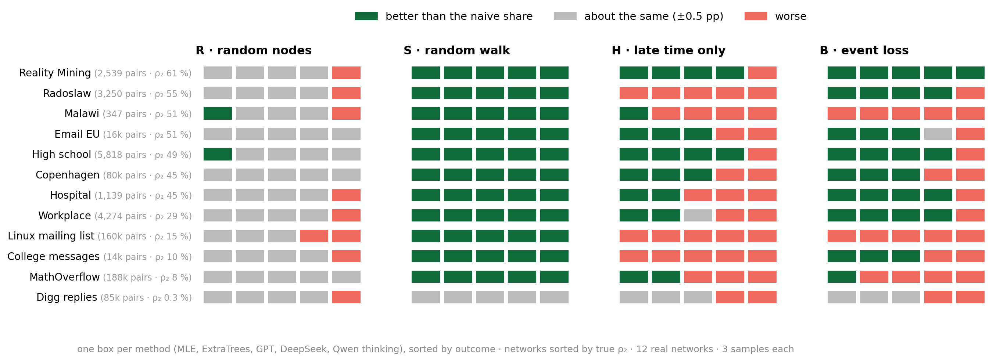

- **S:** all five methods gain on every network but Digg, where there is nothing to correct.
- **H:** most methods gain only on the four networks where the sample is off most (Reality Mining, Email EU, High school, Copenhagen); on Radoslaw, Linux and College messages all five lose.
- **B:** most methods gain on 8 networks; on Malawi and Linux all five lose.

## 4 · Answers often match a simple formula


- The textbook answer is the naive share in R and the **simple reweighting** in S: each visit counts 1 / the pair's number of events. A match means within 0.5 pp.
- In S, GPT's error (8.4 pp) is close to the formula's own (8.8 pp): matching the formula does not remove sampling error.


- GPT gives the formula on every network except Malawi (44 %); DeepSeek on some, Qwen thinking on few (Digg, Linux, MathOverflow).

## 5 · Elsewhere they improvise, and GPT does it best


- "About right" means 50–150 % of the correction the sample needs.
- GPT is the best language model; MLE is about right more often in B (76 %).


- MLE and GPT are about right on most networks but miss different ones: MLE on Malawi, Hospital and MathOverflow, GPT on Malawi, Radoslaw and Workplace. DeepSeek and Qwen rarely are (one exception: DeepSeek on College messages).


- MLE, GPT and DeepSeek recover the whole profile on average, even ρ₄ and ρ₅ in H, which three visible windows cannot show (the naive share is 0 there). Qwen thinking does not.
- A good average can hide large errors: in B, DeepSeek averages only 2.6 pp below the truth, yet its average absolute error is 17.2 pp. Over- and underestimates cancel.

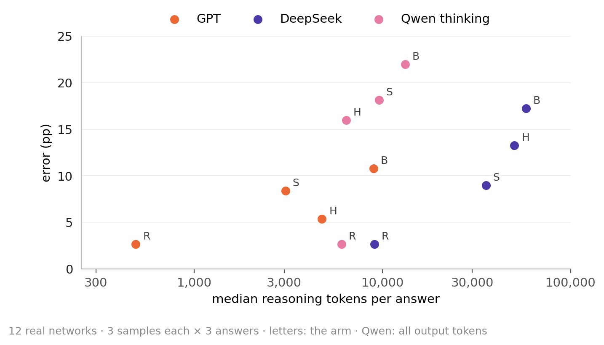

- Every model uses most reasoning tokens under event loss. More tokens do not guarantee better answers across models: DeepSeek uses 6–19 times as many as GPT and is more accurate in no arm.
- Qwen thinking writes as little in H as in R: in 70 % of its H answers it returns the naive share.

<details>
<summary><h3>Reasoning tokens, and what the models write</h3></summary>

| Median reasoning tokens | R | S | H | B |
|---|---:|---:|---:|---:|
| GPT | 489 | 3,051 | 4,764 | 8,966 |
| DeepSeek | 9,069 | 35,483 | 50,226 | 57,932 |
| Qwen thinking | 6,068 | 9,589 | 6,402 | 13,173 |

- The two models whose reasoning is visible say when they improvise: "guess" appears in DeepSeek's reasoning in 82 % of H and 58 % of B answers (R: 2 %), in Qwen's in 40 % and 54 % (R: 4 %). DeepSeek, for example: *"We have no data on windows 1-2, so any extrapolation is a guess."*

</details>

## 6 · Improvised answers vary; the errors are systematic


- Asked again with the same sample, a model repeats itself where it gives a textbook answer (R; in S GPT and DeepSeek) and answers differently where it improvises (H, B; in S Qwen thinking).


- GPT's and DeepSeek's answers vary mostly on persistent networks and hardly at all on Digg and MathOverflow. Qwen varies on almost every network.


- A new sample barely moves the estimate on most networks. It moves more on the smallest networks (Malawi, Hospital) and, under the walk, on Linux, Reality Mining and High school.
- The gap to the truth is often larger than the spread between samples: the errors are systematic, not chance.

## 7 · Python gives no consistent gain


- In R and S, Python changes at most 2 pp on any network. In B it makes 8 of 12 networks worse, Malawi by 23 pp.
- In B on real networks, Python also makes repeated answers less stable: their median spread rises from 5.1 to 12.2 pp.

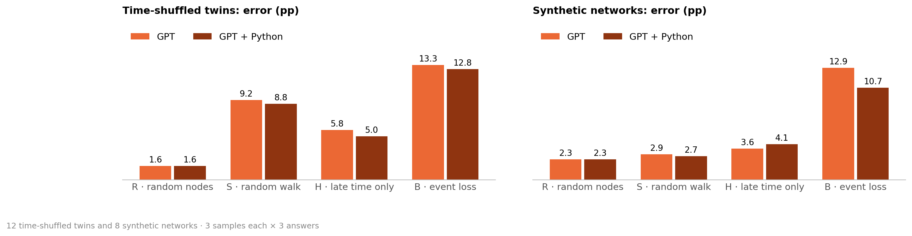

- In B, Python hurts on real networks; on the twins the error barely changes (13.3 → 12.8 pp), on synthetic networks it falls a little (12.9 → 10.7 pp).
- Arithmetic was not what GPT lacked: without Python it already matches the textbook answers to 0.5 pp (section 4).

## 8 · What makes a network hard

### 8.1 With random nodes or a random walk, the same networks are hard for every method


- **R, S:** the dots sit on the diagonal, so difficulty is a property of the network.
- **H, B:** the dots scatter, so it depends on the method. Copenhagen in B is easy for MLE (0.5 pp) and hard for GPT (17.5 pp).
- All six methods together rank the networks alike in R and S (mean rank correlation 0.93 and 0.89), not in H and B (0.42 and 0.38).

*Typical error* (used below): median error of MLE, ExtraTrees, GPT, GPT + Python, DeepSeek and Qwen thinking. It sums up R and S well, H and B only roughly.

### 8.2 Not the number of events, but how many pairs carry them

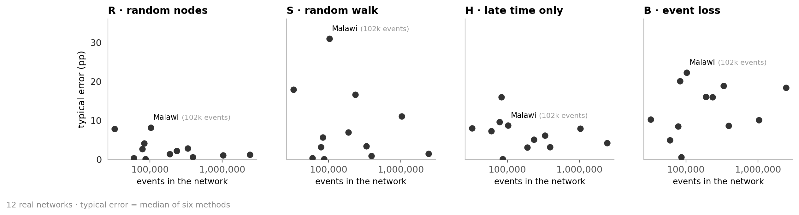

- More events do not help in any arm.

*Pairs that carry the events:* as many equally busy pairs would hold the same events.


- The more pairs carry the events, the easier R and S get; H and B only a little. Malawi's 102k events sit on effectively 55 of its 347 pairs.

### 8.3 Every network on its own


- No arm is the hardest everywhere: event loss on 5 networks, the walk on 4, late time on 2.
- **Digg:** easy everywhere; almost every pair has only one event.
- **Malawi:** hardest in S and B; effectively 55 of its 347 pairs carry the events.
- **Copenhagen:** easy except under event loss.
- **Linux mailing list:** low persistence, yet hard under the walk (11 pp): its samples differ strongly (section 6).
- **College messages:** easy in R and S, harder in H: 85 % of its pairs are active only in the hidden early time.

### 8.4 Time-shuffled twins: the thinking models read the timing; event loss gets harder

Each real network has a **twin**: the same pairs and events per pair, but the times shuffled among all events. Its true ρ₂ is 27 pp higher. A method that ignores timing would give both the same answer.

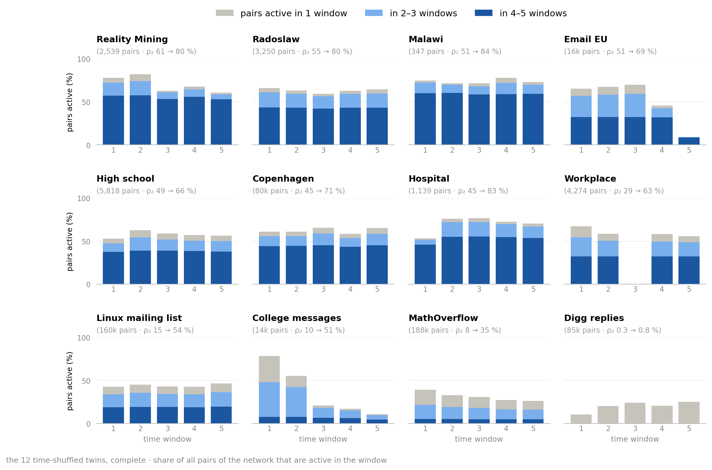

- A twin keeps the rhythm of its network, but its pairs are active in more windows: those active in 4–5 windows rise from 10 % to 34 % of all pairs on average.


- All methods that read timing raise their estimate; in R they follow the truth exactly.
- Qwen no thinking does not (−12 to +3 pp): it ignores the timing.
- Under event loss (B), all follow only part of the change; GPT the most.

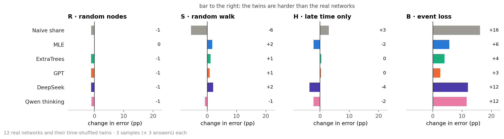

- Under event loss the twins are harder for every method: shuffling makes the networks more persistent, and persistence is what event loss hides (8.6). The naive share loses 16 pp, DeepSeek and Qwen thinking 12 pp, MLE, ExtraTrees and GPT 3–6 pp.
- In R, S and H the errors of the five correcting methods change by at most 4 pp.

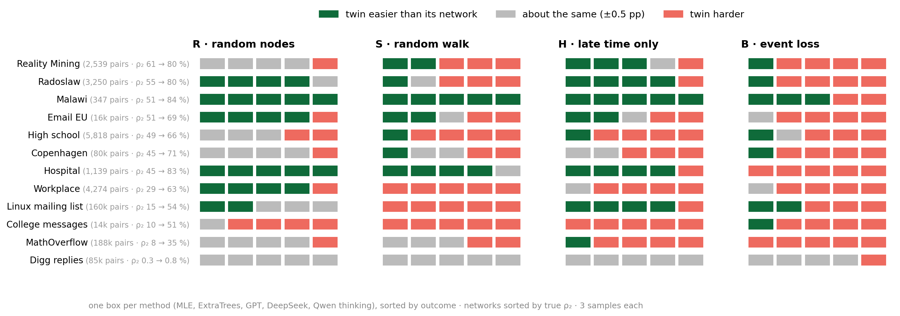

- **B:** almost every twin is harder for most of the five methods; the sample loses most where shuffling raises ρ₂ most (rank correlation 0.90 for the naive share). Only Malawi's twin is easier for three of them.
- **S:** the Linux twin gets much harder for all five (17–22 pp), Malawi's easier for all five.

### 8.5 Synthetic networks: memory makes event loss harder

The synthetic networks change one thing only, **memory**: each generator runs without and with it on the same random numbers (500 nodes, about 10k events).

- **DAR:** each pair is on or off in each window; with memory, it keeps its last state 80 % of the time.
- **Activity-driven:** active nodes create events with a partner; with memory, mostly a known one.

<details>
<summary><h3>DAR step by step (animation)</h3></summary>


- **Models** links that come back: an active pair tends to stay active (Williams et al. 2022). Without memory, only chance decides.
- **Here:** 5,000 possible pairs; on with chance 0.2; kept with chance 0.8 (memory) or never; 1 + Poisson(1) events per active window.

</details>

<details>
<summary><h3>Activity-driven step by step (animation)</h3></summary>


- **Models** people who differ strongly in how active they are; the original model has no memory (Perra et al. 2012). Memory: people mostly call people they already know (Karsai et al. 2014).
- **Here:** 1,000 rounds; with memory, a new partner with chance 1 / (n + 1), n = partners known.

</details>


- Memory puts about the same number of events on fewer pairs, which return in window after window: ρ₂ 39 → 78 % (DAR), 6 → 79 % (activity-driven).

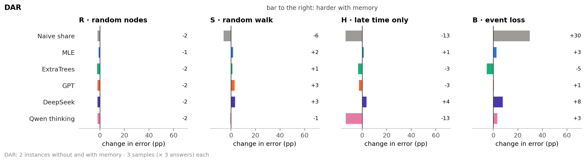

- DAR is persistent even without memory (ρ₂ 39 %). Under event loss, memory costs the sample 30 pp, but the methods at most 8 pp.

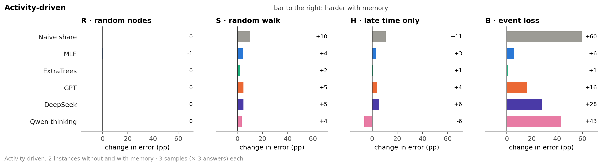

- Activity-driven goes from almost no persistence to much (ρ₂ 6 → 79 %). Under event loss the sample loses 60 pp, the language models 16–43 pp, MLE 6 pp.
- Under the walk, memory costs MLE, ExtraTrees, GPT and DeepSeek 1–5 pp in both generators.
- These are the two drivers seen in the real networks: few pairs carrying the events (S, 8.2) and high persistence (B, 8.6).

<details>
<summary><h3>Instances, and why ExtraTrees is so good here</h3></summary>

- 2 instances per generator; within an instance, both variants share all random numbers, so only memory differs.
- ExtraTrees was trained on other networks from the same two generators (B with memory: 2–3 pp, against 7–19 pp for MLE and GPT).

</details>

### 8.6 All 32 networks: under event loss, persistent networks are hard


- Under event loss (B), every network with ρ₂ above 30 % is hard (10–24 pp): real networks, twins and synthetic networks alike.
- Under the walk (S), only some of them are (1–33 pp).
- A persistent network has more to lose: under event loss a pair must be seen in two windows to count.

<details>
<summary><h3>The same for ρ₃, ρ₄ and ρ₅</h3></summary>

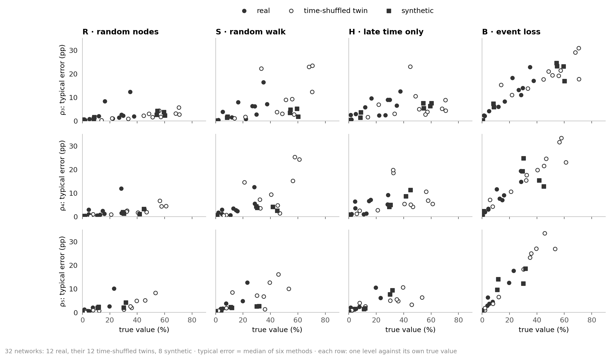

- Under event loss the error grows with the true value at every level, at ρ₅ almost on a line.
- Among the real networks, the same ones are hard at every level in R, S and B; in H they change (rank correlation between the errors at ρ₂ and ρ₅: 0.77, 0.76 and 0.93 against 0.35).

</details>

<details>
<summary><h2>Key findings</h2></summary>

**In one sentence:** sampling shapes the error; language-model answers often match simple formulas and do not consistently beat a statistical model of the sampling.

1. **The sampling design decides how wrong the sample is.** Random nodes keep persistence (naive share off by 3 pp), the walk overstates it (30 pp), late time and event loss understate it (6 and 16 pp). No method brings S, H or B back to R's accuracy. (2, 3)
2. **Correction helps most where the sample is far off.** Off by 10 pp or more, MLE, ExtraTrees and GPT beat the naive share in 21 of 22 cases; off by less than 5 pp, in at most 1 of 18. (3)
3. **Answers often match simple formulas.** GPT and DeepSeek often match the naive share in R and simple reweighting in S; the formulas themselves still have sampling error. (4)
4. **In H and B, answers vary.** Only GPT is about right in half of its answers; a good average can hide large individual errors. (5, 6)
5. **No language model beats MLE consistently.** MLE and ExtraTrees leave about a fifth of a large error, GPT and DeepSeek half, Qwen thinking most; Qwen no thinking does not read the sample. (3)
6. **More reasoning tokens do not guarantee better answers across models; Python gives no consistent gain.** DeepSeek uses 6–19 times as many reasoning tokens as GPT and is more accurate in no arm; Python makes GPT worse under event loss on real networks. (5, 7)
7. **In R and S, difficulty is a property of the network** (few pairs carrying the events); in H and B, of the method. (8.1, 8.2)
8. **Persistence makes event loss hard,** however it arises: across the real networks, through time-shuffling (twins) and through memory (synthetic networks). (8.4, 8.5, 8.6)
9. **Correction helps the higher levels more in H.** Across window counts, the networks' true ρ₂ ranks stay similar; method performance was tested only at five windows. (1, 3, 8.6)
10. **All thinking models read the timing;** Qwen no thinking does not. (8.4)

</details>

<details>
<summary><h2>Definitions, sources and all numbers</h2></summary>

- **ρ₂ … ρ₅:** share of pairs active in ≥ 2 … 5 of the 5 windows, among all pairs with an event. **Naive share:** the same in the sample.
- **Error:** |estimate − true ρ₂| in pp, averaged per network over samples and answers, then over networks.
- **Typical error:** median error of MLE, ExtraTrees, GPT, GPT + Python, DeepSeek and Qwen thinking.
- **Spread:** standard deviation of the three answers to the same sample.
- **Reasoning tokens:** as reported by the provider (GPT, DeepSeek); for Qwen all output tokens, that is the thinking plus an answer of about 55 tokens. The tokenizers differ, so only the order of magnitude compares across models.
- **Pairs that carry the events** (effective number of pairs): 1 / Σ (events of a pair / all events)², the inverse Simpson index. Malawi 55, Copenhagen 4,590, Digg 82,900.
- **Generators:** Williams, Mazzarisi, Lillo & Latora, *Phys. Rev. E* 105, 034301 (2022); Perra, Gonçalves, Pastor-Satorras & Vespignani, *Sci. Rep.* 2, 469 (2012); Karsai, Perra & Vespignani, *Sci. Rep.* 4, 4001 (2014).
- All errors per network and method: [figure](figures/fig_networks_detail.png), [MAIN_RESULTS.md](../results/final/MAIN_RESULTS.md). Robustness: [VARIABILITY.md](../results/final/VARIABILITY.md), [W_SENSITIVITY.md](../results/final/W_SENSITIVITY.md), [WALK.md](../results/final/WALK.md).
- Redraw: `python scripts/analysis_figures.py`; `--inputs` also rebuilds [`data/`](data) (needs `data/raw` and `~/.local/share/masterthesis`).

</details>
