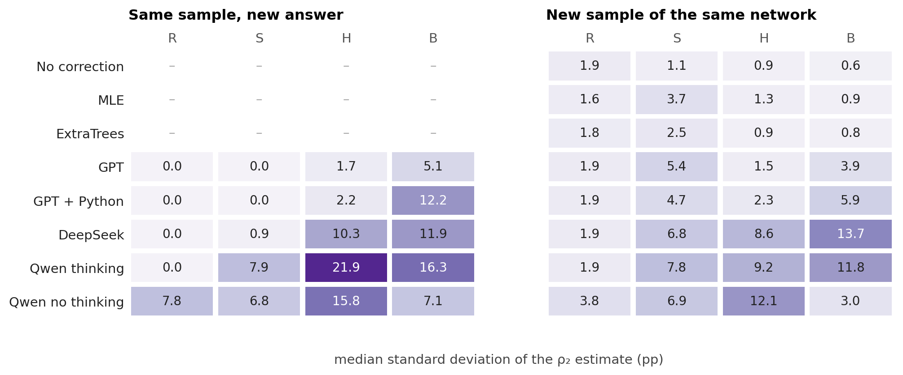
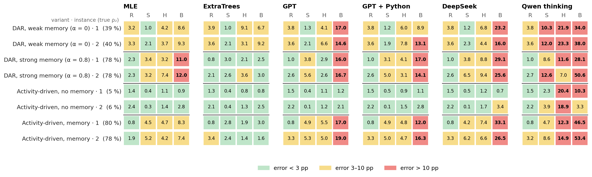
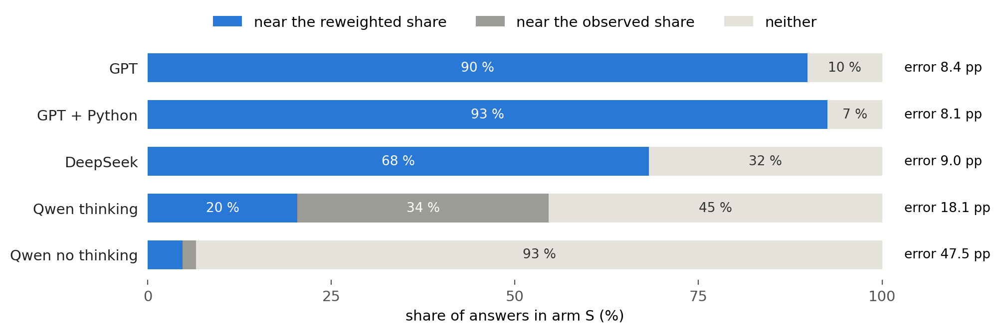
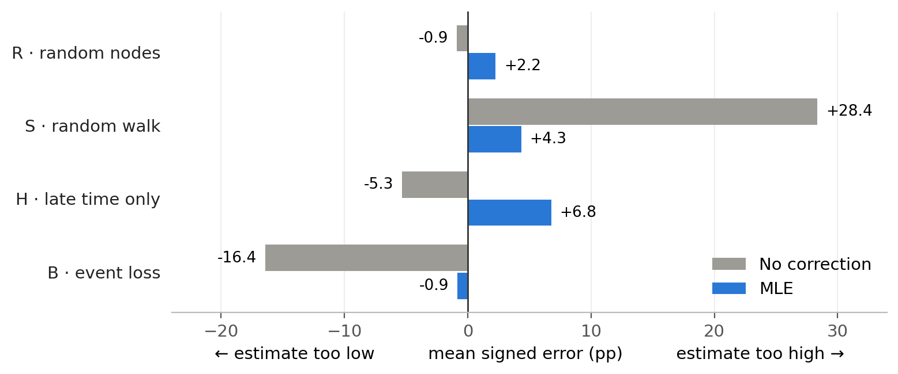

# Analysis

**Question:** how well can language models estimate from a biased sample how persistent a network is, compared with classical methods?

- **ρ₂:** share of interacting pairs that are active in at least 2 of 5 time windows.
- **Error:** mean absolute error of ρ₂ in percentage points (pp). Every network counts equally; lower is better.
- **Sampling arms:**
  - R: random nodes (unbiased)
  - S: random walk (favours busy pairs)
  - H: only the last 60 % of the time
  - B: events randomly lost
- **Methods:**
  - No correction: the observed share
  - MLE: a statistical model of the sampling
  - ExtraTrees: a trained model
  - Language models: GPT, GPT + Python, DeepSeek, Qwen thinking and Qwen no thinking, each giving 3 answers per sample

## The 12 real networks

| Network | Contacts | Nodes | Pairs | Events per pair | One-off pairs | Pairs only in first 40 % | True ρ₂ |
|---|---|---:|---:|---:|---:|---:|---:|
| Digg replies | online replies | 30,360 | 85,155 | 1.0 | 99 % | 30 % | 0.3 % |
| MathOverflow | Q&A interactions | 24,759 | 187,986 | 2.1 | 60 % | 45 % | 8 % |
| College messages | online messages | 1,899 | 13,838 | 4.3 | 38 % | 85 % | 10 % |
| Linux mailing list | mailing-list replies | 26,885 | 159,996 | 6.4 | 42 % | 41 % | 15 % |
| Workplace | face-to-face, office | 217 | 4,274 | 18.3 | 33 % | 46 % | 29 % |
| Hospital | face-to-face, ward | 75 | 1,139 | 28.5 | 14 % | 26 % | 45 % |
| Copenhagen | Bluetooth, students | 692 | 79,530 | 30.5 | 26 % | 19 % | 45 % |
| High school | face-to-face, students | 327 | 5,818 | 32.4 | 31 % | 26 % | 49 % |
| Email EU | emails, institute | 986 | 16,064 | 20.7 | 26 % | 32 % | 51 % |
| Malawi | face-to-face, village | 86 | 347 | 294.8 | 15 % | 36 % | 51 % |
| Radoslaw | emails, company | 167 | 3,250 | 25.5 | 15 % | 37 % | 55 % |
| Reality Mining | Bluetooth, students | 96 | 2,539 | 92.5 | 18 % | 58 % | 61 % |

*One-off pairs have a single event. Pairs active only in the first 40 % of the time are invisible in arm H. Source: [`data/network_features.csv`](data/network_features.csv).*

## 1 · Errors by sampling arm

In R, all methods are within about 1 pp of each other. In S, H and B, the classical methods are best, GPT is the best language model and Qwen thinking is the weakest. Qwen no thinking (25–53 pp) is not shown.

## 2 · Reliability

GPT repeats its answer almost exactly, but its estimate still moves with the sample (S: 0.0 against 5.4 pp). With Python, its answers in B vary more (5.1 → 12.2 pp).

## 3 · Errors per network

Difficulty depends on the method. Copenhagen in B is easy for MLE (0.5 pp) but hard for every language model (17–26 pp).

## 4 · Two cases: how much the sample sees

| Arm S | Hospital | Copenhagen | Malawi | Digg |
|---|---:|---:|---:|---:|
| True ρ₂ | 45 % | 45 % | 51 % | 0.3 % |
| Pairs in the network | 1,139 | 79,530 | 347 | 85,155 |
| Distinct pairs one walk sees | 79 | 4,195 | 20 | 8,342 |
| Walk steps that revisit a pair | 27 % | 29 % | 89 % | 26 % |
| Error MLE / GPT (pp) | 15.6 / 19.1 | 1.0 / 1.4 | 25.8 / 31.5 | 0.1 / 0.1 |

Hospital and Copenhagen have the same ρ₂. The walk sees 50 times fewer pairs in Hospital, and the error is more than ten times larger. In Malawi the walk mostly revisits pairs it has already seen. In Digg, almost every pair has a single event, so ρ₂ ≈ 0 and small errors come easily.

## 5 · Synthetic networks: memory

In B the language models miss by 9–54 pp whenever ρ₂ is high, while ExtraTrees stays at or below 3 pp on the variants with strong memory. Without memory (activity-driven, ρ₂ ≈ 5 %) all methods except Qwen thinking stay at or below 3.4 pp. ExtraTrees was trained on networks from the same generators.

## 6 · Real networks against time-shuffled copies

Filled dots are the real networks, open dots their copies with shuffled time stamps; the number is how many of 12 real networks have the lower error. The result differs mainly in B. Shuffling also raises the true ρ₂ (mean 35 % → 62 %), so the difference is not caused by temporal structure alone.

---

## Appendix

### A1 · GPT's estimates in S mostly match a simple reweighting

The walk visits busy pairs more often. A simple correction gives every observed pair the weight 1 / its number of events. About 90 % of GPT's estimates lie within 0.5 pp of this value. This describes the numbers, not how the model arrived at them.

### A2 · Direction of the error: no correction against MLE

MLE reduces the mean bias in S and B and overcorrects in H.

### A3 · GPT + Python in arm B

The code of 92 % of these answers calls a numerical optimiser (found by searching for `optimize` or `minimize`). Answers with 10 or more tool calls (the limit is 10) have a higher error, 17.0 against 13.4 pp. Harder samples may cause both. Source: [`data/python_tool_use.csv`](data/python_tool_use.csv).

### A4 · Full results and robustness

- **All methods, networks and measures:** [MAIN_RESULTS.md](../results/final/MAIN_RESULTS.md), [PER_SOURCE.csv](../results/final/PER_SOURCE.csv)
- **ExtraTrees training repeats:** [VARIABILITY.md](../results/final/VARIABILITY.md)
- **Number of windows:** [W_SENSITIVITY.md](../results/final/W_SENSITIVITY.md)
- **Random-walk checks:** [WALK.md](../results/final/WALK.md)

Figures are in [`figures/`](figures) as PNG and PDF. Redraw them with `python scripts/analysis_figures.py`. Adding `--inputs` also rebuilds [`data/`](data), which needs `data/raw` and `~/.local/share/masterthesis`.
