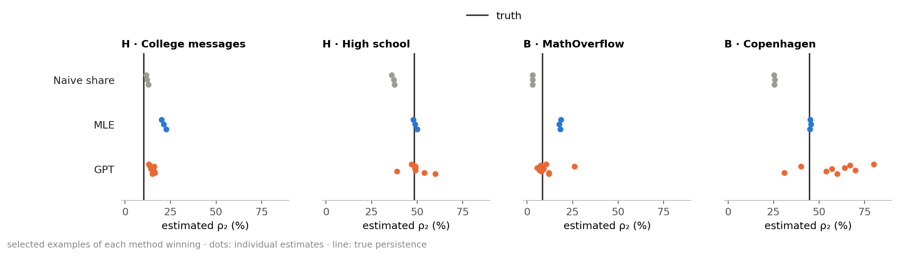

# Persistence under sampling bias

**How does sampling bias affect persistence estimates in temporal graphs—and how do LLMs compare with conventional methods?**

## 0 · The challenge: sampling changes apparent persistence

| Term | Meaning |
|---|---|
| Node | Person or account |
| Event | One interaction between two nodes |
| Pair | Two nodes that interact; direction ignored |
| Window | One of 5 equal time intervals |
| **Persistence · ρ₂** | **Share of interacting pairs active in ≥ 2 windows; our main target** |
| Profile · ρ₃ … ρ₅ | Shares active in ≥ 3 … 5 windows |
| Naive share | Persistence counted directly in the sample |
| Error · pp | Percentage points from truth; 40 % vs 50 % → 10 pp |
| Spread · SD | Standard deviation: how much estimates vary |
| Typical error | Median error across six main methods; excludes Qwen no thinking |

| Sampler | What it shows | What can go wrong |
|---|---|---|
| **R · random nodes** | Full histories between sampled nodes | Equal pair inclusion, but samples vary |
| **S · random walk** | Full histories of visited pairs; visit weights | Busy pairs are overrepresented |
| **H · late time** | Sampled nodes; windows 3–5 only | Early returns are hidden |
| **B · event loss** | Each event retained with probability p | Returns—and whole pairs—disappear |

### 0a · One graph, four samples: different shares of returning pairs


- Pair A returns in 5 windows, B in 2: **each contributes 1** to ρ₂.
- **Goal:** estimate the full graph's share from a biased sample.

### 0b · Real samples: walks overstate persistence; missing time and events usually understate it


- R has no systematic pair-inclusion bias; an individual sample can still miss truth.

## 1 · The networks: similar persistence, different timing

### 1a · Twelve real networks, ordered by true ρ₂

<!-- table:network_specs -->
| Network | Interactions | Nodes | Pairs | Events | Events/pair | True ρ₂ |
| --- | --- | ---: | ---: | ---: | ---: | ---: |
| Reality Mining | Phone proximity | 96 | 2,539 | 234,757 | 92.5 | 60.7 % |
| Radoslaw | Email | 167 | 3,250 | 82,876 | 25.5 | 55.1 % |
| Malawi | Face-to-face | 86 | 347 | 102,293 | 294.8 | 50.7 % |
| Email EU | Email | 986 | 16,064 | 332,334 | 20.7 | 50.6 % |
| High school | Face-to-face | 327 | 5,818 | 188,508 | 32.4 | 48.6 % |
| Copenhagen | Phone proximity | 692 | 79,530 | 2,426,279 | 30.5 | 44.7 % |
| Hospital | Face-to-face | 75 | 1,139 | 32,424 | 28.5 | 44.5 % |
| Workplace | Face-to-face | 217 | 4,274 | 78,249 | 18.3 | 29.0 % |
| Linux mailing list | Email replies | 26,885 | 159,996 | 1,028,233 | 6.4 | 15.3 % |
| College messages | Messages | 1,899 | 13,838 | 59,835 | 4.3 | 10.3 % |
| MathOverflow | Online replies | 24,759 | 187,986 | 390,441 | 2.1 | 8.4 % |
| Digg replies | Online replies | 30,360 | 85,155 | 86,203 | 1.0 | 0.3 % |
<!-- /table:network_specs -->

- Counts describe the cleaned, undirected networks used here.

### 1b · When pairs return: the same ρ₂ can hide different activity patterns


- Malawi and Email EU: both ρ₂ ≈ 51 %; 28 % vs 16 % of pairs return in 4–5 windows.

### 1c · Why five windows? More windows change values, barely the network ordering


- Rank correlation with 5 windows: **≥ 0.97** for 3–20 windows.
- All method comparisons below use **5 windows**.

## 2 · The comparison: the same sample for every method

| Specification | Setting |
|---|---|
| Coverage | About 10 % of active pair–window cells |
| Samples | 3 seeds per network and sampler |
| LLM answers | 3 independent repeats per sample |
| Shared input | Sampling rule, sizes, time-pattern counts; S also has weights |
| Hidden | Truth, network name, node IDs and adjacency |
| Scoring | Mean absolute error; each network counts equally |
| **LLMs** | GPT (`gpt-6-sol`), GPT + Python, DeepSeek (`deepseek-flash`), Qwen3.6 thinking / no thinking |
| **Statistical estimators** | Naive share; MLE (fits a distribution; no training) |
| **Supervised models** | ExtraTrees (16 other real + 400 synthetic training graphs); training-median baseline |
| ExtraTrees check | Test network and twin excluded from training/tuning; fixed fit for comparison |
| Invalid answers | Excluded; no repair or retry |

### Example input · Hospital, random nodes

```text
Rule: 24 random nodes; all events between them are seen.
Seen: 132 pairs, 3,172 events
pattern (windows 1–5)   pairs   events
0 0 0 0 1                  12       86
0 1 1 1 0                   5      283
1 1 1 0 0                   4      490
…                           …        …
Task: estimate the full graph's ρ₂ … ρ₅.
```

## 3 · Estimation: correction helps, but bias remains

### 3a · Mean error: no LLM consistently beats MLE


- Best errors: **R 2.7 · S 5.0 · H 3.9 · B 7.6 pp**. GPT is the strongest LLM overall.
- Qwen no thinking often gives 85–95 %, almost regardless of input.

### 3b · Persistence profile: the broad method ranking changes little


- Close methods swap places; the broad performance pattern persists.
- H: MLE improves at higher levels; the visible 3 windows cannot directly reveal ρ₄ or ρ₅.

### 3c · Corrected estimates: H/S tend above truth; B's errors cancel


- **H/S:** estimates tend to overstate persistence. **B:** both over- and underestimates.
- DeepSeek in B: mean −2.6 pp, absolute error **17.2 pp**—a good mean hides large errors.
- Lines show individual spread, not confidence intervals.

## 4 · Correction: formulas help where information survives

### 4a · R/S: LLM answers often match the direct formula


- R: count returning pairs. S: undo the walk's preference for busy pairs with weights.
- MLE also reweights S **before fitting**; its fitted estimate need not equal the direct formula.

### 4b · H/B: GPT corrects best among LLMs, MLE remains competitive


- “About right”: 50–150 % of the required correction; samples ≥ 5 pp off truth only.

## 5 · Reasoning: more tokens do not guarantee lower error

### Tokens and error · B uses the most reasoning

<!-- table:reasoning -->
<table>
<thead>
<tr><th rowspan="2" scope="col">LLM</th><th colspan="4" scope="colgroup">Median reasoning tokens / error (pp)</th></tr>
<tr><th scope="col">R</th><th scope="col">S</th><th scope="col">H</th><th scope="col">B</th></tr>
</thead>
<tbody>
<tr><th scope="row">GPT</th><td>489 / 2.7</td><td>3,051 / 8.4</td><td>4,764 / 5.4</td><td>8,966 / 10.8</td></tr>
<tr><th scope="row">GPT + Python</th><td>309 / 2.7</td><td>2,080 / 8.1</td><td>3,948 / 6.1</td><td>8,998 / 15.1</td></tr>
<tr><th scope="row">DeepSeek</th><td>9,069 / 2.7</td><td>35,483 / 9.0</td><td>50,226 / 13.3</td><td>57,932 / 17.2</td></tr>
<tr><th scope="row">Qwen thinking</th><td>6,068 / 2.7</td><td>9,589 / 18.1</td><td>6,402 / 16.0</td><td>13,173 / 22.0</td></tr>
</tbody>
</table>
<!-- /table:reasoning -->

- DeepSeek uses **6–19×** GPT's reasoning tokens, with no accuracy gain.
- B uses the most tokens for every listed LLM. Qwen counts total output as a reasoning proxy.

## 6 · Noise: new samples and repeated answers

### 6a · New sample: estimates vary even without answer randomness


- SD of **3 sample estimates**; LLM estimate = mean of valid answers.
- Includes some answer noise; repeated answers below measure that separately.

### 6b · Same sample: H/B trigger more answer variation


- Input fixed, **3 answers**: this isolates response variation.
- MLE and fixed-fit ExtraTrees always repeat the same estimate: **0 pp**.
- Low spread can still mean consistently wrong estimates.

### 6c · ExtraTrees: retraining adds little variation

<!-- table:training -->
| ExtraTrees: new training fit | R | S | H | B |
| --- | ---: | ---: | ---: | ---: |
| Spread (SD, pp) | 0.4 | 0.6 | 0.6 | 0.5 |
<!-- /table:training -->

- 11 training fits; same samples. Chart 6a/6b uses one fixed fit.

<details>
<summary>6d · MLE per network: stable estimates can still miss truth</summary>

### Three sample estimates versus true ρ₂


</details>

## 7 · Python: no consistent accuracy gain

### GPT with and without Python · event loss gets harder


- B: worse with Python on **8 of 12** networks; R/S change little.

## 8 · Individual networks: average difficulty hides exceptions

### 8a · MLE versus GPT: shared difficulty in R/S, different winners in H/B


- A sampler's average error does not predict every network's difficulty.

### 8b · Per-network error: B is hardest often, not always


- Hardest sampler: **B on 6 networks · S on 4 · H on 2**.

### 8c · H/B examples: the size of the correction decides who wins



- H, College messages: activity fades; MLE extrapolates too much. High school: MLE is accurate.
- B: GPT wins on MathOverflow; MLE wins on Copenhagen, where GPT often overshoots.
- MLE's sampling assumptions can miss real timing patterns; these examples do not establish GPT's reasoning.

### 8d · Event concentration: fewer effective pairs make R/S harder


- Effective pairs = equally busy pairs with the same event concentration. Malawi: **347 actual, 55 effective**.

<details>
<summary>Per-network details: formula matches, H/B correction and Python</summary>

### 8e · Walk correction: formula matches vary by network


### 8f · H/B correction: success varies by network


### 8g · Python: gains and losses on each network


</details>

## 9 · Controlled tests: do methods use timing and memory?

### 9.1 · Time-shuffled twins: same connections, different return times

| Kept | Changed | Test |
|---|---|---|
| Nodes, pairs, events per pair, global event times | Times reassigned to pairs; mean ρ₂ **+27 pp** | Do estimates follow timing beyond static size/density cues? |


- R tracks the true change closely; B recovers only part. GPT recovers most among LLMs in B.
- Samples are redrawn and recalibrated: this is a timing-sensitivity test, with sample sizes also changing.

### 9.2 · Synthetic networks: two memory rules with real-world motivations

| Generator | Real-world motivation | Memory rule tested here |
|---|---|---|
| **DAR · link states** | Transport/contact links and diffusion ([Williams et al.](https://arxiv.org/abs/1909.08134)) | 80 % copy previous ON **or OFF**; otherwise redraw |
| **Activity-driven · partners** | Mobile calls and information spreading ([Karsai et al.](https://www.nature.com/articles/srep04001)); original model: epidemics ([Perra et al.](https://arxiv.org/abs/1203.5351)) | Known partner with probability **n/(n+1)**; n = partners known |

- **500 nodes · ≈ 10k events · 2 paired instances per generator**, with shared random draws.
- DAR: simplified DAR(1) control; event multiplicity added here. ExtraTrees has seen these generator families in training.
- GIFs show small examples, not benchmark results.

### DAR · copying the last state makes links persist


### Activity-driven · remembered partners make contacts return


- Contacts last one round; grey lines record history. With 3 known partners: **75 % known, 25 % new**.

### 9.3 · Memory: similar event counts, much more persistence


- True ρ₂: **DAR 39 → 78 % · activity-driven 6 → 79 %**.

### 9.4 · Memory especially hurts event-loss estimates


- Activity-driven, B: **1.9 → 16.1 pp**. S: **+3–5 pp** in both generators.
- Two paired instances per generator: a mechanism check, not a broad synthetic benchmark.

### 9.5 · All 32 networks: persistence makes event loss hard; walks remain network-dependent


- **B:** all tested networks above ρ₂ = 30 % have **10–24 pp** typical error; hidden returns remain hard to recover.
- **S:** the same persistence range spans **1–33 pp** error; persistence alone does not determine difficulty.
- Twins and memory tests reproduce the B pattern. They also change pair histories or concentration: **30 % is not a universal threshold**.

<details>
<summary>Sources and all numbers</summary>

- Design, method settings and literature: [DESIGN.md](../DESIGN.md).
- Scores: [MAIN_RESULTS.md](../results/final/MAIN_RESULTS.md), [all network/method errors](figures/fig_networks_detail.png), [PREDICTIONS.csv](../results/final/PREDICTIONS.csv).
- Noise: [VARIABILITY.md](../results/final/VARIABILITY.md), [per-network SDs and persistence profile](data/noise_by_network.csv), [estimated variance components](data/noise_components.csv).
- Correction: [mean residuals and absolute errors](data/correction_reliability.csv).
- Controls: [twin activity](figures/fig10b_twin_active.png), [twin errors](figures/fig10c_twin_error.png), [Python on controls](figures/fig6c_python_groups.png), [higher persistence levels](figures/fig9b_levels.png).
- Robustness: [window sensitivity](../results/final/W_SENSITIVITY.md), [walk settings](../results/final/WALK.md).
- Redraw: `python scripts/analysis_figures.py`; `--inputs` rebuilds input summaries from locally stored raw data. Frozen results are unchanged.

</details>
