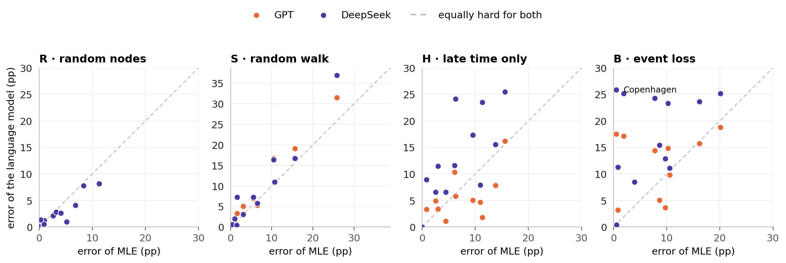
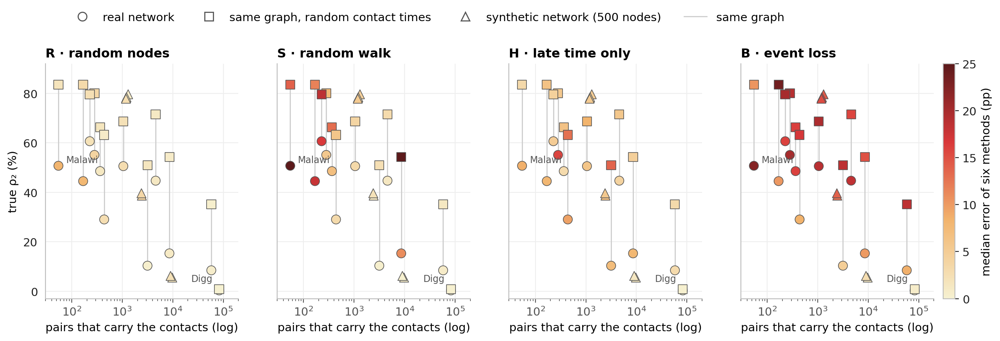
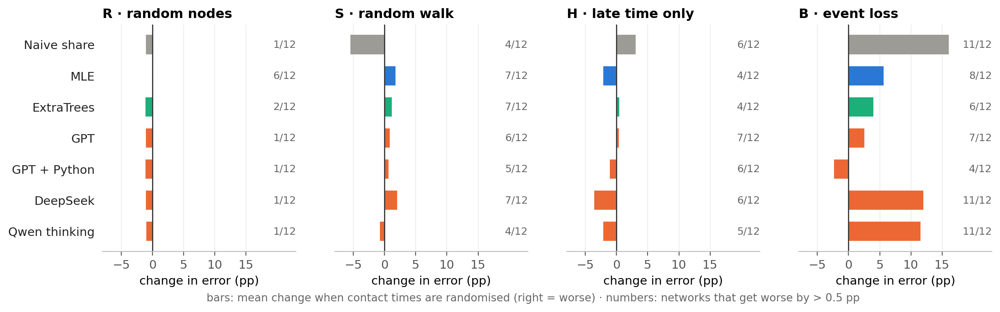

# Estimating persistence from a sample

**Question:** a temporal network is only seen through a sample. Can language models estimate how persistent it is?

**Short answer**
- **Where the sampling has a simple textbook correction** (random nodes, random walk), GPT's and DeepSeek's answers match it and are no better. Under the walk, the statistical model and the trained model beat that formula.
- **Where there is none** (hidden early history, lost contacts), the models improvise. GPT stays close to the statistical model; DeepSeek and Qwen rarely get the correction right.
- **A Python tool** does not help, and with lost contacts it hurts.
- **A network is hard** when few pairs carry its contacts (for every method) or, when contacts are lost, when it is highly persistent (most of all for DeepSeek and Qwen).

## 0 · The task


- **ρ₂:** share of pairs active in ≥ 2 of 5 time windows (ρ₃ to ρ₅: ≥ 3 to 5). **Naive share:** the same share in the sample.
- **Error:** absolute error of ρ₂ in percentage points (pp), mean over 12 real networks.

| Arm | Sample | Also told |
|---|---|---|
| R · random nodes | random nodes and all contacts among them | number of nodes |
| S · random walk | a walk along contacts, which meets busy pairs more often | visits per pair* |
| H · late time only | random nodes, only the last 60 % of the time visible | number of nodes |
| B · event loss | each event kept with a small probability p | p |

Each sample sees about 10 % of the activity, with 3 samples per network and arm. \*The visits allow a textbook answer, the **simple reweighting**: each visit counts 1 / the pair's number of events.

**Methods:**
- **Baselines:** naive share, training median (a constant guess).
- **Statistical model:** MLE.
- **Trained model:** ExtraTrees, a supervised reference.
- **Language models:** GPT, GPT + Python, DeepSeek, Qwen thinking, Qwen no thinking.

<details>
<summary>Real input (shortened) and model versions</summary>

```
Sampling rule: 24 random nodes; every contact between two of them is seen.   (Hospital, arm R)
Seen: 132 pairs, 3,172 events

pattern (windows 1–5)   pairs   events      1 = active in that window
0 0 0 0 1                  12       86
0 0 1 0 0                  23      332
0 1 1 1 0                   5      283
1 1 1 0 0                   4      490
…                           …        …      (31 patterns in total)

Task: estimate ρ₂ … ρ₅ of the full network.        Naive share 56 / 132 = 42 %; true ρ₂ 45 %.
```

| Method | Details |
|---|---|
| MLE | statistical model of the sampling, no training |
| ExtraTrees | trained on 16 other real and 400 synthetic networks with known answers; not a fair competitor |
| GPT | OpenAI `gpt-6-sol`, reasoning effort high |
| GPT + Python | the same, with OpenAI's hosted Python tool (up to 10 calls) |
| DeepSeek | `deepseek-flash`, reasoning effort high |
| Qwen thinking / no thinking | `Qwen3.6-35B-A3B`, run locally, with or without its thinking phase (temperature 1.0 / 0.7) |

</details>

## 1 · The 12 networks

| Network | Contacts | Nodes | Pairs | Events per pair | True ρ₂ |
|---|---|---:|---:|---:|---:|
| Digg replies | online replies | 30,360 | 85,155 | 1.0 | 0.3 % |
| MathOverflow | Q&A | 24,759 | 187,986 | 2.1 | 8 % |
| College messages | online messages | 1,899 | 13,838 | 4.3 | 10 % |
| Linux mailing list | mailing list | 26,885 | 159,996 | 6.4 | 15 % |
| Workplace | face-to-face | 217 | 4,274 | 18.3 | 29 % |
| Hospital | face-to-face | 75 | 1,139 | 28.5 | 45 % |
| Copenhagen | Bluetooth | 692 | 79,530 | 30.5 | 45 % |
| High school | face-to-face | 327 | 5,818 | 32.4 | 49 % |
| Email EU | email | 986 | 16,064 | 20.7 | 51 % |
| Malawi | face-to-face | 86 | 347 | 294.8 | 51 % |
| Radoslaw | email | 167 | 3,250 | 25.5 | 55 % |
| Reality Mining | Bluetooth | 96 | 2,539 | 92.5 | 61 % |

## 2 · Samples distort persistence, except in R


- S overstates persistence; H and B understate it.
- Losing pairs need not distort the share: hiding the early 40 % removes 85 % of College messages' pairs, yet its naive share moves by only 1.9 pp.

## 3 · Correction clearly helps in S and B, only partly in H


- **S:** MLE, ExtraTrees and all thinking models beat the naive share in 11 of 12 networks. **B:** MLE, ExtraTrees and GPT do so in 8 or 9.
- **H:** errors drop on average but not consistently across networks; over ρ₂ to ρ₅ correction helps clearly (naive 7.2 pp, GPT 3.3 pp).
- **GPT against MLE:** no consistent edge (better in 2, 6, 4 and worse in 6, 4, 6 networks in S, H, B).
- **Qwen no thinking** answers 85–95 % in R, S and B almost regardless of the sample, which is worse than the constant guess.

## 4 · Where a simple formula exists, the answers match it


- **S:** 90 % of GPT's answers lie within 0.5 pp of the simple reweighting; GPT's error (8.4 pp) is the formula's own (8.8 pp). This shows matching numbers, not how the models reasoned.


- Counted are samples off by ≥ 5 pp. GPT gets the size of the correction right about twice as often as DeepSeek (H: 60 against 22 %, B: 43 against 21 %); Qwen almost never.

<details>
<summary>Length of the reasoning, and what DeepSeek writes</summary>

| Median reasoning tokens | R | S | H | B |
|---|---:|---:|---:|---:|
| GPT | 489 | 3,051 | 4,764 | 8,966 |
| GPT + Python | 309 | 2,080 | 3,948 | 8,998 |
| DeepSeek | 9,069 | 35,483 | 50,226 | 57,932 |

- All models write the longest reasoning in H and B. DeepSeek writes 6–19 times as much as GPT and is still less accurate.
- "Guess" appears in DeepSeek's full reasoning in 82 % of H and 58 % of B answers (R: 2 %), e.g. *"We have no data on windows 1-2, so any extrapolation is a guess."*
- GPT reveals only short summaries; Qwen's reasoning is not analysed.
- With a stricter band for "about right" (75–125 %), all shares drop, but the order of the models stays.

</details>

## 5 · Asking twice gives different answers


- Asked again with the same sample, the language models change their answer where they improvise: GPT by 5.1 pp in B, DeepSeek and Qwen thinking by 10–22 pp in H and B.
- Two samples of the same network differ far less there (MLE ≤ 1.3 pp).

## 6 · Python costs 3.4 times as much and does not help

| Arm | GPT | GPT + Python | Python better / worse in |
|---|---:|---:|---:|
| R | 2.7 | 2.7 | 0 / 1 |
| S | 8.4 | 8.1 | 2 / 0 |
| H | 5.4 | 6.1 | 3 / 7 |
| B | 10.8 | 15.1 | 2 / 8 |

- The last column counts networks with a difference of more than 0.5 pp. In B, Python adds 4.4 pp of error (2.7 pp without Malawi), with answers that spread more (12.2 against 5.1 pp) and overshoot (+6.4 against +0.5 pp).

<details>
<summary>What the Python code does in B</summary>

For 31 of 35 samples, the code of the three answers to the same sample names different model types (gamma, log-normal, latent classes, …).

</details>

## 7 · What makes a network hard

### 7.1 Is it the network or the method?



- **R, S:** the dots lie on the diagonal, so the same networks are hard for every method. Difficulty is a property of the network (agreement between the six methods: rank correlation 0.93 and 0.89).
- **H, B:** the dots scatter, so which network is hard depends on the method (0.42 and 0.38). In B, Copenhagen gives MLE 0.5 pp, GPT 17.5 pp and DeepSeek 25.8 pp.

### 7.2 Hard: few pairs carry the contacts, or high persistence



- **R, S:** the hard networks lie mostly to the left, where few pairs carry the contacts. Malawi's 102,293 contacts sit on effectively 55 pairs.
- **B:** the hard networks lie at the top: the more persistent, the harder.
- **H:** no clear pattern.
- The total number of contacts barely matters; how they spread over pairs does.

<details>
<summary>How the map is built</summary>

- **Pairs that carry the contacts** (effective number of pairs): how many equally busy pairs would hold the contacts (inverse Simpson index of the contact shares). Copenhagen: 4,590; Digg: 82,900.
- **Same graph, random contact times:** each real network with the same pairs and contact counts, each contact at a random time. This raises ρ₂ in all 12 networks (mean 35 % → 62 %).
- **Synthetic networks** (500 nodes each) from two standard generators:

| Generator | How contacts arise | Without memory | With memory |
|---|---|---:|---:|
| DAR | each pair switches on or off in every window; with memory it keeps its last state 80 % of the time | ρ₂ 39–40 % | ρ₂ 78 % |
| Activity-driven | active nodes contact partners; with memory they prefer known ones | ρ₂ 5–6 % | ρ₂ 78–80 % |

- Colour: median error of MLE, ExtraTrees, GPT, GPT + Python, DeepSeek and Qwen thinking.

</details>

### 7.3 Same graph, random contact times



- **R, S, H:** no method changes reliably. We see no sign that any method relies on the real timing of contacts.
- **B:** random times raise persistence, and the naive error doubles. DeepSeek and Qwen follow it (+12 pp, worse in 11 of 12 networks), while MLE, ExtraTrees and GPT absorb most of it.

All numbers per network and method: [figure](figures/fig_networks_detail.png) · [MAIN_RESULTS.md](../results/final/MAIN_RESULTS.md)

---

<details>
<summary>Robustness and reproduction</summary>

Robustness checks: [VARIABILITY.md](../results/final/VARIABILITY.md), [W_SENSITIVITY.md](../results/final/W_SENSITIVITY.md), [WALK.md](../results/final/WALK.md). Figures: `python scripts/analysis_figures.py`; `--inputs` also rebuilds [`data/`](data) (needs `data/raw` and `~/.local/share/masterthesis`).

</details>
