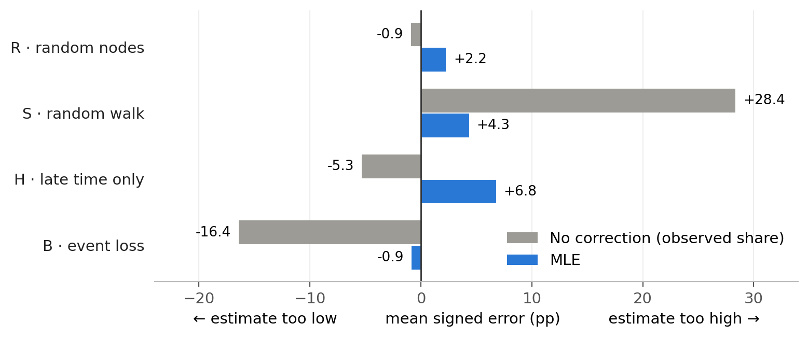
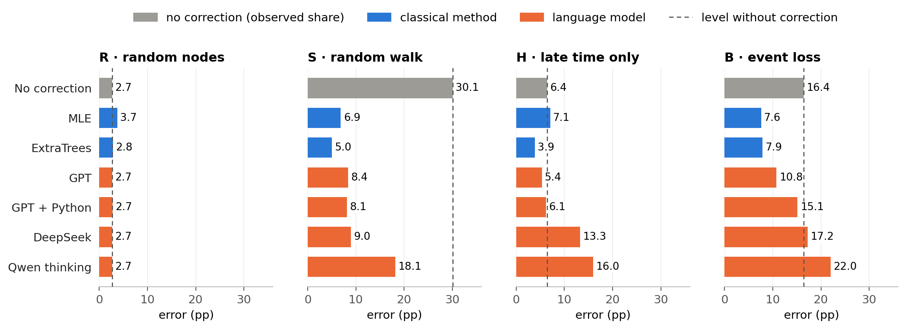
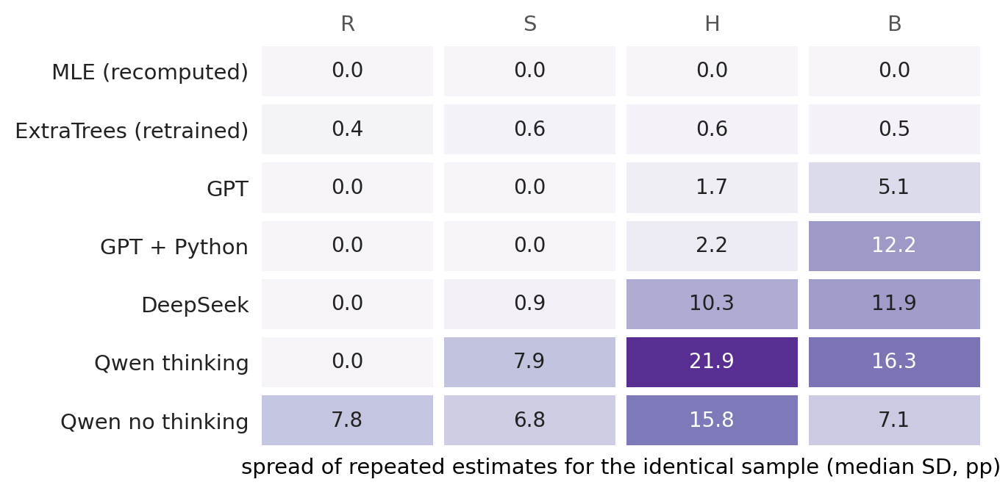
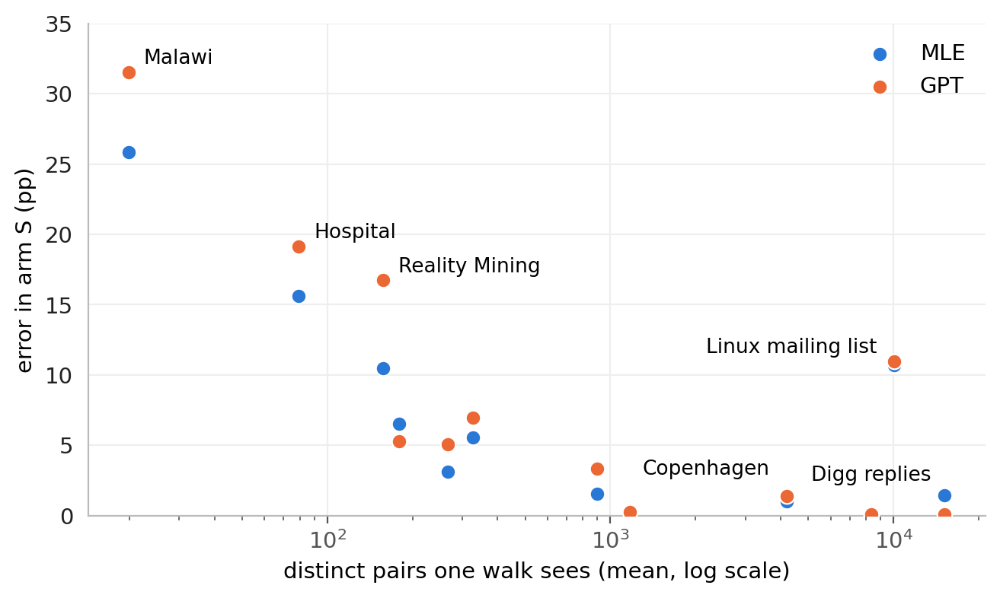
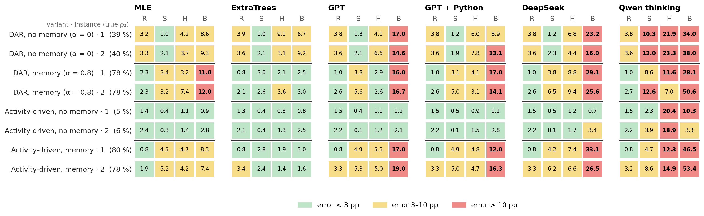
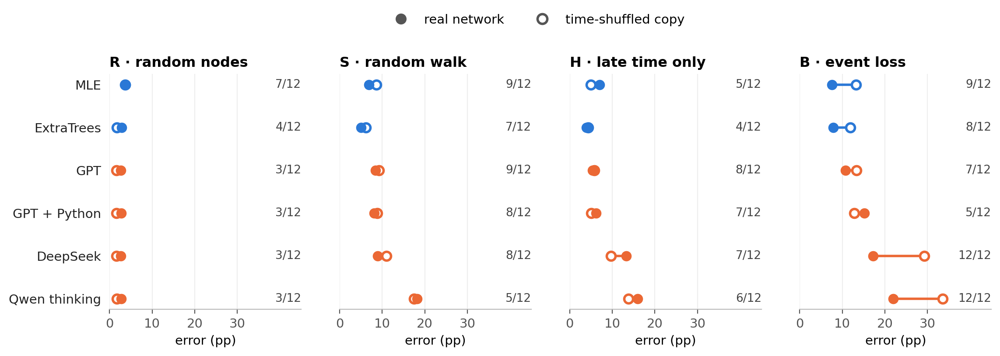
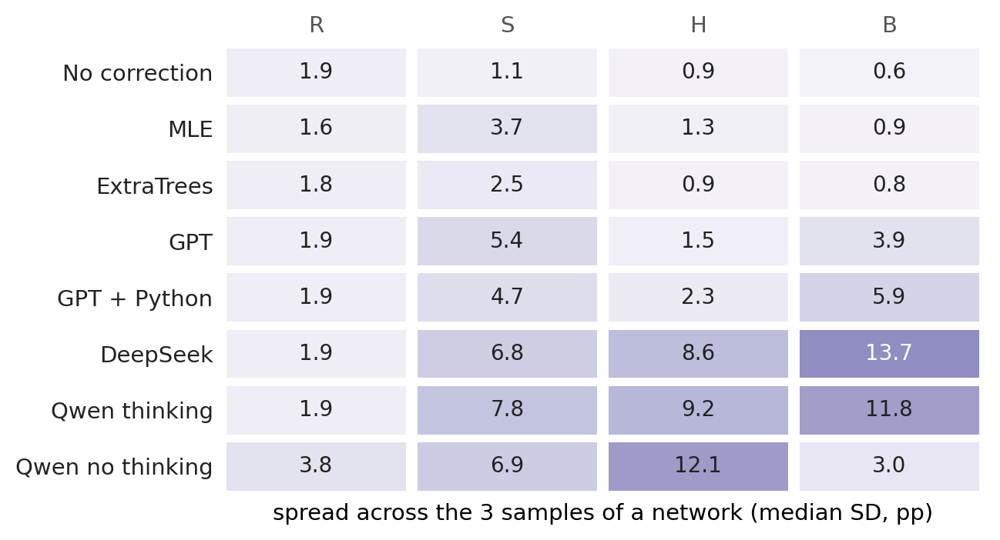

# Analysis

**Question:** how well can language models estimate how persistent a network is from a biased sample, compared with classical methods?

- **ρ₂:** share of interacting pairs that are active in at least 2 of 5 time windows.
- **Error:** mean absolute error of ρ₂ in percentage points (pp). Every network counts equally; lower is better.
- **Sampling arms:**
  - R: random nodes (unbiased)
  - S: random walk (favours busy pairs)
  - H: only the last 60 % of the time
  - B: events randomly lost
- **Methods:**
  - No correction: the observed share
  - MLE: a statistical model of the sampling
  - ExtraTrees: a trained model
  - Language models: GPT, GPT + Python, DeepSeek, Qwen thinking and Qwen no thinking, each giving 3 answers per sample

| Network | Contacts | Nodes | Pairs | True ρ₂ |
|---|---|---:|---:|---:|
| Digg replies | online replies | 30,360 | 85,155 | 0.3 % |
| MathOverflow | Q&A interactions | 24,759 | 187,986 | 8 % |
| College messages | online messages | 1,899 | 13,838 | 10 % |
| Linux mailing list | mailing-list replies | 26,885 | 159,996 | 15 % |
| Workplace | face-to-face, office | 217 | 4,274 | 29 % |
| Hospital | face-to-face, ward | 75 | 1,139 | 45 % |
| Copenhagen | Bluetooth, students | 692 | 79,530 | 45 % |
| High school | face-to-face, students | 327 | 5,818 | 49 % |
| Email EU | emails, institute | 986 | 16,064 | 51 % |
| Malawi | face-to-face, village | 86 | 347 | 51 % |
| Radoslaw | emails, company | 167 | 3,250 | 55 % |
| Reality Mining | Bluetooth, students | 96 | 2,539 | 61 % |

## 1 · The problem: samples distort persistence

Without correction, the walk (S) makes networks look more persistent (+28 pp), while H and B make them look less persistent. MLE removes most of this in S and B but overshoots in H.

## 2 · Which methods fix it

Only a bar left of the dashed line improves on doing nothing:
- ExtraTrees leads in S and H, and ties with MLE in B.
- In H, MLE is worse than no correction, while GPT is better.
- Among the language models, GPT and GPT + Python lead, with Python slightly ahead in S and clearly behind in B.

Qwen no thinking (25–53 pp) is not shown.

## 3 · What the language models compute

In R and S, the models mostly return a known simple estimate: the observed share, or in S a reweighting in which each walk visit of a pair counts 1 / its number of events. In H and B no such simple estimate exists, and most answers are the model's own values (76–89 % for GPT and DeepSeek). Qwen thinking leaves 70 % of its H answers uncorrected. This describes the numbers, not how the models arrived at them.

## 4 · Same sample, asked again

MLE always returns the same number, and ExtraTrees changes by about 0.5 pp when retrained. GPT repeats itself in R and S but varies in H and B, more so with Python (B: 12.2 pp). DeepSeek and Qwen vary most.

## 5 · Arm S: how many pairs the walk sees

The fewer distinct pairs the walk sees, the larger the error, for MLE and GPT alike. Hospital and Copenhagen have the same true ρ₂ (45 %). Yet the walk sees 79 against 4,195 pairs, and GPT's error is 19.1 against 1.4 pp. The Linux mailing list is an exception: over 1,000 simulated walks the simple reweighting there is typically about 4 pp off, so its three samples were unfavourable.

---

## Appendix

### A1 · Error per network, arm and method

Networks are sorted by true ρ₂. Errors grow with ρ₂, most clearly in B. Difficulty also depends on the method: Copenhagen in B gives 0.5 pp for MLE but 17–26 pp for the language models.

### A2 · Synthetic networks

- **DAR:** pair links switch on and off. α is the chance to keep the previous state, so α = 0 has no memory.
- **Activity-driven:** active nodes pick partners. The memory variant prefers known partners.

In B the language models miss by 9–54 pp whenever ρ₂ is high, with or without memory (DAR α = 0 has ρ₂ ≈ 40 %, and GPT is at 15–17 pp there). ExtraTrees was trained on networks from these generators.

### A3 · Real networks against time-shuffled copies

Filled dots are the real networks, open dots their copies with shuffled time stamps. The number is how many of the 12 real networks have the lower error. The results differ mainly in B. Shuffling also raises the true ρ₂ (mean 35 % → 62 %), so the comparison does not isolate temporal structure.

### A4 · New sample of the same network

GPT's estimate moves with the sample (S: 5.4 pp) even though it repeats its answer for the same sample.

### A5 · Network features

| Network | Events per pair | One-off pairs | Pairs only in first 40 % | Distinct pairs per walk | Walk steps revisiting a pair |
|---|---:|---:|---:|---:|---:|
| Digg replies | 1.0 | 99 % | 30 % | 8,342 | 26 % |
| MathOverflow | 2.1 | 60 % | 45 % | 15,144 | 17 % |
| College messages | 4.3 | 38 % | 85 % | 1,168 | 23 % |
| Linux mailing list | 6.4 | 42 % | 41 % | 10,045 | 39 % |
| Workplace | 18.3 | 33 % | 46 % | 266 | 34 % |
| Hospital | 28.5 | 14 % | 26 % | 79 | 27 % |
| Copenhagen | 30.5 | 26 % | 19 % | 4,195 | 29 % |
| High school | 32.4 | 31 % | 26 % | 328 | 51 % |
| Email EU | 20.7 | 26 % | 32 % | 896 | 34 % |
| Malawi | 294.8 | 15 % | 36 % | 20 | 89 % |
| Radoslaw | 25.5 | 15 % | 37 % | 180 | 28 % |
| Reality Mining | 92.5 | 18 % | 58 % | 158 | 36 % |

Pairs active only in the first 40 % of the time are invisible in arm H. Source: [`data/network_features.csv`](data/network_features.csv).

### A6 · Full results and robustness

- **All methods, networks and measures:** [MAIN_RESULTS.md](../results/final/MAIN_RESULTS.md), [PER_SOURCE.csv](../results/final/PER_SOURCE.csv)
- **ExtraTrees training repeats:** [VARIABILITY.md](../results/final/VARIABILITY.md)
- **Number of windows:** [W_SENSITIVITY.md](../results/final/W_SENSITIVITY.md)
- **Random-walk checks:** [WALK.md](../results/final/WALK.md)

Figures are in [`figures/`](figures) as PNG and PDF. Redraw them with `python scripts/analysis_figures.py`. Adding `--inputs` also rebuilds [`data/`](data), which needs `data/raw` and `~/.local/share/masterthesis`.
