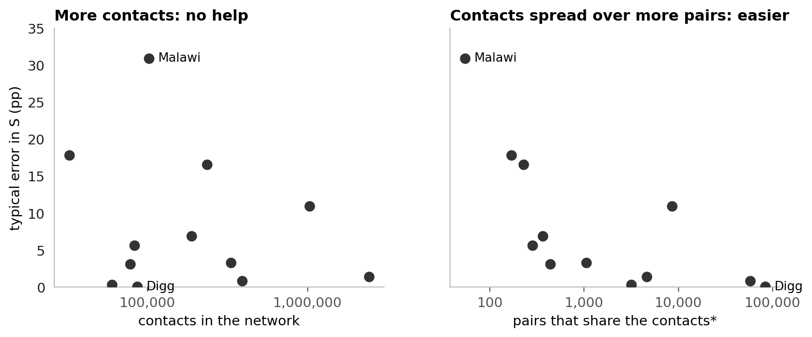
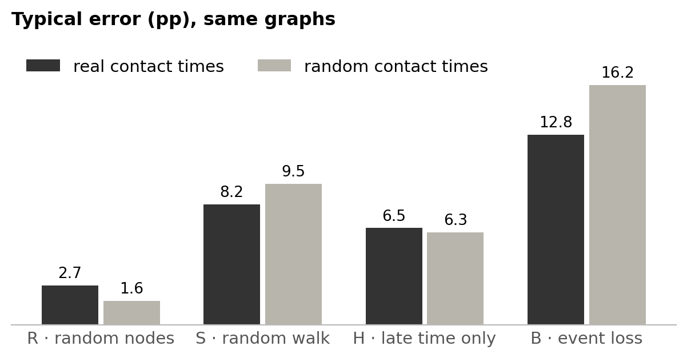
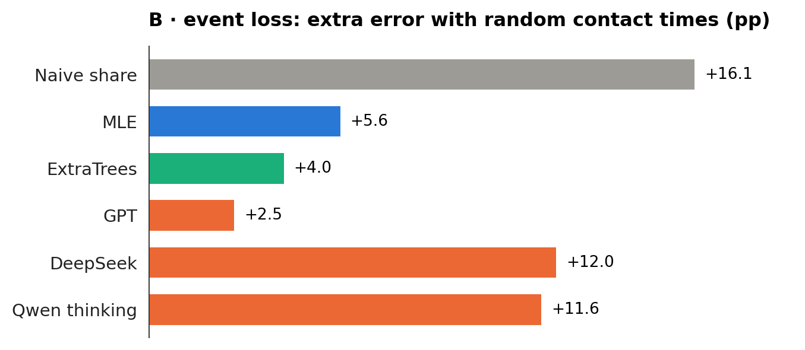

# Estimating persistence from a sample

**Question:** a temporal network is only seen through a sample. Can language models estimate how persistent it is?

**Short answer**
- Where the sampling has a simple textbook correction, GPT and DeepSeek give it, and do no better than the formula.
- Where there is none, they improvise. GPT does best; DeepSeek and Qwen rarely get it right and answer differently each time.
- A Python tool does not help.
- A network is hard when few pairs share its contacts, and, when contacts are lost, when it is highly persistent. Real timing does not matter.

## 0 · The task


- **ρ₂:** share of pairs active in ≥ 2 of 5 time windows. **Naive share:** the same share in the sample.
- **Error:** absolute error of ρ₂ in percentage points (pp), mean over 12 real networks.

| Arm | Sample | Also told |
|---|---|---|
| R · random nodes | random nodes and all contacts among them | number of nodes |
| S · random walk | a walk along contacts, which meets busy pairs more often | visits per pair* |
| H · late time only | random nodes, only the last 60 % of the time visible | number of nodes |
| B · event loss | each event kept with a small probability p | p |

\*Allows the textbook answer, the **simple reweighting**: each visit counts 1 / the pair's number of events.

**Methods:** naive share, training median (a constant guess), MLE (statistical model), ExtraTrees (trained model, a supervised reference), and the language models GPT, GPT + Python, DeepSeek, Qwen thinking and Qwen no thinking.

<details>
<summary>More: real input, model versions, the 12 networks</summary>

Each sample sees about 10 % of the activity, with 3 samples per network and arm. ρ₃ to ρ₅ count pairs active in ≥ 3 to 5 windows.

```
Sampling rule: 24 random nodes; every contact between two of them is seen.   (Hospital, arm R)
Seen: 132 pairs, 3,172 events

pattern (windows 1–5)   pairs   events      1 = active in that window
0 0 0 0 1                  12       86
0 1 1 1 0                   5      283
1 1 1 0 0                   4      490
…                           …        …      (31 patterns in total)

Task: estimate ρ₂ … ρ₅ of the full network.        Naive share 56 / 132 = 42 %; true ρ₂ 45 %.
```

| Method | Details |
|---|---|
| MLE | statistical model of the sampling, no training |
| ExtraTrees | trained on 16 other real and 400 synthetic networks with known answers; not a fair competitor |
| GPT | OpenAI `gpt-6-sol`, reasoning effort high |
| GPT + Python | the same, with OpenAI's hosted Python tool (up to 10 calls) |
| DeepSeek | `deepseek-flash`, reasoning effort high |
| Qwen thinking / no thinking | `Qwen3.6-35B-A3B`, run locally, with or without its thinking phase (temperature 1.0 / 0.7) |

| Network | Contacts | Nodes | Pairs | Events per pair | True ρ₂ |
|---|---|---:|---:|---:|---:|
| Digg replies | online replies | 30,360 | 85,155 | 1.0 | 0.3 % |
| MathOverflow | Q&A | 24,759 | 187,986 | 2.1 | 8 % |
| College messages | online messages | 1,899 | 13,838 | 4.3 | 10 % |
| Linux mailing list | mailing list | 26,885 | 159,996 | 6.4 | 15 % |
| Workplace | face-to-face | 217 | 4,274 | 18.3 | 29 % |
| Hospital | face-to-face | 75 | 1,139 | 28.5 | 45 % |
| Copenhagen | Bluetooth | 692 | 79,530 | 30.5 | 45 % |
| High school | face-to-face | 327 | 5,818 | 32.4 | 49 % |
| Email EU | email | 986 | 16,064 | 20.7 | 51 % |
| Malawi | face-to-face | 86 | 347 | 294.8 | 51 % |
| Radoslaw | email | 167 | 3,250 | 25.5 | 55 % |
| Reality Mining | Bluetooth | 96 | 2,539 | 92.5 | 61 % |

</details>

## 1 · Samples distort persistence, except in R


- The walk (S) overstates persistence; hiding early time (H) and losing events (B) understate it.

## 2 · Who corrects it


- Correction pays off clearly in S and B, only partly in H. In R there is nothing to correct.
- GPT is the best language model but has no consistent edge over MLE. Qwen no thinking is worse than a constant guess.

<details>
<summary>Counts behind this</summary>

- **S:** MLE, ExtraTrees and all thinking models beat the naive share by more than 0.5 pp in 11 of 12 networks. **B:** MLE, ExtraTrees and GPT do so in 8 or 9. **H:** at most 8 of 12; over ρ₂ to ρ₅, correction helps clearly (naive 7.2 pp, GPT 3.3 pp).
- **GPT against MLE:** better in 2, 6, 4 and worse in 6, 4, 6 networks (S, H, B).
- **Qwen no thinking** answers 85–95 % in R, S and B almost regardless of the sample.

</details>

## 3 · Where a textbook answer exists, the models give it


- R: the textbook answer is the naive share. S: it is the simple reweighting. A match means within 0.5 pp.
- In S, GPT's error (8.4 pp) is the formula's own (8.8 pp): no better, no worse.

## 4 · Elsewhere they improvise, and GPT does it best


- "About right" means 50–150 % of the correction the sample needs; only samples off by ≥ 5 pp are counted.

<details>
<summary>Reasoning length and what DeepSeek writes</summary>

| Median reasoning tokens | R | S | H | B |
|---|---:|---:|---:|---:|
| GPT | 489 | 3,051 | 4,764 | 8,966 |
| DeepSeek | 9,069 | 35,483 | 50,226 | 57,932 |

- Both write the longest reasoning in H and B. DeepSeek writes 6–19 times as much as GPT and is still less accurate.
- "Guess" appears in DeepSeek's full reasoning in 82 % of H and 58 % of B answers (R: 2 %), e.g. *"We have no data on windows 1-2, so any extrapolation is a guess."*
- With a stricter band (75–125 %) all shares drop, but the order of the models stays.

</details>

## 5 · Asked again, they answer differently


- MLE always gives the same answer. Two samples of the same network differ by at most 1.3 pp (MLE) in H and B, far less than these spreads.

## 6 · Python does not help


- In B, Python costs 4.4 pp (2.7 pp without Malawi), at 3.4 times the price.

<details>
<summary>What the Python answers look like in B</summary>

Its answers spread more (12.2 against 5.1 pp) and overshoot (+6.4 against +0.5 pp). For 31 of 35 samples, the code of the three answers to the same sample names different model types (gamma, log-normal, latent classes, …).

</details>

## 7 · Which networks are hard

### 7.1 With random nodes or a random walk, the same networks are hard for every method


- **R, S:** the dots sit on the diagonal, so difficulty is a property of the network.
- **H, B:** the dots scatter, so it depends on the method. Copenhagen in B is easy for MLE (0.5 pp) and hard for GPT (17.5 pp).

### 7.2 Not the number of contacts, but how many pairs share them



- Malawi has 102,293 contacts, but they sit on effectively 55 pairs. That is the hardest case.
- Random nodes (R) show the same pattern.

### 7.3 With lost events, persistent networks are hard


- Only in B does the error grow with ρ₂. These are all 32 networks: real, real with random contact times, and synthetic.

### 7.4 Real timing does not matter



- Random contact times leave R, S and H about unchanged. B gets harder only because random times make the networks more persistent (ρ₂ 35 % → 62 %).

### 7.5 DeepSeek and Qwen cannot absorb the extra persistence



- DeepSeek and Qwen are worse in 11 of 12 networks; MLE, ExtraTrees and GPT absorb most of the extra distortion.

<details>
<summary>Definitions and all numbers</summary>

- **Pairs that share the contacts** (effective number of pairs): how many equally busy pairs would hold the contacts (inverse Simpson index of the contact shares). Malawi 55, Copenhagen 4,590, Digg 82,900.
- **Typical error:** median error of MLE, ExtraTrees, GPT, GPT + Python, DeepSeek and Qwen thinking.
- **Random contact times:** each real network with the same pairs and contact counts, each contact at a random time.
- **Synthetic networks** (500 nodes each): DAR (pairs switch on and off per window; with memory a pair keeps its last state 80 % of the time) and activity-driven (active nodes contact partners; with memory they prefer known ones). ρ₂ ranges from 5 % to 80 %.
- All errors per network and method: [figure](figures/fig_networks_detail.png), [MAIN_RESULTS.md](../results/final/MAIN_RESULTS.md). Robustness: [VARIABILITY.md](../results/final/VARIABILITY.md), [W_SENSITIVITY.md](../results/final/W_SENSITIVITY.md), [WALK.md](../results/final/WALK.md).
- Redraw: `python scripts/analysis_figures.py`; `--inputs` also rebuilds [`data/`](data) (needs `data/raw` and `~/.local/share/masterthesis`).

</details>
