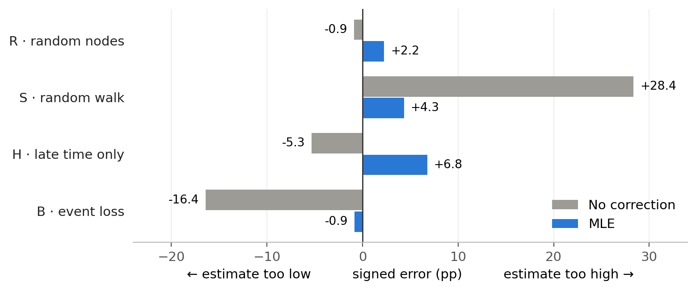
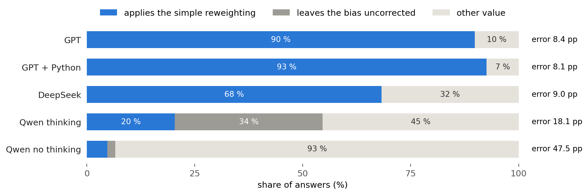
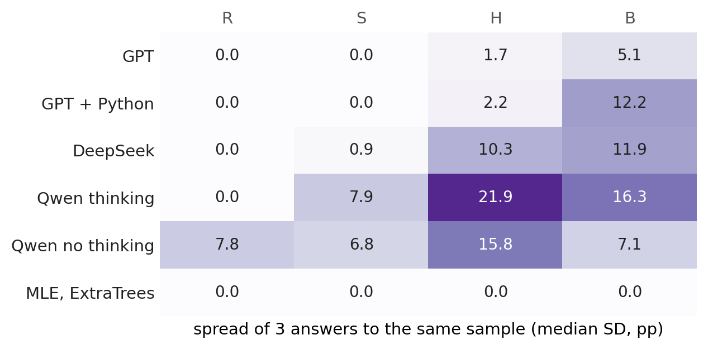
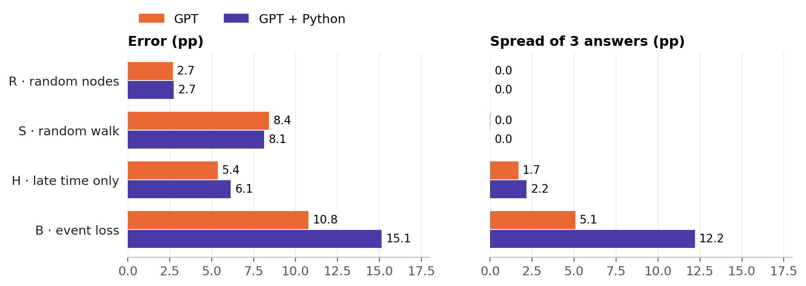
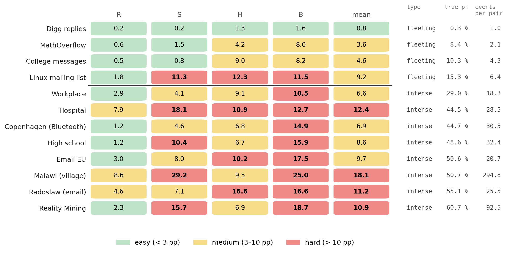
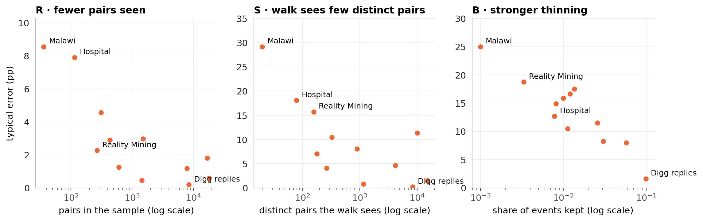
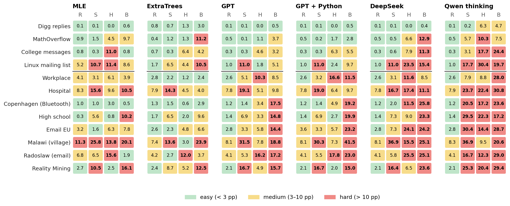

# Analysis

**Question:** how well can language models estimate how persistent a network is from a biased sample, compared with classical methods?

- **Target ρ₂:** share of interacting pairs that are active in at least 2 of 5 time windows.
- **Error:** mean absolute error of ρ₂ in percentage points (pp), 12 real networks, every network counts equally. Lower is better.
- **Sampling arms:** R random nodes (unbiased) · S random walk (favours busy pairs) · H only the last 60 % of the time · B events randomly lost.
- **Methods:** no correction (observed share) · MLE (statistical model of the sampling) · ExtraTrees (trained model) · GPT, GPT + Python, DeepSeek, Qwen thinking, Qwen no thinking (language models, 3 answers per sample).

Figures are in [`figures/`](figures) as PNG and PDF. They are drawn by `scripts/analysis_figures.py` from the frozen results in [`../results/final`](../results/final).

---

## 1 · Biased sampling separates the methods


Without bias (R) all methods tie. With bias, the classical methods are best, GPT is the best language model and Qwen thinking is the weakest. Qwen no thinking (25–53 pp) is left out.

## 2 · MLE removes the bias of the sample



MLE knows the sampling rule and reverses it for all pairs at once. It overshoots only where nothing needs correcting (R) or where its model does not fit (H).

## 3 · Language models copy simple formulas (arm S)



The ranking of the language models in S follows how often they apply the simple reweighting. In R, all models except Qwen no thinking simply return the observed share (96–100 % of answers).

## 4 · Answers vary where no simple formula exists



GPT answers consistently. DeepSeek and Qwen vary strongly in H and B.

## 5 · Python does not help GPT



In B, GPT + Python fits its own numerical model in 92 % of answers. 47 % of its B answers use 10 or more tool calls (the limit is 10), and those are the worst (17.0 pp error, against 13.4 pp for the rest).

## 6 · Which networks are easy and which are hard



Typical error = mean of MLE, ExtraTrees, GPT, GPT + Python, DeepSeek and Qwen thinking. Fleeting networks (large, mostly one-off contacts) are easy. Intense networks (small, many contacts per pair) are hard. The same figure for each method separately is [Figure A1](#appendix).

## 7 · Hard networks give little information



Small intense networks give few pairs in the sample, walks that keep revisiting the same pairs, and extreme thinning in B (Malawi keeps 1 in 1,000 events). For H, no single feature stands out.

---

## Other results (not shown)

- **Time-shuffled copies:** the ranking of the methods is similar. The real networks are clearly easier mainly in B.
- **Synthetic networks:** the ranking is similar. The language models are even weaker in B (GPT 13 pp, ExtraTrees 3.7 pp).
- **Caution:** there are 12 networks, and their features (true ρ₂, size, contacts per pair) are strongly linked, so Figures 6 and 7 show associations, not causes.

## Appendix



*Figure A1.* Error per network and arm for each method. Colours as in Figure 6.

## Redrawing

```
python scripts/analysis_figures.py            # figures from docs/results/final and docs/analysis/data
python scripts/analysis_figures.py --inputs   # also rebuild docs/analysis/data (needs data/raw and ~/.local/share/masterthesis)
```
