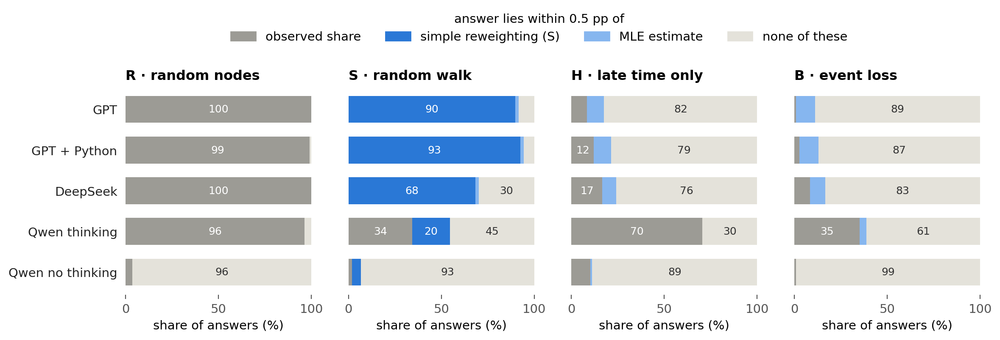
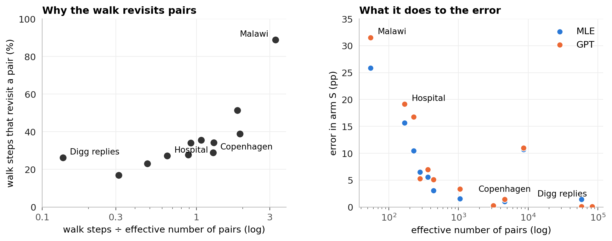
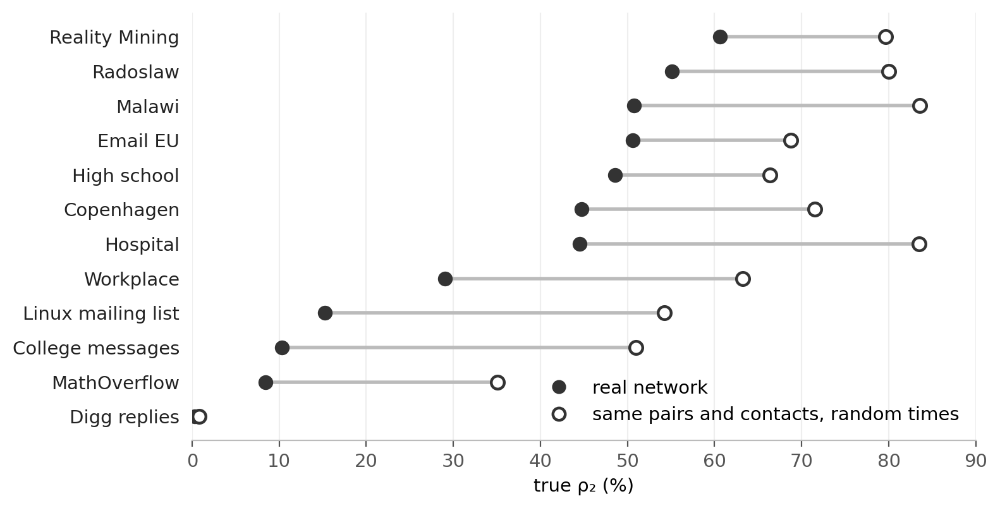
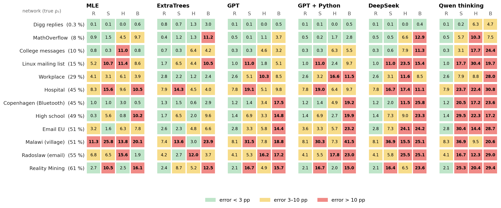

# Estimating persistence from a sample

**Question:** a temporal network is only seen through a sample. Can language models estimate how persistent it is?

**Short answer**
- **Simple textbook answer exists (R, S):** GPT's and DeepSeek's answers match it, and are no better. In S, MLE and ExtraTrees beat it.
- **No textbook answer (H, B):** the models improvise. GPT stays close to MLE; DeepSeek and Qwen rarely get the size of the correction right.
- **Python** does not help, and in B it hurts.
- **Hard networks** give few pairs in the sample (R, S; in S because contacts concentrate on few pairs) or are highly persistent (B).

## 0 · The task


- **ρ₂:** share of pairs active in ≥ 2 of 5 time windows (ρ₃ to ρ₅: ≥ 3 to 5).
- **Naive share:** the same share, computed on the sample.
- **Error:** absolute error of ρ₂ in percentage points (pp), mean over 12 real networks.

Real input, shortened (Hospital, arm R):

```
Sampling rule: 24 random nodes; every contact between two of them is seen.
Seen: 132 pairs, 3,172 events

pattern (windows 1–5)   pairs   events      1 = active in that window
0 0 0 0 1                  12       86
0 0 1 0 0                  23      332
0 1 1 1 0                   5      283
1 1 1 0 0                   4      490
…                           …        …      (31 patterns in total)

Task: estimate ρ₂ … ρ₅ of the full network.
```

Naive share 56 / 132 = 42 %; true ρ₂ 45 %.

| Arm | Sample | Also told |
|---|---|---|
| R · random nodes | random nodes and all contacts among them | number of nodes |
| S · random walk | a walk along contacts, which meets busy pairs more often | visits per pair* |
| H · late time only | random nodes, only the last 60 % of the time visible | number of nodes |
| B · event loss | each event kept with a small probability p | p |

- Each sample sees about 10 % of the activity; 3 samples per network and arm.
- \*Allows a textbook answer, the **simple reweighting**: each visit counts 1 / the pair's number of events.

| Method | What it is |
|---|---|
| Naive share | the share in the sample, uncorrected |
| Training median | a constant guess |
| MLE | statistical model of the sampling, no training |
| ExtraTrees | trained on 16 other real and 400 synthetic networks with known answers; a supervised reference, not a fair competitor |
| GPT | OpenAI `gpt-6-sol`, reasoning effort high |
| GPT + Python | the same, with OpenAI's hosted Python tool (up to 10 calls) |
| DeepSeek | `deepseek-flash`, reasoning effort high |
| Qwen thinking / no thinking | `Qwen3.6-35B-A3B`, run locally, with or without its thinking phase (temperature 1.0 / 0.7) |

## 1 · The 12 networks

| Network | Contacts | Nodes | Pairs | Events per pair | True ρ₂ |
|---|---|---:|---:|---:|---:|
| Digg replies | online replies | 30,360 | 85,155 | 1.0 | 0.3 % |
| MathOverflow | Q&A | 24,759 | 187,986 | 2.1 | 8 % |
| College messages | online messages | 1,899 | 13,838 | 4.3 | 10 % |
| Linux mailing list | mailing list | 26,885 | 159,996 | 6.4 | 15 % |
| Workplace | face-to-face | 217 | 4,274 | 18.3 | 29 % |
| Hospital | face-to-face | 75 | 1,139 | 28.5 | 45 % |
| Copenhagen | Bluetooth | 692 | 79,530 | 30.5 | 45 % |
| High school | face-to-face | 327 | 5,818 | 32.4 | 49 % |
| Email EU | email | 986 | 16,064 | 20.7 | 51 % |
| Malawi | face-to-face | 86 | 347 | 294.8 | 51 % |
| Radoslaw | email | 167 | 3,250 | 25.5 | 55 % |
| Reality Mining | Bluetooth | 96 | 2,539 | 92.5 | 61 % |

## 2 · Samples distort persistence, except in R


- S overstates persistence; H and B understate it.
- Losing pairs need not distort the share: hiding the early 40 % removes 85 % of College messages' pairs, yet its naive share moves by only 1.9 pp.

## 3 · Correction clearly helps in S and B, only partly in H


- **S:** MLE, ExtraTrees and all thinking models beat the naive share in 11 of 12 networks.
- **B:** MLE, ExtraTrees and GPT do so in 8 or 9.
- **H:** errors drop on average (ExtraTrees 3.9, GPT 5.4, naive 6.4 pp), but not consistently across networks. Over ρ₂ to ρ₅ correction helps clearly (naive 7.2 pp, GPT 3.3 pp).
- **Against MLE**, GPT has no consistent edge: it is better in 2, 6 and 4 networks and worse in 6, 4 and 6 (S, H, B).
- **Qwen no thinking** answers 85–95 % in R, S and B almost regardless of the sample, which is worse than the constant guess.

## 4 · Where a simple formula exists, the answers match it



- **S:** 90 % of GPT's answers lie within 0.5 pp of the simple reweighting, and GPT's error (8.4 pp) is the formula's own (8.8 pp).
- This shows matching numbers, not how the models reasoned.


- Only samples that are off by ≥ 5 pp are counted.
- GPT gets the size right about twice as often as DeepSeek (H: 60 against 22 %, B: 43 against 21 %); Qwen almost never.
- With a stricter band (75–125 %) all shares drop, but the order stays.

| Median length of the reasoning (tokens) | R | S | H | B |
|---|---:|---:|---:|---:|
| GPT | 489 | 3,051 | 4,764 | 8,966 |
| GPT + Python | 309 | 2,080 | 3,948 | 8,998 |
| DeepSeek | 9,069 | 35,483 | 50,226 | 57,932 |

- All models write the longest reasoning in H and B. DeepSeek writes 6–19 times as much as GPT and is still less accurate.
- The word "guess" appears in DeepSeek's full reasoning in 82 % of H and 58 % of B answers (R: 2 %), e.g. *"We have no data on windows 1-2, so any extrapolation is a guess."*
- GPT reveals only short summaries; Qwen's reasoning is not analysed.

## 5 · Asking twice gives different answers


- Each language model answered every sample 3 times.
- They change their answer where they improvise: GPT by 5.1 pp in B, DeepSeek and Qwen thinking by 10–22 pp in H and B.
- In H and B, two samples of a network differ far less (MLE ≤ 1.3 pp). There the models' own noise is larger than the difference between two samples.

## 6 · Python costs 3.4 times as much and does not help

| Arm | GPT | GPT + Python | Python better / worse in |
|---|---:|---:|---:|
| R | 2.7 | 2.7 | 0 / 1 |
| S | 8.4 | 8.1 | 2 / 0 |
| H | 5.4 | 6.1 | 3 / 7 |
| B | 10.8 | 15.1 | 2 / 8 |

- The last column counts networks with a difference above 0.5 pp.
- In B, Python adds 4.4 pp of error (2.7 pp without Malawi).
- There its answers spread more (12.2 against 5.1 pp) and overshoot (+6.4 against +0.5 pp).
- Its code names different model types (gamma, log-normal, latent classes, …) in the three answers to the same sample for 31 of 35 samples.

## 7 · What makes a network hard

The methods only see the compact table, never the network itself. A network's structure therefore matters through what the sample can show.

### 7.1 Few pairs make R and S hard


- With 10 % of the activity, small networks give few pairs (Malawi 18–51, Digg about 8,500).
- In R and S, fewer pairs mean a larger error, for every method.

### 7.2 In S, concentrated contacts trap the walk



- **Effective number of pairs:** how many equally busy pairs would hold the contacts. Malawi's 102,293 contacts sit on the equivalent of 55 pairs (of 347), Copenhagen's on 4,590 and Digg's on 82,900.
- **Left:** the longer the walk compared with this number, the more often it returns to pairs it has already seen (Malawi: 89 % of steps).
- **Right:** fewer effective pairs mean a larger error in S, for MLE and GPT alike. The Linux mailing list is the one exception.

### 7.3 Timing, not the contact graph, sets persistence



- **Time-shuffled copy:** the same pairs with the same number of contacts, each contact at a random time.
- ρ₂ rises in all 12 networks (mean 35 % → 62 %). Real contacts of a pair cluster in time, so each pair is active in fewer windows.
- Who meets whom and how often therefore does not fix persistence; when they meet does.

### 7.4 High persistence makes B hard, and the methods cope differently

To vary persistence further, 8 synthetic networks (500 nodes each) come from two standard generators:

| Generator | How contacts arise | Without memory | With memory |
|---|---|---:|---:|
| DAR | each pair switches on or off in every window; with memory it keeps its last state 80 % of the time | ρ₂ 39–40 % | ρ₂ 78 % |
| Activity-driven | active nodes contact partners; with memory they prefer known ones | ρ₂ 5–6 % | ρ₂ 78–80 % |


- Only in B does the error climb steadily with ρ₂: the naive share from 4 to 51 pp, DeepSeek from 6 to 31 pp and Qwen thinking from 12 to 42 pp.
- GPT and MLE stay at or below about 17 pp, and ExtraTrees at or below 10 pp. ExtraTrees was trained on networks from these generators.
- The shuffled copies are harder only in B, as their higher ρ₂ predicts. Because shuffling changes ρ₂ as well, this cannot isolate whether a method uses real timing.

### 7.5 Every network in detail

<details>
<summary>Error per network, arm and method (click to open)</summary>



</details>

---

**More:** full results in [MAIN_RESULTS.md](../results/final/MAIN_RESULTS.md); robustness in [VARIABILITY.md](../results/final/VARIABILITY.md), [W_SENSITIVITY.md](../results/final/W_SENSITIVITY.md) and [WALK.md](../results/final/WALK.md). Figures: `python scripts/analysis_figures.py`; `--inputs` also rebuilds [`data/`](data) (needs `data/raw` and `~/.local/share/masterthesis`).
