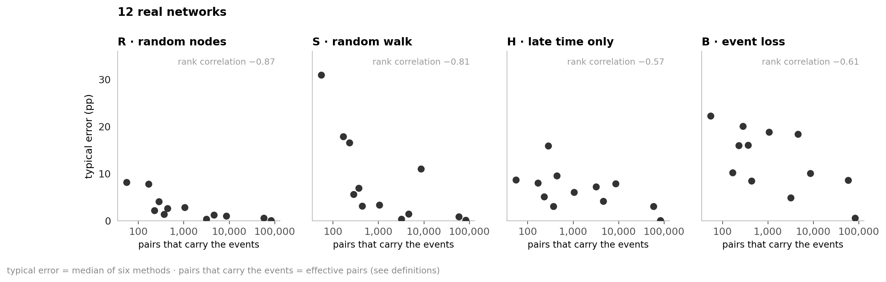
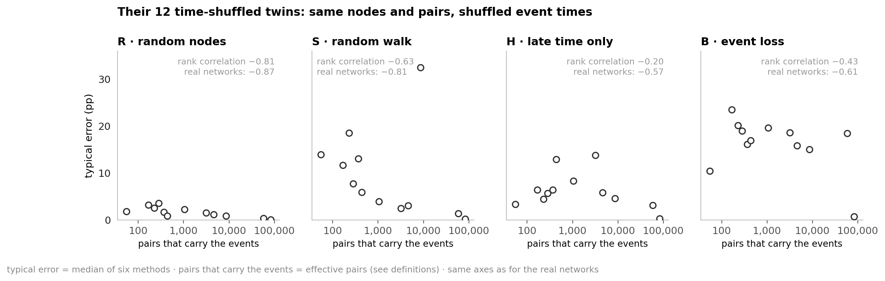
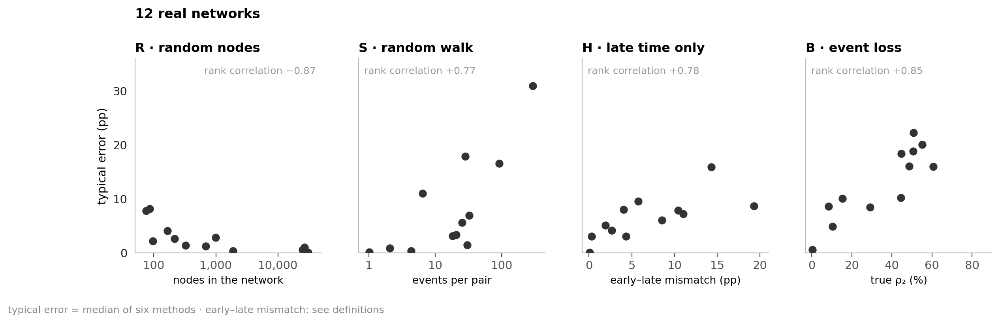
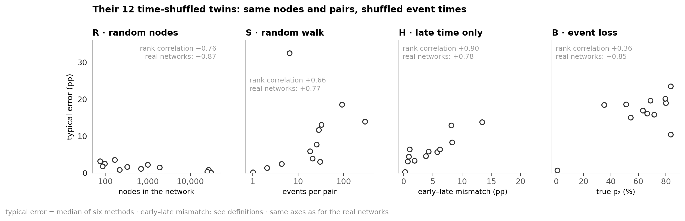
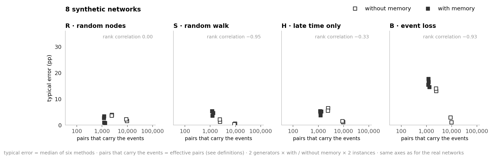
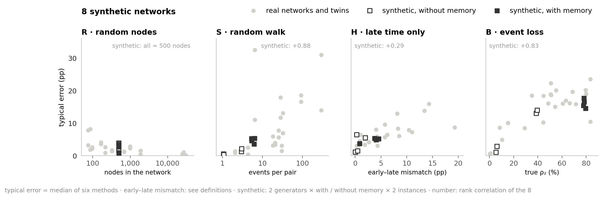
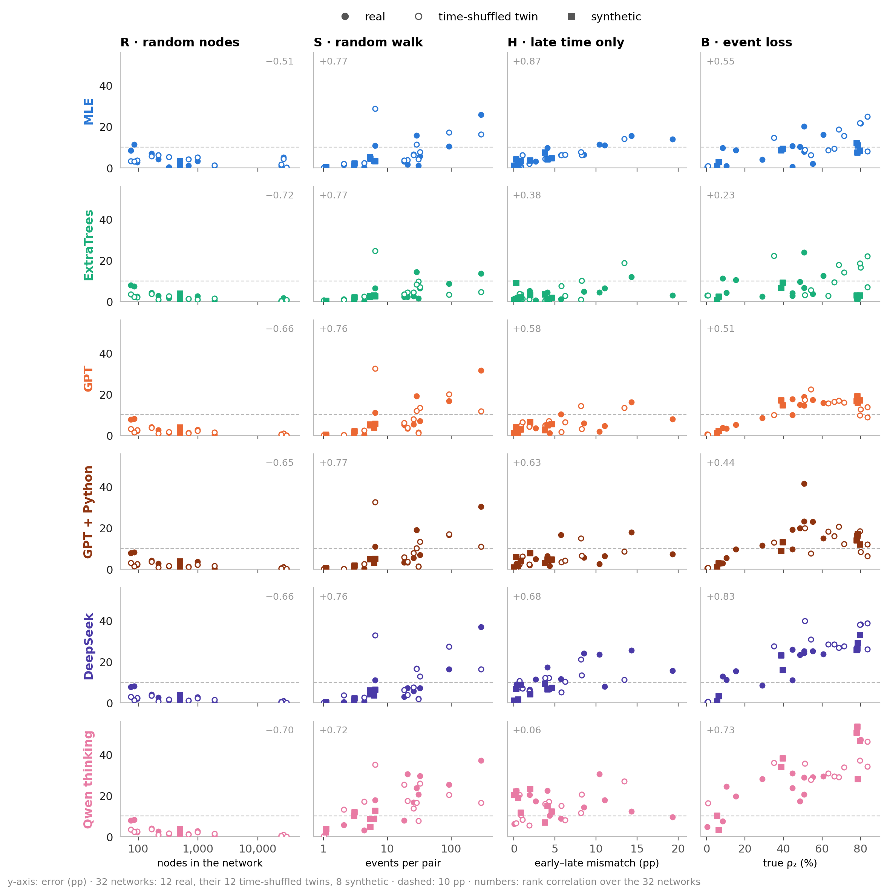

# Persistence under sampling bias

**How does sampling bias affect persistence estimates in temporal graphs—and how do LLMs compare with conventional methods?**

- **Why persistence?** It separates lasting ties from one-off encounters. Lasting ties shape how diseases and information spread.

## 0 · The challenge: sampling changes apparent persistence

<details>
<summary>Definitions</summary>

| Term | Meaning |
|---|---|
| Node | Person or account |
| Event | One interaction between two nodes |
| Pair | Two nodes that interact; direction ignored |
| Window | One of 5 equal time intervals |
| **Persistence · ρ₂** | **Share of interacting pairs active in ≥ 2 windows; our main target** |
| Profile · ρ₃ … ρ₅ | Shares active in ≥ 3 … 5 windows |
| Naive share | Persistence counted directly in the sample |
| Error · pp | Percentage points from truth; 40 % vs 50 % → 10 pp |
| Spread · SD | Standard deviation: how much estimates vary |
| Typical error | Median error across six main methods; excludes Qwen no thinking |
| Effective pairs | Pairs that carry the events: as many equally busy pairs would hold them |
| Time-shuffled twin | A real network with shuffled event times; same nodes, pairs and events per pair |
| Early–late mismatch | Sampler H without sampling noise: guess the two hidden early windows of the complete network from its three late ones; how far the resulting ρ₂ is from the truth |

</details>

### 0a · One graph, four samples: different shares of returning pairs


| Sampler | Real-world case | What it shows | What can go wrong |
|---|---|---|---|
| **R · random nodes** | A study panel: only some people take part, e.g. wear a sensor | Full histories between sampled nodes | Equal pair inclusion, but samples vary |
| **S · random walk** | Crawling a platform from contact to contact (snowball) | Full histories of visited pairs; visit weights | Busy pairs are overrepresented |
| **H · late time** | Recording starts late, or old logs were deleted | Sampled nodes; windows 3–5 only | Early returns are hidden |
| **B · event loss** | Lossy recording: sensors miss contacts, or only a share of messages is stored | Each event retained with probability p | Returns—and whole pairs—disappear |

### 0b · Real samples: walks overstate persistence; missing time and events usually understate it


- The bias shifts the level, not the order: in every sampler the naive share still ranks the 12 networks almost correctly (rank correlation 0.95–0.98).

## 1 · Twelve networks: persistence from 0.3 % to 61 %

### 1a · Twelve real networks, ordered by true ρ₂

<!-- table:network_specs -->
| Network | Interactions | Nodes | Pairs | Events | Events/pair | True ρ₂ |
| --- | --- | ---: | ---: | ---: | ---: | ---: |
| Reality Mining | Phone proximity | 96 | 2,539 | 234,757 | 92.5 | 60.7 % |
| Radoslaw | Email | 167 | 3,250 | 82,876 | 25.5 | 55.1 % |
| Malawi | Face-to-face | 86 | 347 | 102,293 | 294.8 | 50.7 % |
| Email EU | Email | 986 | 16,064 | 332,334 | 20.7 | 50.6 % |
| High school | Face-to-face | 327 | 5,818 | 188,508 | 32.4 | 48.6 % |
| Copenhagen | Phone proximity | 692 | 79,530 | 2,426,279 | 30.5 | 44.7 % |
| Hospital | Face-to-face | 75 | 1,139 | 32,424 | 28.5 | 44.5 % |
| Workplace | Face-to-face | 217 | 4,274 | 78,249 | 18.3 | 29.0 % |
| Linux mailing list | Email replies | 26,885 | 159,996 | 1,028,233 | 6.4 | 15.3 % |
| College messages | Messages | 1,899 | 13,838 | 59,835 | 4.3 | 10.3 % |
| MathOverflow | Online replies | 24,759 | 187,986 | 390,441 | 2.1 | 8.4 % |
| Digg replies | Online replies | 30,360 | 85,155 | 86,203 | 1.0 | 0.3 % |
<!-- /table:network_specs -->

### 1b · Activity over time: how many pairs are active in each window, and how often they return


### 1c · 3–20 windows: persistence changes modestly, the ordering even less


- Mean ρ₂ stays within **6 pp** of the five-window value; rank correlation **≥ 0.97**. Methods were tested with five windows only.

## 2 · The comparison: the same sample for every method

| Specification | Setting |
|---|---|
| Coverage | About 10 % of active pair–window cells |
| Samples | 3 seeds per network and sampler |
| LLM answers | 3 independent repeats per sample, each scored on its own ([mean of 3 → 6c](#averaging)) |
| Scoring | Mean absolute error; each network counts equally |
| **LLMs** | GPT (`gpt-6-sol`), GPT + Python, DeepSeek (`deepseek-flash`), Qwen3.6 thinking / no thinking |
| **Statistical estimators** | Naive share; MLE (fits a distribution; no training) |
| **Supervised models** | ExtraTrees (15–16 other real + 400 synthetic training graphs); training-median baseline |

<details>
<summary>2 detail · Which features does ExtraTrees use?</summary>

### ExtraTrees: 174 input features

| Feature group | Count | Content |
|---|---:|---|
| Time patterns · pairs | 31 | Share of seen pairs per on/off pattern over the 5 windows |
| Time patterns · events | 31 | Share of seen events per pattern |
| Events per window | 5 | Share of seen events in each window |
| Size and density | 4 | Nodes, pairs and events seen (log); events per pair |
| Starting estimate | 4 | Simple ρ₂ … ρ₅: naive share (R), MLE (S, H), thinning model (B) |
| Sampler | 6 | Sampler flags; B's keep rate p |
| Walk weights · S only | 93 | The 31 pattern shares, weighted three ways by walk visits |

- All computed from the text the LLMs see. ExtraTrees learns a correction to the starting estimate.

</details>

### 2a · Example input: Hospital, random nodes

- Sampling rule, sizes and time patterns; S also has weights. No truth, names or node IDs.

```text
Rule: 24 random nodes; all events between them are seen.
Seen: 132 pairs, 3,172 events
pattern (windows 1–5)   pairs   events
0 0 0 0 1                  12       86
0 1 1 1 0                   5      283
1 1 1 0 0                   4      490
…                           …        …
Task: estimate the full graph's ρ₂ … ρ₅.
```

## 3 · Estimation: correction helps in S and B; in H mainly beyond ρ₂

<a id="ranking-real"></a>

### 3a · Mean error: no LLM consistently beats MLE in S/H/B


- GPT is the strongest LLM: its answers match the formulas most often ([4a](#formula)) and scatter least ([6b](#answer-noise)).
- **R:** nothing to correct; random nodes cause no selection bias. MLE's model fit costs 1 pp.
- **H:** only ExtraTrees is well below the naive share (3.9 vs 6.4 pp). **Why:** the time cut hides returns but also whole pairs; the two partly cancel, so the sample is already close.
- **B:** hardest overall ([per network → 8b](#network-difficulty)). **Why:** two opposite effects. Pairs with few events vanish, so the pairs still seen are the persistent ones (35 → 64 %); then their returns vanish too (64 → 19 %).

### 3b · Whole profile: GPT keeps up with MLE and ExtraTrees, except in B


- **H:** with three visible windows the naive share must say 0 for ρ₄ and ρ₅; there correction clearly helps.
- Over ρ₂–ρ₅, GPT matches ExtraTrees in H (3.3 vs 3.2 pp) and beats MLE (4.4). In B it falls behind (7.8 vs 4.6 and 4.9).

### 3c · Corrected estimates: H/S tend above truth; B's errors cancel


- **Why:** in H, methods add returns for the hidden windows ([8a](#mle-gpt)); in S, two small networks (Malawi, Hospital) cause most of the excess.
- **B:** a good mean hides large errors. DeepSeek's mean error is −2.6 pp, yet 36 % of its estimates are more than 20 pp off (GPT 15 %, MLE and ExtraTrees 6 %).

## 4 · Correction: formulas help where information survives

<a id="formula"></a>

### 4a · R/S: answers match the direct formula in R; in S it depends on the LLM


- **R:** count returning pairs. **S:** undo the walk's preference for busy pairs with weights.
- **S:** the formula alone gives 8.8 pp (GPT: 8.4). MLE (6.9) reweights before fitting; ExtraTrees (5.0) starts from the MLE.
- **Why Qwen thinking trails (18 pp):** a third of its S answers equal the unweighted naive share.

<details>
<summary>4a detail · On which networks do the answers match the weighting formula?</summary>

### S per network: the LLM matters most, but small networks are harder for all three


- The LLM matters most: 90 % of GPT's answers match the formula, 68 % of DeepSeek's, 20 % of Qwen thinking's.
- The network matters too: all three match most on the three largest networks (Linux, MathOverflow, Digg) and least on small ones (Workplace, Hospital, Radoslaw).

</details>

### 4b · H/B: how often is the correction within 50–150 % of what is needed? GPT most often among LLMs; MLE stays competitive


- Needed correction = truth − naive share; made = estimate − naive share. Counted: made is 50–150 % of needed. Only samples at least 5 pp off.
- **Why Qwen thinking and DeepSeek trail:** Qwen often makes no correction at all (70 % of its H answers repeat the naive share). DeepSeek corrects, but its answers scatter ([6b](#answer-noise)).

<details>
<summary>4b detail · On which networks is the correction within 50–150 %?</summary>

### H/B per network: how often the correction is within 50–150 % depends on the network


</details>

## 5 · Reasoning: more tokens do not guarantee lower error

### 5a · Tokens and error: B uses the most reasoning

<!-- table:reasoning -->
<table>
<thead>
<tr><th rowspan="2" scope="col">LLM</th><th colspan="4" scope="colgroup">Median reasoning tokens / error (pp)</th></tr>
<tr><th scope="col">R</th><th scope="col">S</th><th scope="col">H</th><th scope="col">B</th></tr>
</thead>
<tbody>
<tr><th scope="row">GPT</th><td>489 / 2.7</td><td>3,051 / 8.4</td><td>4,764 / 5.4</td><td>8,966 / 10.8</td></tr>
<tr><th scope="row">GPT + Python</th><td>309 / 2.7</td><td>2,080 / 8.1</td><td>3,948 / 6.1</td><td>8,998 / 15.1</td></tr>
<tr><th scope="row">DeepSeek</th><td>9,069 / 2.7</td><td>35,483 / 9.0</td><td>50,226 / 13.3</td><td>57,932 / 17.2</td></tr>
<tr><th scope="row">Qwen thinking</th><td>6,068 / 2.7</td><td>9,589 / 18.1</td><td>6,402 / 16.0</td><td>13,173 / 22.0</td></tr>
</tbody>
</table>
<!-- /table:reasoning -->

- DeepSeek uses **6–19×** GPT's reasoning tokens, with no accuracy gain.
- **Why:** long reasoning marks a hard sample; it does not solve it. Within one sample the longest-reasoning answer is as often the worst (35 %) as the best (38 %).
- Qwen: all output tokens counted. Without thinking: valid answers, but 25–53 pp error—worse than the constant training median (23 pp).

## 6 · Noise: new samples and repeated answers

### 6a · Noise from 3 sample redraws: highest in S


- **Why S:** a walk keeps revisiting busy pairs; it sees about 40 % fewer different pairs than random nodes.
- **H/B:** MLE's redraw SD is ≈ 1 pp, its error 7–8 pp: mostly bias, not sample noise.

<details>
<summary>6a detail · Which networks generate redraw noise?</summary>

### Redraw noise per network: small networks are the noisy ones, in every sampler


- The fewer pairs a sample holds, the more the estimate changes between draws—in all four samplers, weakest in S.

</details>

<a id="answer-noise"></a>

### 6b · Noise from 3 LLM answers to the same sample: H/B dominate


- **Likely why H/B:** R/S have a formula, so repeated answers agree. H/B have none; each answer makes its own assumptions.
- **B:** answer noise explains most of GPT's extra error. With its 3 answers to a sample averaged, 8.2 pp remain (single answers 10.8; MLE 7.6, ExtraTrees 7.9).
- ExtraTrees gives one answer per sample; its bar shows 11 retrainings instead. The reported fit is the best of the 11 in S and H (5.0 vs 5.5 pp; 3.9 vs 4.2).

<details>
<summary>6b detail · Which networks generate answer noise?</summary>

### Answer noise per network: no stable pattern; it changes with sampler and LLM


- A stable pattern would put the networks on the line. Instead, the networks that are noisy in H are mostly not the ones that are noisy in B.
- GPT shows a trend in both samplers (more noise on more persistent networks), DeepSeek only in B.


</details>

<a id="averaging"></a>

<details>
<summary>6c · What if the 3 answers are averaged first?</summary>

### Averaging the 3 answers: LLM error drops in H/B, most in B


- Elsewhere each answer is scored on its own. With the mean of 3, DeepSeek and Qwen thinking also beat the naive share in B (10.9 and 14.4 vs 16.4 pp).
- Averaging can never raise this error and costs three answers; its size is the finding.

</details>

## 7 · Python: no consistent accuracy gain

### 7a · GPT with and without Python: in B, error and answer spread both rise


- **B:** worse with Python on **8 of 12** networks. R/S change little.
- **Likely why:** R/S need only arithmetic, which GPT does without Python. In B, GPT uses Python to fit models of its own, and its answers scatter twice as much.
- Cost: **3.4×**.

<details>
<summary>7a detail · On which networks does Python help or hurt?</summary>

### Python per network: effects vary by network


</details>

## 8 · Individual networks: what makes one hard depends on the sampler

<a id="mle-gpt"></a>

### 8a · Network or method: the network decides in R/S, the method in H/B


- **R/S:** all methods struggle on the same networks.
- **H/B:** which method is used matters as much as the network.

<details>
<summary>8a detail · How much of the error comes from the network, how much from the method?</summary>

### Share of the differences in error: the network in R/S, network and method in H/B

<!-- table:network_or_method -->
| Sampler | Network | Method | Both together |
| --- | ---: | ---: | ---: |
| **R · random nodes** | 94 % | 2 % | 4 % |
| **S · random walk** | 68 % | 18 % | 14 % |
| **H · late time only** | 28 % | 39 % | 34 % |
| **B · event loss** | 39 % | 31 % | 30 % |
<!-- /table:network_or_method -->

- 12 real networks, six methods. "Both together": which method works depends on the network.
- Across all samplers, choosing among MLE, ExtraTrees and GPT explains 2 % of the differences; the network explains 42 %.

</details>

<details>
<summary>8a detail · On which networks does GPT win, on which MLE and ExtraTrees?</summary>

### H/B per network: GPT wins where little needs correcting, ExtraTrees and MLE where much does


- **Low persistence (bottom four networks):** the sample is nearly right. GPT changes little and is best (H 1.9, B 3.1 pp); MLE and ExtraTrees correct too much (H 6.7 and 3.4; B 4.9 and 7.2).
- **The other eight:** much must be corrected. ExtraTrees leads (H 4.2, B 8.2 pp); GPT falls behind in B (14.6), where its answers scatter (Copenhagen: 31–80 %, truth 45 %).
- **Why MLE overshoots in H:** it assumes steady pair activity and adds ≈ 12 pp where ≈ 5 are needed ([twins → 8c](#twins)).

</details>

<a id="network-difficulty"></a>

### 8b · Per-network error: B is hardest often, not always


- Hardest sampler: **B on 6 networks · S on 4 · H on 2**.

<a id="twins"></a>

### 8c · Time-shuffled twins: the same network with shuffled timing; LLMs follow the change—except Qwen no thinking

- A twin is a real network whose event times are shuffled. It shows what timing alone does.

| Kept | Changed | Test |
|---|---|---|
| Nodes, pairs, events per pair, global event times | Times reassigned to pairs: bursts dissolve, mean ρ₂ **+27 pp** | Timing sensitivity beyond node/pair/event totals |


- **R/S/H:** the naive share itself rises by 18–28 pp, so following it proves little.
- **B:** the cleaner test: naive +11, MLE +17, GPT +24 of +27 pp.
- **H:** MLE adds ≈ 11 pp on twins and ≈ 12 on real networks; twins need ≈ 9, real networks ≈ 5. So it fits the twins: 4.9 pp vs naive 9.4.

<details>
<summary>8c detail · Which methods estimate persistence best on twins?</summary>

### Twins: mean error by method and sampler


- vs [real networks (3a)](#ranking-real): R/S unchanged. **H:** MLE moves ahead of the naive share. **B:** most errors rise; ExtraTrees, GPT (with or without Python) and MLE stay ahead, within 1.5 pp.

</details>

### 8d · Across samplers: few effective pairs is a tendency, and no property decides everywhere



- Effective pairs = equally busy pairs with the same event concentration. Malawi: **347 actual, 55 effective**, the hardest network in R, S and B.
- **Real networks:** in every sampler, fewer effective pairs go with larger errors (R −0.87, S −0.81, H −0.57, B −0.61).



- **Twins:** the same pairs, so the same effective pairs; only the timing differs.
- **R/S:** the pattern stays (−0.81, −0.63). **Likely why:** with few effective pairs, a sample holds few different pairs (a Malawi walk sees ≈ 20).
- **H:** the pattern is gone (−0.20): the six twins with few effective pairs are no harder than the other six (6.0 vs 5.2 pp).
- **B:** only a weak rest (−0.43) that hangs on single twins (−0.26 to −0.76 with one left out); in size nothing is left (18.0 vs 17.1 pp).
- **So:** we found no network property that makes a network hard in every sampler. It depends on the sampler ([8e](#hard-networks); synthetic networks: [9d](#hard-all)).

<a id="hard-networks"></a>

### 8e · Per sampler: a different property decides whether a network is hard



- **R · few nodes** (−0.87). A small network gives a sample with few pairs (Malawi: 36).
- **S · many events per pair** (+0.77). The walk follows events and keeps revisiting busy pairs.
- **H · early windows unlike the late ones** (+0.78). Early–late mismatch: guess the two hidden windows of the complete network from its three late ones; how far the resulting ρ₂ is from the truth.
- **B · high persistence** (+0.85). The more pairs return, the more returns event loss hides.



- **Twins:** the same property decides in R, S and H (−0.76, +0.66, +0.90).
- **B:** weak on the twins (+0.36). Shuffling makes 10 of 12 twins persistent (ρ₂ above ≈ 45 %), and there the error no longer grows.
- **H:** the mismatch uses MLE's way of guessing, but the other methods follow it too (without MLE: +0.71, twins +0.90). **Likely why:** real pairs come and go, so the guess lands 6.6 pp too high on average; with shuffled timing only 1 pp.
- These are associations, and the properties overlap. The synthetic networks confirm S and B ([9d](#hard-all)).

<details>
<summary>8e detail · Do the same properties decide for ρ₃ to ρ₅?</summary>

### ρ₃ to ρ₅: the same property decides at every level

<!-- table:levels -->
| Sampler | Property | ρ₂ | ρ₃ | ρ₄ | ρ₅ |
| --- | --- | ---: | ---: | ---: | ---: |
| **R** | nodes | −0.87 / −0.76 | −0.89 / −0.87 | −0.92 / −0.94 | −0.74 / −0.76 |
| **S** | events per pair | +0.77 / +0.66 | +0.78 / +0.74 | +0.80 / +0.77 | +0.75 / +0.72 |
| **H** | early–late mismatch of that level | +0.78 / +0.90 | +0.87 / +0.71 | +0.84 / +0.62 | +0.92 / +0.81 |
| **B** | true share of that level | +0.85 / +0.36 | +0.90 / +0.80 | +0.93 / +0.95 | +0.97 / +0.97 |
<!-- /table:levels -->

- Rank correlation with the typical error of that level: real / twins. Negative: fewer nodes, larger error.
- **B:** clearer on the twins at higher levels (+0.80 to +0.97). There they still differ; at ρ₂ most are above 45 %.
- **Few effective pairs (8d):** from ρ₃ on, the tendency also shows on the twins in H and B (−0.49 to −0.77). **Likely why:** at higher levels the true share matters in every sampler (ρ₅: +0.84 to +0.99), and networks with few effective pairs are the persistent ones.

</details>

## 9 · Synthetic networks: memory under control, and the same properties again

### 9a · Synthetic networks: two memory rules with real-world motivations

| Generator | Real-world motivation | Memory rule tested here |
|---|---|---|
| **DAR · link states** | Transport/contact links and diffusion ([Williams et al.](https://arxiv.org/abs/1909.08134)) | 80 % copy previous ON **or OFF**; otherwise redraw |
| **Activity-driven · partners** | Mobile calls and information spreading ([Karsai et al.](https://www.nature.com/articles/srep04001)); original model: epidemics ([Perra et al.](https://arxiv.org/abs/1203.5351)) | Known partner with probability **n/(n+1)**; n = partners known |

- Per generator: 2 networks without and 2 with memory, same size (**≈ 500 nodes, ≈ 10k events**) and same random numbers: only the memory rule differs.
- DAR only switches links ON or OFF; we add event counts. The animations show tiny examples, not the tested networks.

#### DAR: copying the last state makes links persist

- **Copy:** ON stays ON, OFF stays OFF. **New draw:** choose ON (20 %) or OFF again.


#### Activity-driven: remembered partners make contacts return

- Active nodes make one contact, lasting one round. With 3 known partners: **75 % known, 25 % new**.


### 9b · Memory: similar event counts, much more persistence


### 9c · Memory raises event-loss error—mostly where persistence starts low


- Activity-driven: ρ₂ 6 → 79 %, B error 2 → 16 pp. DAR: 39 → 78 %, 13 → 16 pp.
- Two paired instances per generator: a mechanism check, not a broad synthetic benchmark.

<details>
<summary>9c detail · Which methods estimate persistence best on synthetic networks?</summary>

### Synthetic networks: mean error by method and sampler


- vs [real networks (3a)](#ranking-real): same leaders (ExtraTrees, MLE, GPT). **H:** all three, and DeepSeek, now beat the naive share (9.5 pp). **B:** ExtraTrees clearly first (3.6 vs MLE 7.5 pp); it was trained on graphs from the same two generators.
- Why S and H are easier than on real networks: [9d](#hard-all).

</details>

<a id="hard-all"></a>

### 9d · Synthetic networks: the same properties decide in S and B; R and H offer little to test

<!-- table:hard_properties -->
| Property | Sampler | Real | Twins | Synthetic | All 32 |
| --- | --- | ---: | ---: | ---: | ---: |
| Effective pairs | R | −0.87 | −0.81 | 0.00 | −0.67 |
| Effective pairs | S | −0.81 | −0.63 | −0.95 | −0.77 |
| Effective pairs | H | −0.57 | −0.20 | −0.33 | −0.47 |
| Effective pairs | B | −0.61 | −0.43 | −0.93 | −0.56 |
| **Nodes** | **R** | −0.87 | −0.76 | – | −0.67 |
| **Events per pair** | **S** | +0.77 | +0.66 | +0.88 | +0.79 |
| **Early–late mismatch** | **H** | +0.78 | +0.90 | +0.29 | +0.80 |
| **True ρ₂** | **B** | +0.85 | +0.36 | +0.83 | +0.65 |
<!-- /table:hard_properties -->

- Rank correlation of the typical error with the property; negative means fewer, larger error. Bold: the sampler's own property ([8e](#hard-networks)).
- **S, B:** confirmed (+0.88, +0.83).
- **R:** no test; all eight networks have ≈ 500 nodes.
- **H:** the generators run evenly over time, so the early–late mismatch is small on all eight (at most 4.6 pp; real networks up to 19.3). H is easier there (4.2 vs 6.5 pp), with too little spread for a trend (+0.29).
- **Few effective pairs:** as on the real networks in S and B. But memory changes effective pairs and persistence together, so the two cannot be separated here.
- **Likely why synthetic networks are easier in S:** few events per pair (median 4 vs 23).

<details>
<summary>9d detail · Are synthetic networks with few effective pairs harder?</summary>

### Synthetic networks: few effective pairs go with larger errors in S and B



</details>

<details>
<summary>9d detail · Does each sampler's property decide on the synthetic networks?</summary>

### Synthetic networks: events per pair (S) and persistence (B) decide again



</details>

### 9e · All 32 networks: the sampler's property goes with the error of nearly every method



- **R, S:** every method (−0.51 to −0.72; +0.72 to +0.77).
- **H:** every method except Qwen thinking (+0.06), whose error is high everywhere. Clearest for MLE (+0.87), whose way of guessing it is; then DeepSeek, GPT + Python and GPT (+0.68, +0.63, +0.58); weak for ExtraTrees (+0.38).
- **B:** every method (+0.23 to +0.83), least ExtraTrees: above 30 %, it stays below 10 pp on 16 of 24 networks, MLE on 12, GPT on 4, DeepSeek and Qwen thinking on none.
- **B:** above 60 %, MLE and ExtraTrees are 10–12 pp too low; GPT is not, but scatters. Averaged, it is ahead on 9 of 12 twins (8.1 vs 11.9 and 13.2 pp); on synthetic networks ExtraTrees, trained on the same generators, leads.
- Order of the networks: over all 32, the naive share loses it in B (rank correlation 0.77); MLE, ExtraTrees and GPT keep it (0.91–0.93).

## 10 · Key findings

**How does sampling bias affect persistence estimates?**

1. **It depends on what the sampler hides.** Random nodes: no selection bias. Walks overstate persistence (+28 pp). Missing time and missing events understate it (−5 and −16 pp). The order of the real networks survives in every sampler.
2. **What is hidden decides how well it can be corrected.** Walk weights are known, so a formula removes most of the bias (30 → 5–9 pp). Hidden time and lost events must be modelled; 4–8 pp remain even for the best method.
3. **What makes a network hard depends on the sampler.** Few effective pairs is a tendency in all four, but with shuffled timing it holds only in R and S. Per sampler another property decides: few nodes (R), many events per pair (S), early windows unlike the late ones (H), high persistence (B).

**How do LLMs compare with conventional methods?**

4. **Where a formula exists (R, S), the best LLM's answers match it** and come close to the conventional methods (S: GPT 8.4, MLE 6.9, ExtraTrees 5.0 pp).
5. **Where none exists (H, B), only GPT keeps up**: best where little needs correcting, behind ExtraTrees and MLE where much does. In B much of its extra error is answer noise. DeepSeek and Qwen fall behind. Longer reasoning or Python brings no gain.
6. **In short:** the best LLM gets close to the conventional methods, but it is noisier and never clearly better than the best of them. The other LLMs fall behind.

<details>
<summary>Evidence behind the why-statements</summary>

| Statement | Evidence | Data |
|---|---|---|
| 0b · Order of the networks | Rank correlation of the naive share with the truth, 12 real networks: R 0.98, S 0.95, H 0.97, B 0.97. MLE, ExtraTrees, GPT: 0.86–0.98, no better | [relations.csv](data/relations.csv) |
| 3a · GPT is the strongest LLM | Answers within 0.5 pp of the formula: 100 % (R) and 90 % (S); lowest answer SD of all LLMs (H 1.7, B 5.1 pp) | [answer_types.csv](data/answer_types.csv), [VARIABILITY.md](../results/final/VARIABILITY.md) |
| 3a · H: hidden returns and hidden pairs partly cancel | 51 % of returning pairs look non-returning; 40 % of all pairs are hidden; the naive share ends only 5 pp too low | [HISTORY.md](../results/final/HISTORY.md) |
| 3a · B: two opposite effects | Mean over the 12 real networks, ratios of expected counts: true ρ₂ 34.9 %; true ρ₂ of the pairs still seen 64.3 %; ρ₂ seen 18.6 %. Same direction in all 12. Keep rate p: 0.1 % (Malawi) to 9.9 % (Digg) | [event_loss_split.csv](data/event_loss_split.csv), [network_features.csv](data/network_features.csv) |
| 3b · H beyond ρ₂ | ρ₄: naive 10.3, training median 8.7, MLE 3.7, ExtraTrees 2.7, GPT 2.6 pp. ρ₃: naive 6.7, GPT 3.3 | [PREDICTIONS.csv](../results/final/PREDICTIONS.csv) |
| 3b · Whole profile | Error over ρ₂–ρ₅ in H: GPT 3.3, ExtraTrees 3.2, MLE 4.4 pp (GPT better than MLE on 8 of 12 networks). B: GPT 7.8, ExtraTrees 4.6, MLE 4.9 | [SUMMARY.csv](../results/final/SUMMARY.csv) |
| 3c · Large errors in B | Single estimates more than 20 pp off: MLE 6 %, ExtraTrees 6 %, GPT 15 %, GPT + Python 32 %, DeepSeek 36 %, Qwen thinking 49 % | [relations.csv](data/relations.csv) |
| 3c · S ends above truth | Signed error of the six methods: Malawi +14 to +37 pp, Hospital +14 to +24 (a walk sees ≈ 20 and ≈ 80 pairs). Without the two, the mean is −0.5 to +1.0 pp (Qwen thinking: +11) | [PER_SOURCE.csv](../results/final/PER_SOURCE.csv), [WALK.md](../results/final/WALK.md) |
| 4a detail · Small networks are harder | Share of S answers using the weights vs pairs in the network, Spearman: GPT 0.71, DeepSeek 0.53, Qwen thinking 0.51 | [relations.csv](data/relations.csv) |
| 4a · Qwen thinking in S | 34 % of its S answers equal the naive share (34 pp off); its other answers: 9 pp | [answer_types.csv](data/answer_types.csv) |
| 4b · Qwen thinking, DeepSeek in H/B | Qwen repeats the naive share in 70 % (H) and 35 % (B) of answers; its other H answers are 39 pp off. DeepSeek answer SD: 10–12 pp | [answer_types.csv](data/answer_types.csv), [VARIABILITY.md](../results/final/VARIABILITY.md) |
| 5a · Tokens follow difficulty | Median tokens rise from R to B in every LLM (table in 5a). Within a sample (H and B, all 32 networks; GPT, GPT + Python, DeepSeek) the longest-reasoning answer is the best of three in 38 % and the worst in 35 % | [under_the_hood.csv](data/under_the_hood.csv), [reasoning_within_sample.csv](data/reasoning_within_sample.csv) |
| 6a · S is the noisiest sample | 17–89 % of walk steps revisit a pair; a walk sees 40 % fewer pairs than random nodes (median) | [WALK.md](../results/final/WALK.md), [relations.csv](data/relations.csv) |
| 6a detail · Small networks are noisy | Redraw SD vs pairs in the sample, Spearman: R −0.67, S −0.55, H −0.83, B −0.90 | [relations.csv](data/relations.csv) |
| 6b · Answer noise in B | GPT: single answers 10.8 pp, mean of 3 answers to a sample 8.2; MLE 7.6, ExtraTrees 7.9. With all estimates of a network averaged: GPT 7.0, MLE 7.5, ExtraTrees 7.7 (finite averages, not a full split into bias and noise) | [answer_averaging.csv](data/answer_averaging.csv), [relations.csv](data/relations.csv) |
| 6b detail · No stable pattern | Same networks noisy in H and B? Spearman: GPT 0.55, DeepSeek 0.29, Qwen thinking −0.03. GPT's noise vs ρ₂: 0.73 (H), 0.66 (B) | [relations.csv](data/relations.csv) |
| 7a · Python | 8.3 code runs per B answer (R: 0.9); 92 % of B answers call a numerical optimiser; answer SD 5.1 → 12.2 pp; averaged over 3 answers the penalty shrinks from 4.4 to 2.4 pp; cost USD 94.50 vs 27.59 | [under_the_hood.csv](data/under_the_hood.csv), [answer_averaging.csv](data/answer_averaging.csv) |
| 8a · Network in R/S, method in H/B | Mean rank agreement of the six methods on which networks are hard: R 0.93, S 0.89, H 0.42, B 0.38. Shares of the differences in error: table in 8a detail; MLE, ExtraTrees and GPT across samplers: network 42 %, sampler 12 %, method 2 % | [relations.csv](data/relations.csv) |
| 8a detail · Where GPT wins | Mean error on the 4 real networks with ρ₂ < 20 % and on the other 8 (naive share: H 1.2 and 9.0, B 4.3 and 22.5 pp) | [relations.csv](data/relations.csv) |
| 8a detail · MLE in H | MLE adds 12.1 pp, needed 5.3 (twins: 10.8 vs 9.3) | [SUMMARY.csv](../results/final/SUMMARY.csv) |
| 8d · Few effective pairs: a tendency | Typical error vs effective pairs, Spearman: real R −0.87, S −0.81, H −0.57, B −0.61; twins −0.81, −0.63, −0.20, −0.43. Median typical error of the six networks with the fewest vs the most effective pairs, R / S / H / B: real 3.4 vs 0.8, 11.7 vs 1.1, 8.3 vs 5.1, 16.0 vs 9.3 pp; twins 2.2 vs 1.0, 12.4 vs 2.8, 6.0 vs 5.2, 18.0 vs 17.1 pp. With one twin left out: H −0.36 to +0.05, B −0.26 to −0.76. Twins keep nodes, pairs and events per pair; bursty pairs (several events, all in one window) fall from 31 % to 3 % of pairs, median ρ₂ rises from 45 % to 68 % | [relations.csv](data/relations.csv), [twin_features.csv](data/twin_features.csv) |
| 8d · No property for every sampler | Of 12 network properties (nodes, pairs, events, events per pair, effective pairs, one-event pairs, bursty pairs, true ρ₂ to ρ₅, early–late mismatch), none reaches ±0.3 in all four samplers on real networks and twins alike; effective pairs comes closest (weakest value −0.20). A wider exploratory search (133 network and sample properties, not kept in the repository) found none either | [relations.csv](data/relations.csv) |
| 8e · R, S | Typical error vs nodes (R): real −0.87, twins −0.76. Vs events per pair (S): +0.77, +0.66. Pairs in an R sample: 36 (Malawi) to 18,154 (MathOverflow). Walk revisits: row 6a | [relations.csv](data/relations.csv), [network_features.csv](data/network_features.csv) |
| 8e · H: early–late mismatch | The MLE's model fitted to the last three windows of all pairs of the complete network, so without sampling noise; the mismatch is the absolute error of its ρ₂. Typical error vs mismatch: real +0.78, twins +0.90, all 32 +0.80 (any one network left out: +0.78 or more). Without MLE +0.71 and +0.90; the four LLMs alone +0.62 and +0.75. From a network to its twin, the change in mismatch goes with the change in typical error: +0.93 (without MLE +0.76). Typical error 3.6 pp where the mismatch is at most its median (3.9 pp), 8.1 pp above. Mean signed error of the guess: real +6.57, twins +1.05, synthetic +2.01 pp; mean signed error of the six methods: real +1.5 to +9.5, twins −3.9 to +3.5 pp | [relations.csv](data/relations.csv), [network_features.csv](data/network_features.csv), [twin_features.csv](data/twin_features.csv) |
| 8e · B: persistence up to ≈ 45 % | Typical error vs true ρ₂: real +0.85, twins +0.36. On all 32 networks: +0.90 among the 13 below 45 %, −0.09 among the 19 from 45 %; median error 2.8 pp below 20 %, 13.4 pp from 20 to 45 %, 16.9 pp from 45 %. Networks from 45 %: 5 real, 10 twins, 4 synthetic | [relations.csv](data/relations.csv) |
| 8e · Properties overlap | Real networks: true ρ₂ vs keep rate p, Spearman −0.76 | [relations.csv](data/relations.csv) |
| 8e detail · ρ₃ to ρ₅ | Table in 8e detail. Few effective pairs vs typical error on the twins, ρ₃ / ρ₄ / ρ₅: H −0.49 / −0.68 / −0.70, B −0.64 / −0.77 / −0.69 (R and S: −0.67 to −0.93). True share vs typical error at ρ₅: real +0.93 to +0.97, twins +0.84 to +0.99. Effective pairs vs true share, ρ₂ to ρ₅: real −0.69 to −0.78, twins −0.73 to −0.89 | [relations.csv](data/relations.csv) |
| 9d · Synthetic networks | Table in 9d. Early–late mismatch: at most 4.6 pp (synthetic), 19.3 (real), 13.4 (twins); means 2.0, 6.9, 4.6 pp. Mean typical error in H: 4.2 (synthetic) vs 6.5 pp (real); in S: 2.8 vs 8.2 pp. Median events per pair: 4 (synthetic) vs 23 (real, twins). Effective pairs vs true ρ₂ on the synthetic networks: −0.76 | [relations.csv](data/relations.csv), [synthetic_features.csv](data/synthetic_features.csv) |
| 9e · Per method | Error vs the sampler's property on all 32 networks. Nodes (R): −0.51 (MLE) to −0.72 (ExtraTrees). Events per pair (S): +0.72 (Qwen thinking) to +0.77. Early–late mismatch (H): MLE +0.87, DeepSeek +0.68, GPT + Python +0.63, GPT +0.58, ExtraTrees +0.38, Qwen thinking +0.06. True ρ₂ (B): ExtraTrees +0.23, GPT + Python +0.44, GPT +0.51, MLE +0.55, Qwen thinking +0.73, DeepSeek +0.83 | [relations.csv](data/relations.csv) |
| 9e · B at high persistence | Networks with ρ₂ > 30 % (24) and B error below 10 pp: ExtraTrees 16, MLE 12, GPT + Python 5, GPT 4, DeepSeek 0, Qwen thinking 0. Mean signed error on the 13 networks with ρ₂ > 60 %: MLE −11.6, ExtraTrees −10.0, GPT −0.8 pp | [relations.csv](data/relations.csv) |
| 9e · Averaged GPT answers | B, mean of 3 answers: twins 8.1 (ExtraTrees 11.9, MLE 13.2; better on 9 of 12, not significant), real 8.2 (7.9, 7.6), synthetic 12.3 (3.6, 7.5). Python on twins and synthetic networks: no B penalty (12.8 vs 13.3; 10.7 vs 12.9 pp) | [answer_averaging.csv](data/answer_averaging.csv), [SUMMARY.csv](../results/final/SUMMARY.csv) |
| 9e · Order on all 32 networks | Rank correlation with the truth in B: naive 0.77, MLE 0.92, ExtraTrees 0.91, GPT 0.93 | [relations.csv](data/relations.csv) |

</details>

<details>
<summary>Sources and all numbers</summary>

- Design, method settings and literature: [DESIGN.md](../DESIGN.md).
- Scores: [MAIN_RESULTS.md](../results/final/MAIN_RESULTS.md), [all network/method errors](figures/fig_networks_detail.png), [PREDICTIONS.csv](../results/final/PREDICTIONS.csv), [between-network error SDs](data/performance_spread.csv), [method-vs-method counts and sign-flip tests (descriptive)](data/paired_comparisons.csv).
- Noise: [VARIABILITY.md](../results/final/VARIABILITY.md), [per-network SDs and persistence profile](data/noise_by_network.csv), [estimated variance components](data/noise_components.csv), [averaged answers](data/answer_averaging.csv).
- Correction: [mean residuals and absolute errors](data/correction_reliability.csv), [time cut in H](../results/final/HISTORY.md).
- LLMs: [reasoning tokens and Python code runs](data/under_the_hood.csv), [answers matching a formula](data/answer_types.csv).
- Controls: [twin activity](figures/fig10b_twin_active.png), [twin errors](figures/fig10c_twin_error.png), [Python on controls](figures/fig6c_python_groups.png), [higher persistence levels](figures/fig9b_levels.png), [twin features](data/twin_features.csv).
- Robustness: [window sensitivity](../results/final/W_SENSITIVITY.md), [walk settings](../results/final/WALK.md).
- Redraw: `python scripts/analysis_figures.py`; `--inputs` rebuilds input summaries from locally stored raw data. Frozen results are unchanged.

</details>
