# Persistence under sampling bias

**How does sampling bias affect persistence estimates in temporal graphs—and how do LLMs compare with conventional methods?**

## 0 · The challenge: sampling changes apparent persistence

<details>
<summary>Definitions</summary>

| Term | Meaning |
|---|---|
| Node | Person or account |
| Event | One interaction between two nodes |
| Pair | Two nodes that interact; direction ignored |
| Window | One of 5 equal time intervals |
| **Persistence · ρ₂** | **Share of interacting pairs active in ≥ 2 windows; our main target** |
| Profile · ρ₃ … ρ₅ | Shares active in ≥ 3 … 5 windows |
| Naive share | Persistence counted directly in the sample |
| Error · pp | Percentage points from truth; 40 % vs 50 % → 10 pp |
| Spread · SD | Standard deviation: how much estimates vary |
| Typical error | Median error across six main methods; excludes Qwen no thinking |

</details>

### 0a · One graph, four samples: different shares of returning pairs


| Sampler | What it shows | What can go wrong |
|---|---|---|
| **R · random nodes** | Full histories between sampled nodes | Equal pair inclusion, but samples vary |
| **S · random walk** | Full histories of visited pairs; visit weights | Busy pairs are overrepresented |
| **H · late time** | Sampled nodes; windows 3–5 only | Early returns are hidden |
| **B · event loss** | Each event retained with probability p | Returns—and whole pairs—disappear |

### 0b · Real samples: walks overstate persistence; missing time and events usually understate it


## 1 · Twelve networks: persistence from 0.3 % to 61 %

### 1a · Twelve real networks, ordered by true ρ₂

<!-- table:network_specs -->
| Network | Interactions | Nodes | Pairs | Events | Events/pair | True ρ₂ |
| --- | --- | ---: | ---: | ---: | ---: | ---: |
| Reality Mining | Phone proximity | 96 | 2,539 | 234,757 | 92.5 | 60.7 % |
| Radoslaw | Email | 167 | 3,250 | 82,876 | 25.5 | 55.1 % |
| Malawi | Face-to-face | 86 | 347 | 102,293 | 294.8 | 50.7 % |
| Email EU | Email | 986 | 16,064 | 332,334 | 20.7 | 50.6 % |
| High school | Face-to-face | 327 | 5,818 | 188,508 | 32.4 | 48.6 % |
| Copenhagen | Phone proximity | 692 | 79,530 | 2,426,279 | 30.5 | 44.7 % |
| Hospital | Face-to-face | 75 | 1,139 | 32,424 | 28.5 | 44.5 % |
| Workplace | Face-to-face | 217 | 4,274 | 78,249 | 18.3 | 29.0 % |
| Linux mailing list | Email replies | 26,885 | 159,996 | 1,028,233 | 6.4 | 15.3 % |
| College messages | Messages | 1,899 | 13,838 | 59,835 | 4.3 | 10.3 % |
| MathOverflow | Online replies | 24,759 | 187,986 | 390,441 | 2.1 | 8.4 % |
| Digg replies | Online replies | 30,360 | 85,155 | 86,203 | 1.0 | 0.3 % |
<!-- /table:network_specs -->

### 1b · When pairs return: the same ρ₂ can hide different activity patterns

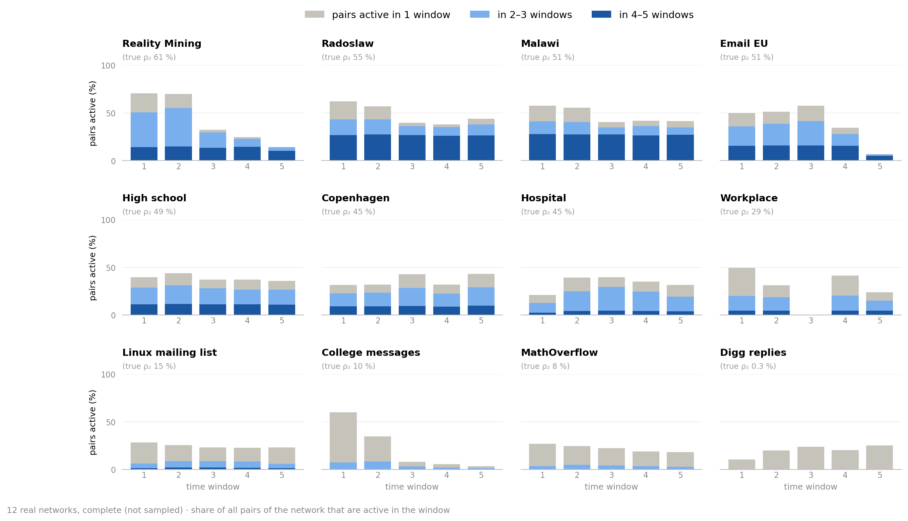

### 1c · 3–20 windows: values change modestly, ordering even less


- Mean ρ₂ stays within **6 pp** of the five-window value; rank correlation **≥ 0.97**.

## 2 · The comparison: the same sample for every method

| Specification | Setting |
|---|---|
| Coverage | About 10 % of active pair–window cells |
| Samples | 3 seeds per network and sampler |
| LLM answers | 3 independent repeats per sample, each scored on its own ([mean of 3 → 6c](#averaging)) |
| Scoring | Mean absolute error; each network counts equally |
| **LLMs** | GPT (`gpt-6-sol`), GPT + Python, DeepSeek (`deepseek-flash`), Qwen3.6 thinking / no thinking |
| **Statistical estimators** | Naive share; MLE (fits a distribution; no training) |
| **Supervised models** | ExtraTrees (16 other real + 400 synthetic training graphs); training-median baseline |

<details>
<summary>ExtraTrees · the 174 input features</summary>

| Feature group | Count | Content |
|---|---:|---|
| Time patterns · pairs | 31 | Share of seen pairs per on/off pattern over the 5 windows |
| Time patterns · events | 31 | Share of seen events per pattern |
| Events per window | 5 | Share of seen events in each window |
| Size and density | 4 | Nodes, pairs and events seen (log); events per pair |
| Starting estimate | 4 | Simple ρ₂ … ρ₅: naive share (R), MLE (S, H), thinning model (B) |
| Sampler | 6 | Sampler flags; B's keep rate p |
| Walk weights · S only | 93 | The 31 pattern shares, weighted three ways by walk visits |

- All computed from the text the LLMs see. ExtraTrees learns a correction to the starting estimate.

</details>

### Example input · Hospital, random nodes

- Sampling rule, sizes and time patterns; S also has weights. No truth, names or node IDs.

```text
Rule: 24 random nodes; all events between them are seen.
Seen: 132 pairs, 3,172 events
pattern (windows 1–5)   pairs   events
0 0 0 0 1                  12       86
0 1 1 1 0                   5      283
1 1 1 0 0                   4      490
…                           …        …
Task: estimate the full graph's ρ₂ … ρ₅.
```

## 3 · Estimation: correction helps in S and B; in H mainly beyond ρ₂

<a id="ranking-real"></a>

### 3a · Mean error: no LLM consistently beats MLE in S/H/B


- GPT is the strongest LLM; B is hardest overall. [Network-specific difficulty → 8b](#network-difficulty).
- **R:** nothing to correct—random nodes cause no selection bias; MLE's model fit costs 1 pp.
- **H:** only ExtraTrees is well below the naive share (3.9 vs 6.4 pp; 8 of 12 networks). The time cut makes 51 % of returning pairs look non-returning but also hides 40 % of all pairs; the two partly cancel ([HISTORY.md](../results/final/HISTORY.md)).

### 3b · Persistence profile: similar ranking; in H correction pays off beyond ρ₂

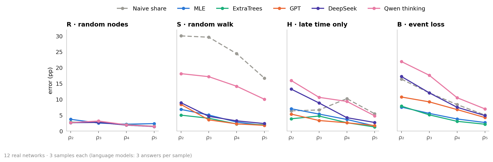

- **H:** three visible windows cannot show ρ₄ or ρ₅, so the naive share says 0. There MLE, ExtraTrees and GPT are far better, also than the constant training median (ρ₄: 2.6–3.7 vs 8.7 pp). At ρ₃ only GPT gains much (3.3 vs 6.7).

### 3c · Corrected estimates: H/S tend above truth; B's errors cancel

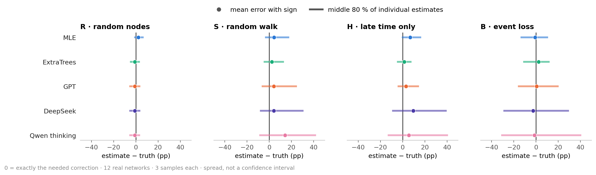

- DeepSeek in B: mean −2.6 pp, absolute error **17.2 pp**—a good mean hides large errors.

## 4 · Correction: formulas help where information survives

### 4a · R/S: LLM answers often match the direct formula


- R: count returning pairs. S: undo the walk's preference for busy pairs with weights.
- S: the formula alone gives 8.8 pp (GPT: 8.4). MLE (6.9) reweights **before fitting**; ExtraTrees (5.0) starts from the MLE.

<details>
<summary>4a detail · Formula matches on individual networks</summary>

### Walk estimates · formula matches vary by network


</details>

### 4b · H/B estimates: GPT comes closest among LLMs; MLE remains competitive


- Target band: 50–150 % of the needed adjustment; samples ≥ 5 pp off truth only.

<details>
<summary>4b detail · Estimation performance on individual networks</summary>

### H/B estimates · reaching the target band depends on the network


</details>

## 5 · Reasoning: more tokens do not guarantee lower error

### Tokens and error · B uses the most reasoning

<!-- table:reasoning -->
<table>
<thead>
<tr><th rowspan="2" scope="col">LLM</th><th colspan="4" scope="colgroup">Median reasoning tokens / error (pp)</th></tr>
<tr><th scope="col">R</th><th scope="col">S</th><th scope="col">H</th><th scope="col">B</th></tr>
</thead>
<tbody>
<tr><th scope="row">GPT</th><td>489 / 2.7</td><td>3,051 / 8.4</td><td>4,764 / 5.4</td><td>8,966 / 10.8</td></tr>
<tr><th scope="row">GPT + Python</th><td>309 / 2.7</td><td>2,080 / 8.1</td><td>3,948 / 6.1</td><td>8,998 / 15.1</td></tr>
<tr><th scope="row">DeepSeek</th><td>9,069 / 2.7</td><td>35,483 / 9.0</td><td>50,226 / 13.3</td><td>57,932 / 17.2</td></tr>
<tr><th scope="row">Qwen thinking</th><td>6,068 / 2.7</td><td>9,589 / 18.1</td><td>6,402 / 16.0</td><td>13,173 / 22.0</td></tr>
</tbody>
</table>
<!-- /table:reasoning -->

- DeepSeek uses **6–19×** GPT's reasoning tokens, with no accuracy gain.
- Qwen counts total output as a reasoning proxy.
- Qwen no thinking: valid answers (1,150 of 1,152), but 25–53 pp error—worse than the constant training median (23 pp).

## 6 · Noise: new samples and repeated answers

### 6a · Noise from 3 sample redraws: highest in S

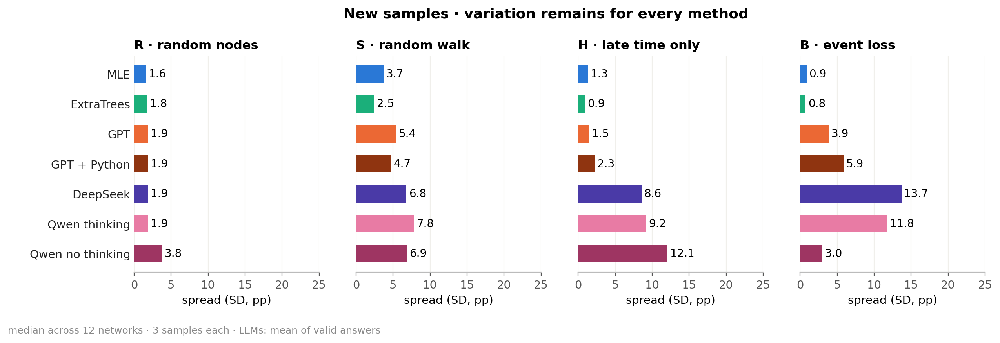

- LLMs excluded: their redraws mix sample noise with answer noise.
- H/B: MLE's redraw SD is ≈ 1 pp, its error 7–8 pp—mostly bias, not sample noise.

<details>
<summary>6a detail · Which networks generate redraw noise?</summary>

### Per-network redraw noise · MLE and ExtraTrees, averaged over samplers

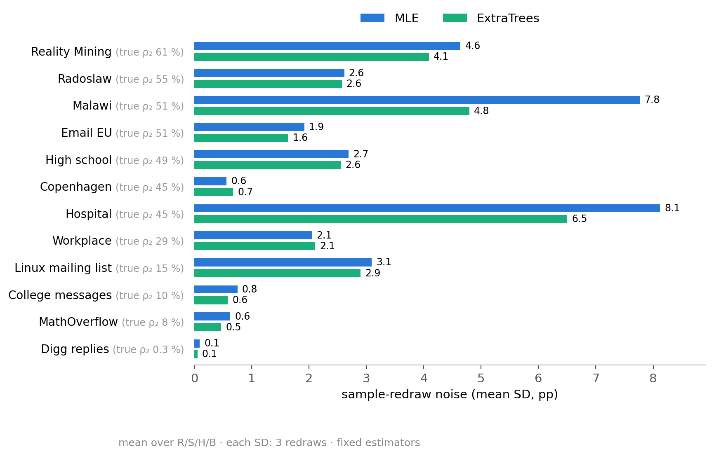

</details>

<a id="answer-noise"></a>

### 6b · Noise from 3 LLM answers to the same sample: H/B dominate


- Low spread can still mean consistently wrong estimates.
- ExtraTrees: the reported fit is the best of 11 retrainings in S and H (5.0 vs 5.5 pp on average; 3.9 vs 4.2); its rank holds for every fit.

<details>
<summary>6b detail · Which networks generate answer-repeat noise?</summary>

### Per-network answer noise · GPT, DeepSeek and Qwen thinking, averaged over samplers

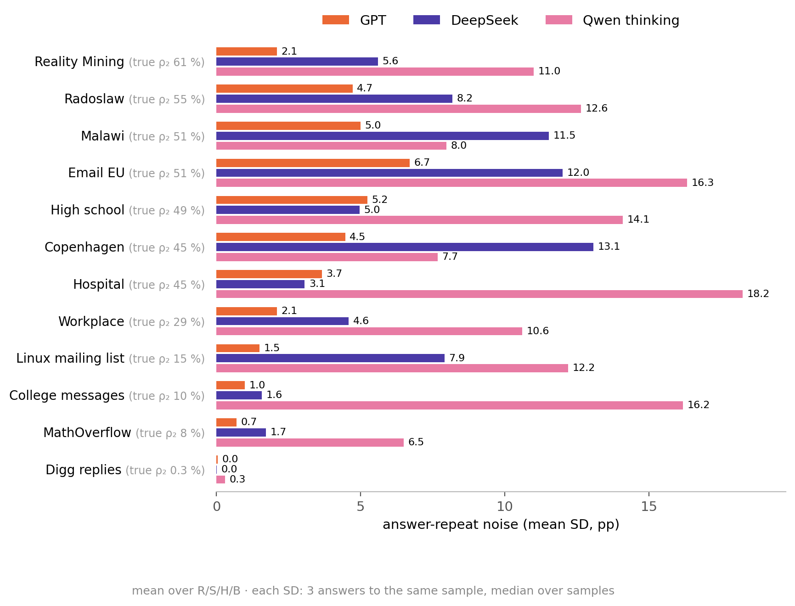

</details>

<a id="averaging"></a>

### 6c · What if the 3 answers are averaged first? LLM error drops in H/B, most in B

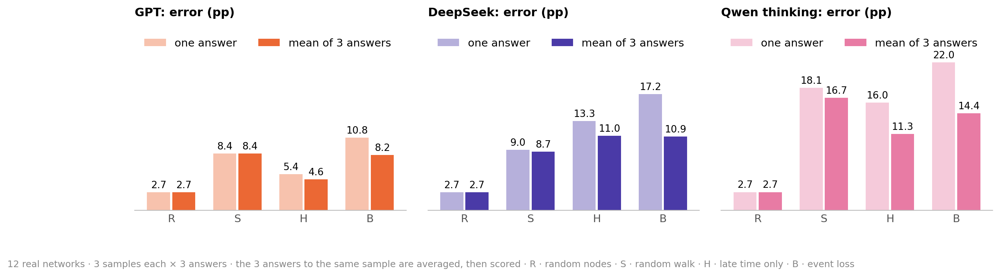

- Everywhere else each answer is scored on its own. With the mean of 3, the order in B stays MLE 7.6, ExtraTrees 7.9, GPT 8.2 pp; DeepSeek and Qwen thinking now beat the naive share (16.4).
- Averaging can never raise this error and costs three answers; its size is the finding.

## 7 · Python: no consistent accuracy gain

### GPT with and without Python · event loss gets harder


- **B:** worse with Python on **8 of 12** networks; barely better than the naive share (15.1 vs 16.4 pp). R/S change little.
- **Likely why:** R/S need only arithmetic GPT already does unaided. In B it fits its own statistical models in Python (**8 code runs per answer**; R: 1) and its answers scatter twice as much ([6b](#answer-noise)). About half the penalty is this noise: with the 3 answers averaged it shrinks from 4.4 to 2.4 pp ([6c](#averaging)).
- Twins and synthetic networks: no B penalty ([figure](figures/fig6c_python_groups.png)). Cost: **3.4×** (USD 94.50 vs 27.59).

<details>
<summary>Python · Gains and losses on individual networks</summary>

### Python versus GPT · effects vary by network


</details>

## 8 · Individual networks: average difficulty hides exceptions

### 8a · Difficulty: network-dependent in R/S, method-dependent in H/B


- **H:** MLE assumes steady pair activity and adds ≈ 12 pp where only ≈ 5 are needed ([twins → 9.1](#twins)): right where the sample is far off (High school, Reality Mining), too much where it is close (Linux, College messages). There GPT adds only 2–3 pp.
- **B:** GPT wins clearly only on Linux and MathOverflow, where MLE overshoots by 9–10 pp. Elsewhere GPT's answers scatter: Copenhagen 31–80 %, truth 45 %.

<details>
<summary>8a detail · On which networks does MLE win, on which GPT?</summary>

### H/B · error of MLE and GPT on each network

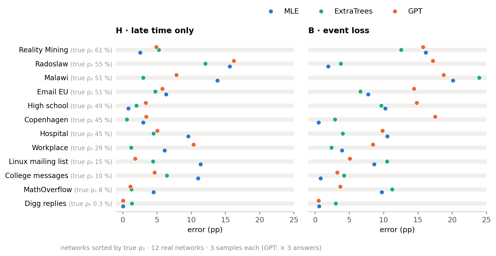

</details>

### Event concentration · fewer effective pairs make R/S harder

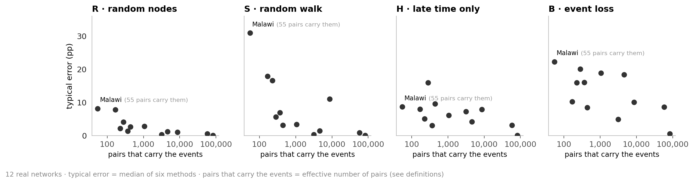

- Effective pairs = equally busy pairs with the same event concentration. Malawi: **347 actual, 55 effective**.
- Malawi, S: 89 % of walk steps revisit a pair; a walk sees ≈ 20 pairs. Even exact reweighting is off by +12 pp ([WALK.md](../results/final/WALK.md)).

<a id="network-difficulty"></a>

### 8b · Per-network error: B is hardest often, not always


- Hardest sampler: **B on 6 networks · S on 4 · H on 2**.

## 9 · Controlled tests: do methods use timing and memory?

<a id="twins"></a>

### 9.1 · Twins: timing sensitivity in LLMs—except Qwen no thinking

| Kept | Changed | Test |
|---|---|---|
| Nodes, pairs, events per pair, global event times | Times reassigned to pairs; mean ρ₂ **+27 pp** | Timing sensitivity beyond node/pair/event totals |


- R/S/H: the naive share itself rises by 18–28 pp, so following it proves little. **B** is the cleaner test: naive +11, MLE +17, GPT +24 of +27 pp.
- **H:** MLE adds ≈ 11 pp on twins, ≈ 12 on real networks; twins need ≈ 9, real networks ≈ 5. So it fits the twins: 4.9 pp vs naive 9.4.

<details>
<summary>Twins · Which methods estimate persistence best?</summary>

### Twin estimates · mean error and SD by method and sampler

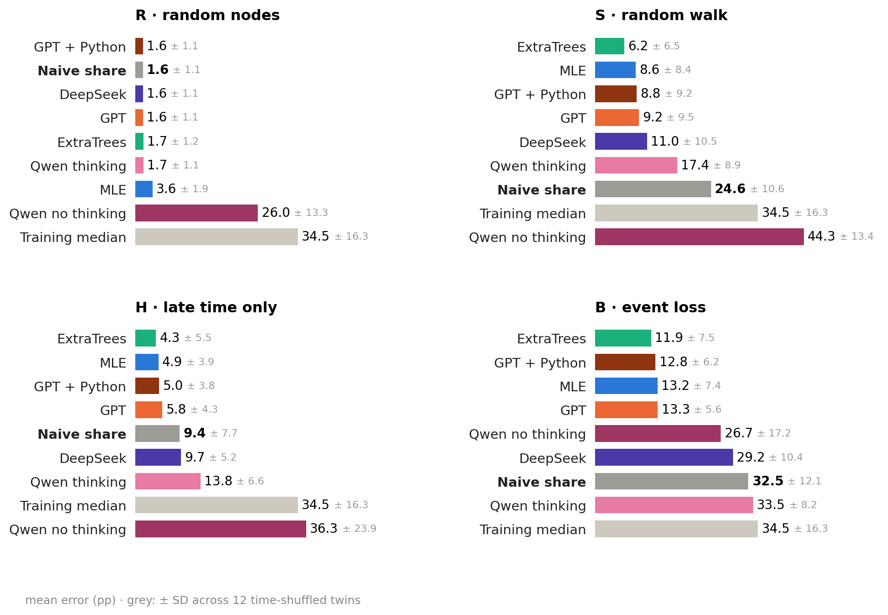

- vs [real networks (3a)](#ranking-real): R/S unchanged. H: MLE moves ahead of the naive share. B: all errors rise; ExtraTrees, GPT (with or without Python) and MLE stay ahead, within 1.5 pp.

</details>

### 9.2 · Synthetic networks: two memory rules with real-world motivations

| Generator | Real-world motivation | Memory rule tested here |
|---|---|---|
| **DAR · link states** | Transport/contact links and diffusion ([Williams et al.](https://arxiv.org/abs/1909.08134)) | 80 % copy previous ON **or OFF**; otherwise redraw |
| **Activity-driven · partners** | Mobile calls and information spreading ([Karsai et al.](https://www.nature.com/articles/srep04001)); original model: epidemics ([Perra et al.](https://arxiv.org/abs/1203.5351)) | Known partner with probability **n/(n+1)**; n = partners known |

- Per generator: 2 networks without and 2 with memory. Same size (**500 nodes, ≈ 10k events**) and same random numbers, so only the memory rule differs.
- DAR only switches links ON or OFF; we add event counts. The animations show tiny examples, not the tested networks.

### DAR · copying the last state makes links persist

- **Copy:** ON stays ON, OFF stays OFF. **New draw:** choose ON (20 %) or OFF again.

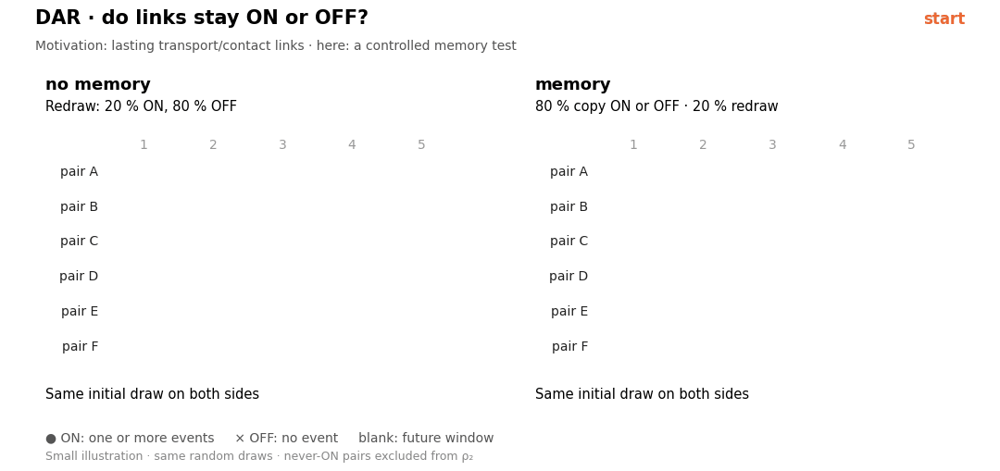

### Activity-driven · remembered partners make contacts return

- Active nodes make one contact, lasting one round. With 3 known partners: **75 % known, 25 % new**.

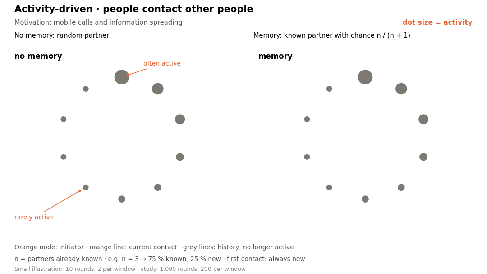

### 9.3 · Memory: similar event counts, much more persistence

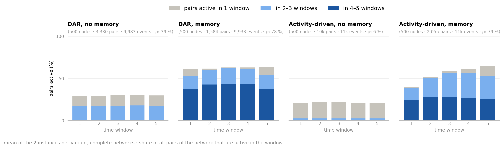

### 9.4 · Memory raises event-loss error—mostly where persistence starts low

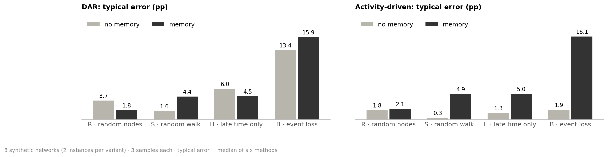

- Activity-driven: ρ₂ 6 → 79 %, B error 2 → 16 pp. DAR: 39 → 78 %, 13 → 16 pp.
- Two paired instances per generator: a mechanism check, not a broad synthetic benchmark.

<details>
<summary>Synthetic networks · Which methods estimate persistence best?</summary>

### Synthetic estimates · mean error and SD by method and sampler

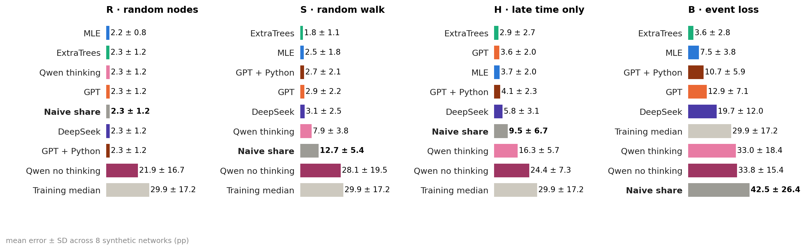

- vs [real networks (3a)](#ranking-real): same leaders (ExtraTrees, MLE, GPT). H: all three, and DeepSeek, now beat the naive share (9.5 pp). B: ExtraTrees clearly first (3.6 vs MLE 7.5 pp)—it was trained on graphs from the same two generators.

</details>

### 9.5 · All 32 networks: at high persistence, event loss separates the methods; walks remain network-dependent


- **B:** above ρ₂ = 30 % the typical error is 10–24 pp on all 24 networks—but ExtraTrees stays below 10 pp on 16 of them, MLE on 12, GPT on 4.
- **S:** the same persistence range spans **1–33 pp** error; persistence alone does not determine difficulty.
- Not persistence alone: on the real networks higher ρ₂ comes with a lower keep rate p (9.9 % → 0.1 %; Spearman −0.76); twins and memory tests also change pair histories. **30 % is not a universal threshold.**

<details>
<summary>9.5 detail · Event loss per method</summary>

### B · MLE and ExtraTrees often stay below 10 pp; GPT sits at 9–22 pp above ρ₂ ≈ 30 %

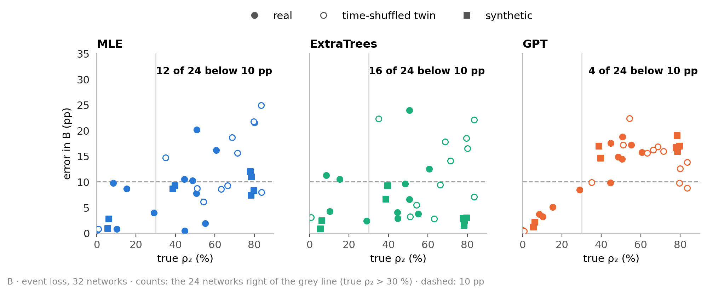

</details>

<details>
<summary>Key findings · the opening question answered</summary>

1. **Sampling bias shifts apparent persistence.** Walks overstate it (+28 pp); missing time and events understate it (−5, −16 pp); random nodes do not.
2. **Correction helps in S and B; in H mainly beyond ρ₂**—and never reaches R's accuracy (2.7 pp). MLE's remaining H/B error is bias; LLM error is partly answer noise: averaging 3 answers cuts it by 24–37 % in B.
3. **No LLM consistently beats the conventional methods.** ExtraTrees is among the two best in S, H and B; MLE in S and B. GPT is the strongest LLM. More reasoning or Python gives no consistent gain.
4. **Sampler, network and method interact.** R/S: a network is hard for all methods alike. H/B: the method's assumptions decide.
5. **Event loss on persistent networks separates the methods.** Above ρ₂ ≈ 30 %, ExtraTrees stays below 10 pp on 16 of 24 networks, MLE on 12, GPT on 4.

</details>

<details>
<summary>Sources and all numbers</summary>

- Design, method settings and literature: [DESIGN.md](../DESIGN.md).
- Scores: [MAIN_RESULTS.md](../results/final/MAIN_RESULTS.md), [all network/method errors](figures/fig_networks_detail.png), [PREDICTIONS.csv](../results/final/PREDICTIONS.csv), [between-network error SDs](data/performance_spread.csv), [method-vs-method counts and sign-flip tests (descriptive)](data/paired_comparisons.csv).
- Noise: [VARIABILITY.md](../results/final/VARIABILITY.md), [per-network SDs and persistence profile](data/noise_by_network.csv), [estimated variance components](data/noise_components.csv), [averaged answers](data/answer_averaging.csv).
- Correction: [mean residuals and absolute errors](data/correction_reliability.csv), [time cut in H](../results/final/HISTORY.md).
- LLMs: [reasoning tokens and Python code runs](data/under_the_hood.csv), [answers matching a formula](data/answer_types.csv).
- Controls: [twin activity](figures/fig10b_twin_active.png), [twin errors](figures/fig10c_twin_error.png), [Python on controls](figures/fig6c_python_groups.png), [higher persistence levels](figures/fig9b_levels.png).
- Robustness: [window sensitivity](../results/final/W_SENSITIVITY.md), [walk settings](../results/final/WALK.md).
- Redraw: `python scripts/analysis_figures.py`; `--inputs` rebuilds input summaries from locally stored raw data. Frozen results are unchanged.

</details>
