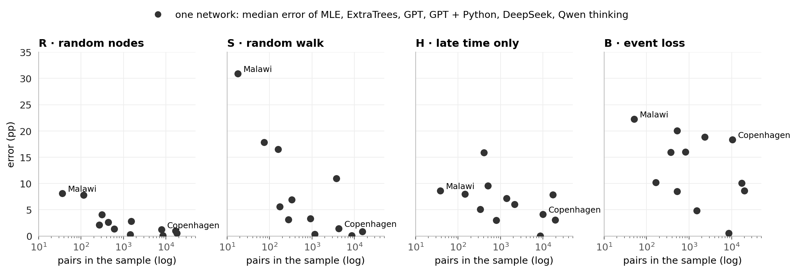
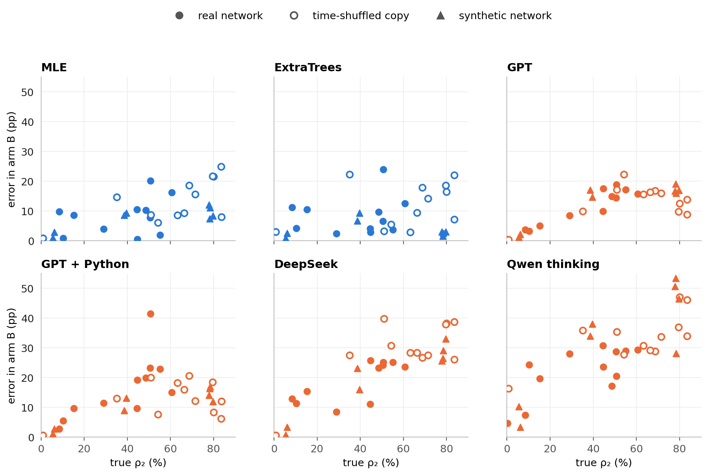
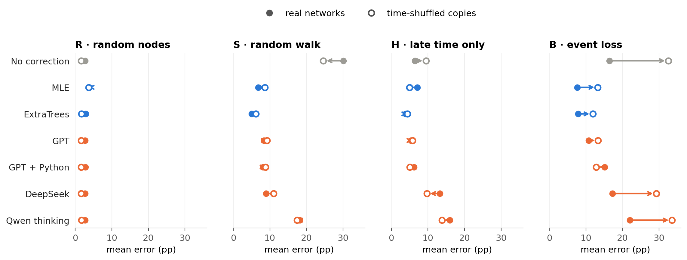

# Estimating persistence from a sample

**Question:** a temporal network is only seen through a sample. Can language models estimate how persistent it is, compared with classical methods?

**ρ₂** is the share of pairs that are active in at least 2 of 5 time windows. **Error** is the absolute error of ρ₂ in percentage points (pp), averaged over the 12 real networks.

## 0 · What a method gets

A shortened sample from the Hospital network, arm R:

```
Sampling rule: 24 random people; every contact between two of them is seen.
Seen: 132 pairs, 3,172 events

pattern (windows 1–5)   pairs   events
0 0 0 0 1                  12       86
0 0 1 0 0                  23      332
0 1 1 1 0                   5      283
1 1 1 0 0                   4      490
…                           …        …      (31 patterns in total)

Task: estimate ρ₂ … ρ₅ of the full network.
```

In this sample, 56 of the 132 pairs are active in at least 2 windows, so the observed share is 42 %. The true ρ₂ is 45 %.

| Arm | How the sample is drawn |
|---|---|
| R · random nodes | random people and all their mutual contacts |
| S · random walk | a walk along contacts, so busy pairs are visited more often |
| H · late time only | random people, but windows 1–2 are hidden |
| B · event loss | every event is kept only with a small probability p |

**Methods:**
- **Classical:** MLE (a statistical model of the sampling) and ExtraTrees (trained on other networks).
- **Language models:** GPT, GPT + Python, DeepSeek, Qwen thinking and Qwen no thinking, 3 answers each.
- **Baselines:** no correction (the observed share) and the training median (a constant guess).

## 1 · The 12 networks

| Network | Contacts | Nodes | Pairs | Events per pair | True ρ₂ |
|---|---|---:|---:|---:|---:|
| Digg replies | online replies | 30,360 | 85,155 | 1.0 | 0.3 % |
| MathOverflow | Q&A | 24,759 | 187,986 | 2.1 | 8 % |
| College messages | online messages | 1,899 | 13,838 | 4.3 | 10 % |
| Linux mailing list | mailing list | 26,885 | 159,996 | 6.4 | 15 % |
| Workplace | face-to-face | 217 | 4,274 | 18.3 | 29 % |
| Hospital | face-to-face | 75 | 1,139 | 28.5 | 45 % |
| Copenhagen | Bluetooth | 692 | 79,530 | 30.5 | 45 % |
| High school | face-to-face | 327 | 5,818 | 32.4 | 49 % |
| Email EU | email | 986 | 16,064 | 20.7 | 51 % |
| Malawi | face-to-face | 86 | 347 | 294.8 | 51 % |
| Radoslaw | email | 167 | 3,250 | 25.5 | 55 % |
| Reality Mining | Bluetooth | 96 | 2,539 | 92.5 | 61 % |

## 2 · The sample distorts persistence


Only R is honest. The random walk (S) overstates persistence, while H and B understate it.

## 3 · Who corrects it


Methods above the grey row beat doing nothing. Classical methods lead in S, H and B. GPT, with or without Python, is the best language model.

## 4 · What the language models compute


Where a textbook estimate exists (R, S), the models return it. Where none exists (H, B), they invent their own, and that is where they fall behind.

## 5 · How stable the estimates are


The language models vary most exactly where they invent their own estimate (H, B).

## 6 · Small samples are hard



In R and S, fewer pairs in the sample means a larger error, with Malawi's 18–36 pairs as the extreme. In H and B the link is weak (see 7).

## 7 · Event loss is hard when persistence is high

To test this beyond the 12 real networks, two extra sets of networks are used:
- **Time-shuffled copies:** the same pairs and event counts at random times. Shuffling raises ρ₂.
- **Synthetic networks:** 8 generated networks with and without memory, with ρ₂ from 5 to 80 %.



For the language models, the error in B grows with ρ₂ in every kind of network, for GPT up to about 40 %. ExtraTrees stays flat, but it was trained on networks from the same generators.

---

## Appendix

### A1 · Error per network

| Network | True ρ₂ | Pairs in sample R | S | H | B |
|---|---:|---:|---:|---:|---:|
| Digg replies | 0.3 % | 8,434 | 8,597 | 8,577 | 8,515 |
| MathOverflow | 8 % | 18,154 | 15,261 | 19,280 | 20,155 |
| College messages | 10 % | 1,445 | 1,168 | 1,382 | 1,516 |
| Linux mailing list | 15 % | 16,800 | 3,719 | 17,156 | 17,186 |
| Workplace | 29 % | 436 | 277 | 503 | 525 |
| Hospital | 45 % | 115 | 74 | 146 | 164 |
| Copenhagen | 45 % | 7,912 | 4,220 | 9,987 | 10,380 |
| High school | 49 % | 609 | 331 | 791 | 816 |
| Email EU | 51 % | 1,512 | 914 | 2,123 | 2,332 |
| Malawi | 51 % | 36 | 18 | 38 | 51 |
| Radoslaw | 55 % | 312 | 175 | 404 | 518 |
| Reality Mining | 61 % | 268 | 158 | 332 | 372 |


### A2 · Real networks against time-shuffled copies

| Network | Digg | MathOverflow | College | Linux | Workplace | Hospital | Copenhagen | High school | Email EU | Malawi | Radoslaw | Reality |
|---|---:|---:|---:|---:|---:|---:|---:|---:|---:|---:|---:|---:|
| True ρ₂, real | 0.3 % | 8 % | 10 % | 15 % | 29 % | 45 % | 45 % | 49 % | 51 % | 51 % | 55 % | 61 % |
| True ρ₂, shuffled | 1 % | 35 % | 51 % | 54 % | 63 % | 84 % | 72 % | 66 % | 69 % | 84 % | 80 % | 80 % |



### A3 · Synthetic networks

| Variant | How it works | Pairs | Events per pair | True ρ₂ |
|---|---|---:|---:|---:|
| DAR, no memory | each pair switches on and off at random per window | ≈ 3,300 | 3.0 | 39–40 % |
| DAR, memory | a pair keeps its last state 80 % of the time | ≈ 1,600 | 6.3 | 78 % |
| Activity-driven, no memory | active people pick random partners | ≈ 10,200 | 1.1 | 5–6 % |
| Activity-driven, memory | active people prefer known partners | ≈ 2,050 | 5.3 | 78–80 % |

All have 500 nodes, with 2 networks per variant.


### A4 · More

- **Full results:** [MAIN_RESULTS.md](../results/final/MAIN_RESULTS.md) and [PER_SOURCE.csv](../results/final/PER_SOURCE.csv)
- **Robustness:** [VARIABILITY.md](../results/final/VARIABILITY.md), [W_SENSITIVITY.md](../results/final/W_SENSITIVITY.md) and [WALK.md](../results/final/WALK.md)
- **Redraw the figures:** `python scripts/analysis_figures.py`. Add `--inputs` to also rebuild [`data/`](data), which needs `data/raw` and `~/.local/share/masterthesis`.
