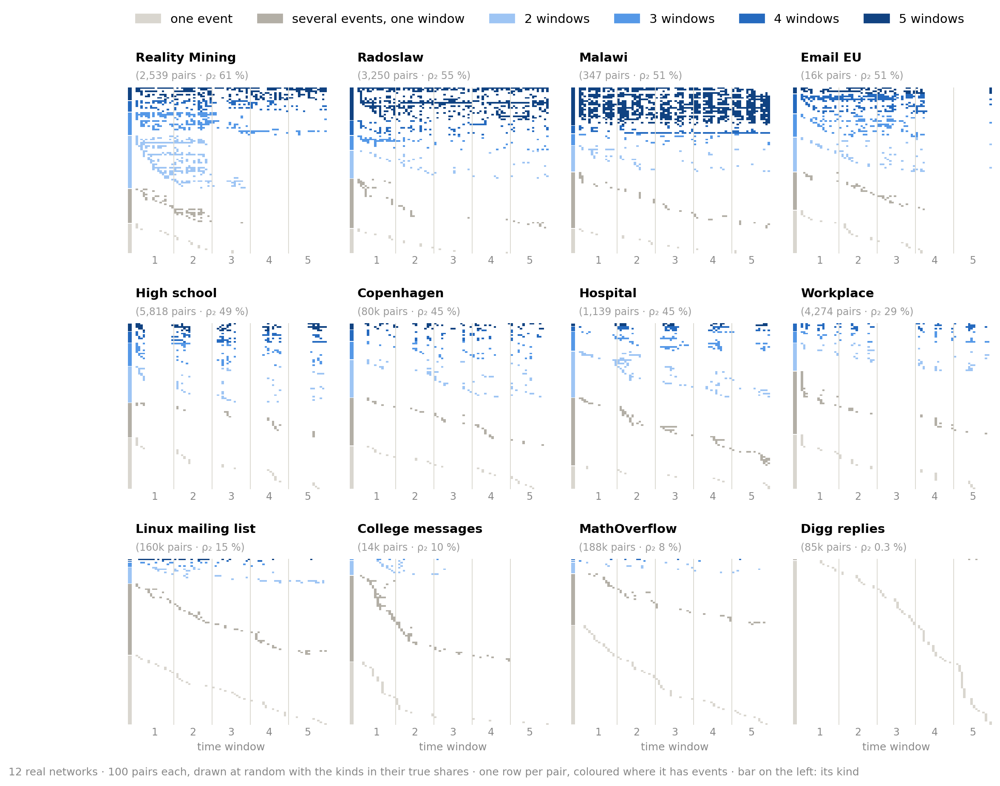
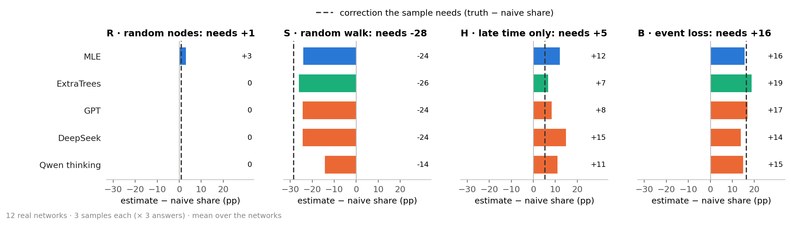
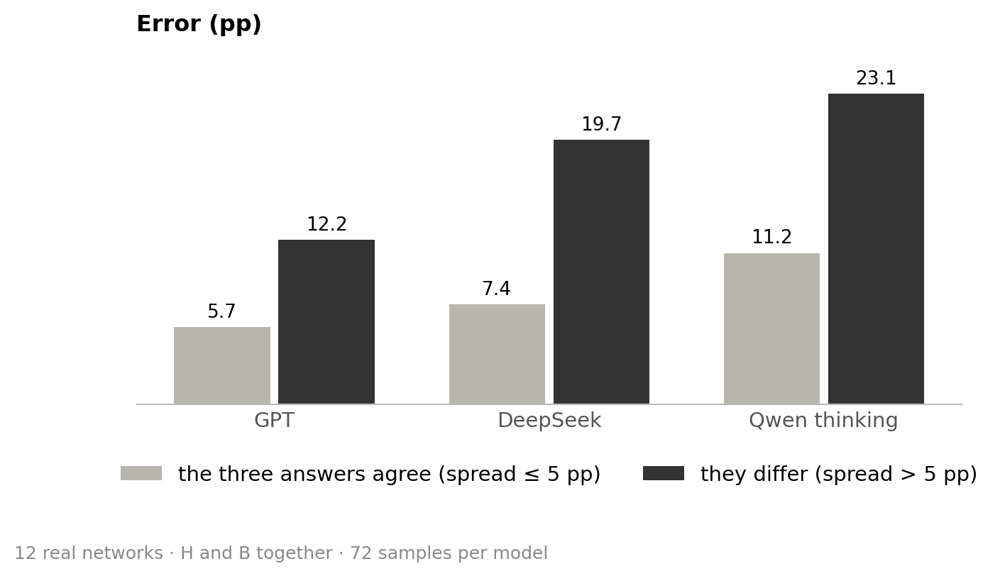
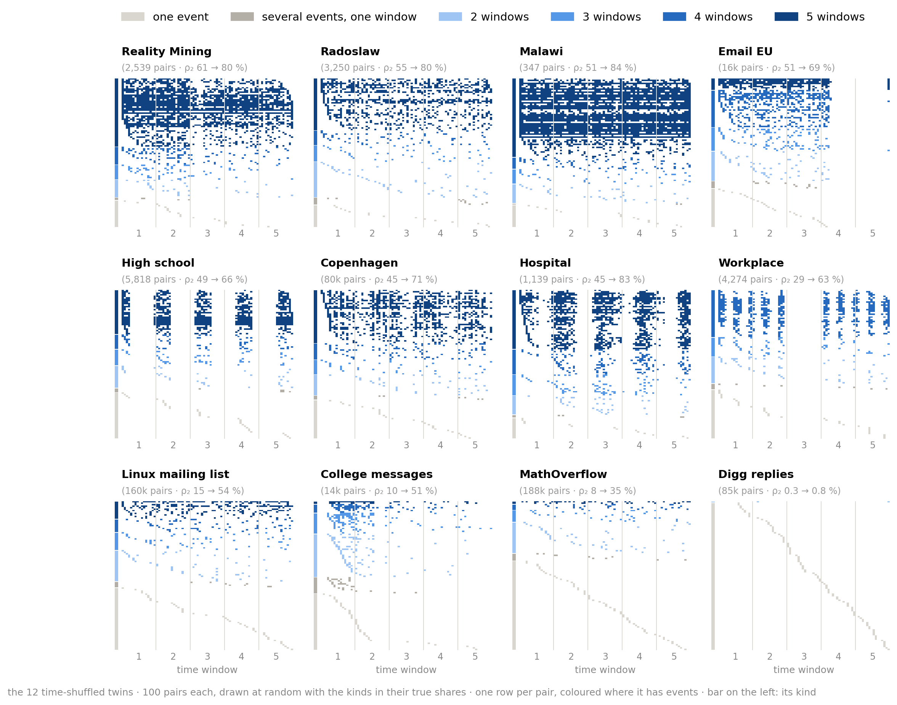
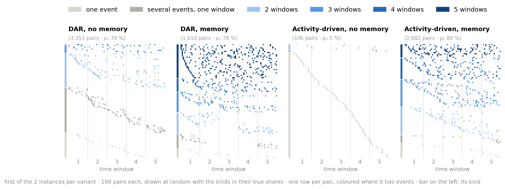

# Estimating persistence from a sample

**Question:** a temporal network is only seen through a sample. Can language models estimate how persistent it is?

## 0 · The task


- **ρ₂ (persistence):** share of pairs active in ≥ 2 of 5 time windows. **Naive share:** the same share in the sample.
- Errors in percentage points (pp).

<details>
<summary><h3>The four samples (arms)</h3></summary>

| Arm | What the sample shows | Also told |
|---|---|---|
| R · random nodes | random nodes and all events among them | number of nodes |
| S · random walk | a walk along events; busy pairs are met more often | visits per pair |
| H · late time only | random nodes, only the last 60 % of the time (windows 3–5) | number of nodes |
| B · event loss | each event kept with a small probability p | p |

Each sample shows about 10 % of the active pair-windows; 3 samples per network and arm.

</details>

<details>
<summary><h3>The methods</h3></summary>

| Method | What it is |
|---|---|
| Naive share | ρ₂ of the sample, uncorrected |
| Training median | a constant guess from the training networks |
| MLE | statistical model of the sampling, no training |
| ExtraTrees | trained on 16 other real and 400 synthetic networks; a supervised reference, not a fair competitor |
| GPT | OpenAI `gpt-6-sol`, reasoning effort high |
| GPT + Python | the same, with OpenAI's hosted Python tool (up to 10 calls) |
| DeepSeek | `deepseek-flash`, reasoning effort high |
| Qwen thinking / no thinking | `Qwen3.6-35B-A3B`, run locally, with or without thinking (temperature 1.0 / 0.7) |

Each language model answers each sample 3 times.

</details>

<details>
<summary><h3>One real input</h3></summary>

```
Sampling rule: 24 random nodes; every event between two of them is seen.   (Hospital, arm R)
Seen: 132 pairs, 3,172 events

pattern (windows 1–5)   pairs   events      1 = active in that window
0 0 0 0 1                  12       86
0 1 1 1 0                   5      283
1 1 1 0 0                   4      490
…                           …        …      (31 patterns in total)

Task: estimate ρ₂ … ρ₅ of the full network.        Naive share 56 / 132 = 42 %; true ρ₂ 45 %.
```

ρ₃ to ρ₅ count pairs active in ≥ 3 to 5 windows.

</details>

## 1 · What the networks look like


- Many events do not make a pair persistent: in all networks but Digg, 21–52 % of pairs have several events, all in one window.
- The same ρ₂ can hide different shapes: Malawi and Email EU both have 51 %, but 23 % against 4 % of their pairs are active in all 5 windows.



- High school, Hospital and Workplace pulse with the days. Workplace is empty in window 3, so none of its pairs can be active in all 5 windows.
- College messages, Reality Mining and Email EU fade out towards the end.

<details>
<summary><h3>Does the number of time windows matter?</h3></summary>


- More windows raise ρ₂ a little (mean 30 % with 3, 35 % with 5, 41 % with 20 windows), but the networks keep their order (rank correlation with 5 windows ≥ 0.97).

</details>

## 2 · Samples distort persistence, except in R


- The walk (S) overstates persistence; hiding the early time (H) and losing events (B) understate it.

## 3 · Who corrects it


- Correction pays off clearly in S and B, only partly in H. In R there is nothing to correct.
- GPT is the best language model but has no consistent edge over MLE.
- Qwen no thinking is worse than a constant guess: in R, S and B it answers 85–95 % almost regardless of the sample.



- In H, every method corrects too much: the sample needs +5 pp, they add +7 to +15.
- In S and B the amount is about right on average; Qwen thinking makes only half of it in S.

<details>
<summary><h3>Counted per network: who beats the naive share, GPT against MLE</h3></summary>

- **S:** MLE, ExtraTrees and all thinking models beat the naive share by more than 0.5 pp in 11 of 12 networks. **B:** MLE, ExtraTrees and GPT do so in 8 or 9. **H:** at most 8 of 12.
- **GPT against MLE:** better in 2, 6, 4 and worse in 6, 4, 6 networks (S, H, B).

</details>

## 4 · Where a textbook answer exists, the models give it


- The textbook answer is the naive share in R and the **simple reweighting** in S: each visit counts 1 / the pair's number of events. A match means within 0.5 pp.
- In S, GPT's error (8.4 pp) is the formula's own (8.8 pp).


- GPT gives the formula on every network except Malawi (44 %); DeepSeek on some, Qwen thinking on few (Digg, Linux, MathOverflow).

## 5 · Elsewhere they improvise, and GPT does it best


- "About right" means 50–150 % of the correction the sample needs.


- GPT is about right on most networks, but not on Malawi, Radoslaw and Workplace. DeepSeek and Qwen rarely are (one exception: DeepSeek on College messages).


- GPT recovers the whole profile in every arm, even ρ₄ and ρ₅ in H, which three visible windows cannot show (the naive share is 0 there).

<details>
<summary><h3>How long the models think, and what DeepSeek writes</h3></summary>

| Median reasoning tokens | R | S | H | B |
|---|---:|---:|---:|---:|
| GPT | 489 | 3,051 | 4,764 | 8,966 |
| DeepSeek | 9,069 | 35,483 | 50,226 | 57,932 |

- Both write the longest reasoning in H and B. DeepSeek writes 6–19 times as much as GPT and is still less accurate.
- "Guess" appears in DeepSeek's full reasoning in 82 % of H and 58 % of B answers (R: 2 %), e.g. *"We have no data on windows 1-2, so any extrapolation is a guess."*

</details>

## 6 · How much the estimates move


- Asked again with the same sample, the language models answer differently where they improvise (H, B).


- GPT's and DeepSeek's answers vary mostly on persistent networks and hardly at all on Digg and MathOverflow. Qwen varies on almost every network.



- Where the three answers differ, the error is two to three times as large.


- A new sample barely moves the estimate on most networks. It moves more on the smallest networks (Malawi, Hospital) and, under the walk, on Linux, Reality Mining and High school.
- The gap to the truth is often larger than the spread between samples: the errors are systematic, not chance.

## 7 · Python does not help


- In R and S, Python changes nothing on any network. In B it makes 8 of 12 networks worse, Malawi by 23 pp.


- Python hurts only on real networks: on the twins B stays the same (13.3 → 12.8 pp), on synthetic networks it improves a little (12.9 → 10.7 pp).

## 8 · Which networks are hard

### 8.1 With random nodes or a random walk, the same networks are hard for every method


- **R, S:** the dots sit on the diagonal, so difficulty is a property of the network.
- **H, B:** the dots scatter, so it depends on the method. Copenhagen in B is easy for MLE (0.5 pp) and hard for GPT (17.5 pp).

### 8.2 Not the number of events, but how many pairs carry them

*Typical error:* median error of MLE, ExtraTrees, GPT, GPT + Python, DeepSeek and Qwen thinking.


- More events do not help in any arm.

*Pairs that carry the events:* as many equally busy pairs would hold the same events.


- The more pairs carry the events, the easier R and S get; H and B only a little. Malawi's 102k events sit on effectively 55 of its 347 pairs.

### 8.3 Every network on its own


- **Digg:** easy everywhere; almost every pair has only one event.
- **Malawi:** hardest in S and B; effectively 55 of its 347 pairs carry the events.
- **Copenhagen:** easy except under event loss.
- **Linux mailing list:** low persistence, yet hard under the walk (11 pp): its samples differ strongly (section 6).
- **College messages:** easy in R and S, harder in H: 85 % of its pairs are active only in the hidden early time.

### 8.4 Time-shuffled twins: do the methods read the timing?

Each real network has a **twin**: the same pairs and events per pair, but the times shuffled among all events. Its true ρ₂ is 27 pp higher. A method that ignores timing would give both the same answer.



- A twin keeps the rhythm of its network but spreads each pair's events over the whole time: pairs with several events in one window drop from 21–52 % to 1–11 % of all pairs (Digg aside).


- All methods that read timing raise their estimate; in R they follow the truth exactly.
- Qwen no thinking does not (−12 to +3 pp): it ignores the timing.
- Under event loss (B), all follow only part of the change; GPT the most.

### 8.5 Synthetic networks: what memory changes

The synthetic networks change one thing only, **memory**: each generator runs without and with it on the same random numbers (500 nodes, about 10k events).

- **DAR:** each pair is on or off in each window; with memory, it keeps its last state 80 % of the time.
- **Activity-driven:** active nodes create events with a partner; with memory, mostly a known one.

<details>
<summary><h3>DAR step by step (animation)</h3></summary>


- **Models** links that come back: an active pair tends to stay active (Williams et al. 2022). Without memory, only chance decides.
- **Here:** 5,000 possible pairs; on with chance 0.2; kept with chance 0.8 (memory) or never; 1 + Poisson(1) events per active window.

</details>

<details>
<summary><h3>Activity-driven step by step (animation)</h3></summary>


- **Models** people who differ strongly in how active they are; the original model has no memory (Perra et al. 2012). Memory: people mostly call people they already know (Karsai et al. 2014).
- **Here:** 1,000 rounds; with memory, a new partner with chance 1 / (n + 1), n = partners known.

</details>


- Memory puts about the same number of events on fewer pairs and makes them persistent: ρ₂ 39 → 78 % (DAR), 6 → 79 % (activity-driven).



- With memory, the same pairs return in window after window.


- With memory, S and B get harder in both generators; R does not, H only in activity-driven.
- These are the two drivers seen in the real networks: few pairs carrying the events (S, 8.2) and high persistence (B, 8.6).

<details>
<summary><h3>Instances, and why ExtraTrees is so good here</h3></summary>

- 2 instances per generator; within an instance, both variants share all random numbers, so only memory differs.
- ExtraTrees was trained on other networks from the same two generators (B with memory: 2–3 pp, against 8–18 pp for MLE and GPT). Without it, the values in the figure change by at most 2.4 pp; the picture stays the same.

</details>

### 8.6 All 32 networks: under event loss, persistent networks are hard


- Under event loss (B), every network with ρ₂ above 30 % is hard (10–24 pp): real networks, twins and synthetic networks alike.
- Under the walk (S), only some of them are (1–33 pp).

<details>
<summary><h2>Key findings</h2></summary>

1. **Samples distort persistence:** the walk overstates it, late time only and event loss understate it, random nodes do not. (2)
2. **Where a textbook answer exists, the language models give it** (R: naive share; S: simple reweighting, mostly GPT and DeepSeek), and are as good as the formula, not better. (4)
3. **Where none exists, they improvise:** GPT corrects about right most often; DeepSeek and Qwen rarely, and differently each time. (5, 6)
4. **Disagreement warns:** where the three answers to one sample differ, the error is two to three times as large. (6)
5. **No language model beats MLE consistently;** Qwen no thinking is worse than a constant guess. (3)
6. **In H, every method corrects too much;** in S and B the amount is about right on average. (3)
7. **The errors are systematic, not chance:** a new sample barely moves a good estimate. (6)
8. **Python does not help GPT;** under event loss it makes 8 of 12 real networks worse, but not the twins or the synthetic networks. (7)
9. **What makes a network hard:** with random nodes and the walk, few pairs carrying the events; under event loss, high persistence. Memory in synthetic networks produces both. (8.1, 8.2, 8.5, 8.6)
10. **All thinking models read the timing;** Qwen no thinking does not. (8.4)
11. **Five windows are not a special choice:** other numbers shift ρ₂ a little and keep the order of the networks. (1)

</details>

<details>
<summary><h2>Definitions, sources and all numbers</h2></summary>

- **ρ₂ … ρ₅:** share of pairs active in ≥ 2 … 5 of the 5 windows, among all pairs with an event. **Naive share:** the same in the sample.
- **Error:** |estimate − true ρ₂| in pp, averaged per network over samples and answers, then over networks.
- **Typical error:** median error of MLE, ExtraTrees, GPT, GPT + Python, DeepSeek and Qwen thinking.
- **Spread:** standard deviation of the three answers to the same sample.
- **Pairs that carry the events** (effective number of pairs): 1 / Σ (events of a pair / all events)², the inverse Simpson index. Malawi 55, Copenhagen 4,590, Digg 82,900.
- **Generators:** Williams, Mazzarisi, Lillo & Latora, *Phys. Rev. E* 105, 034301 (2022); Perra, Gonçalves, Pastor-Satorras & Vespignani, *Sci. Rep.* 2, 469 (2012); Karsai, Perra & Vespignani, *Sci. Rep.* 4, 4001 (2014).
- All errors per network and method: [figure](figures/fig_networks_detail.png), [MAIN_RESULTS.md](../results/final/MAIN_RESULTS.md). Robustness: [VARIABILITY.md](../results/final/VARIABILITY.md), [W_SENSITIVITY.md](../results/final/W_SENSITIVITY.md), [WALK.md](../results/final/WALK.md).
- Redraw: `python scripts/analysis_figures.py`; `--inputs` also rebuilds [`data/`](data) (needs `data/raw` and `~/.local/share/masterthesis`).

</details>
